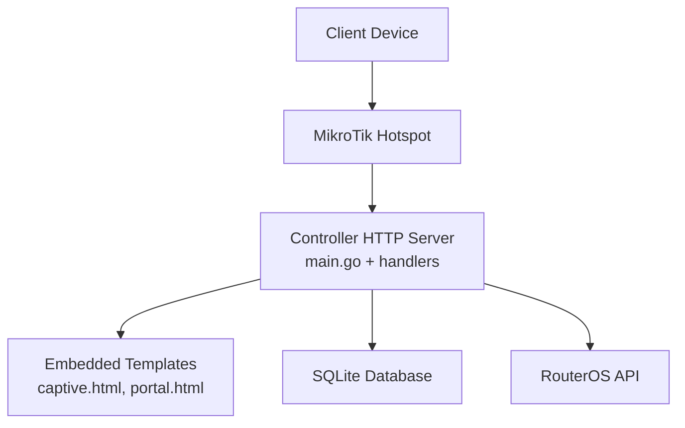
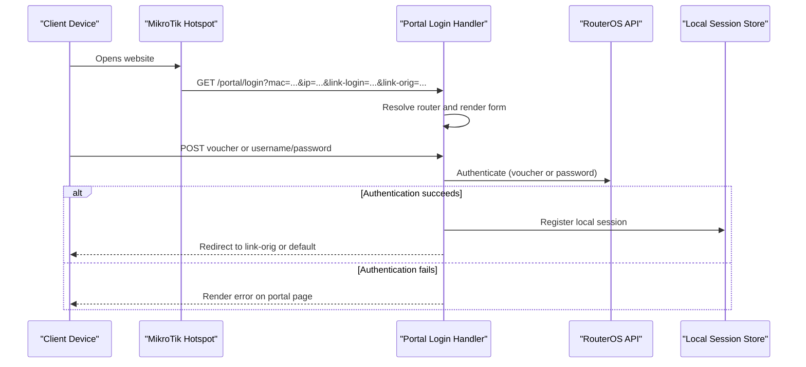
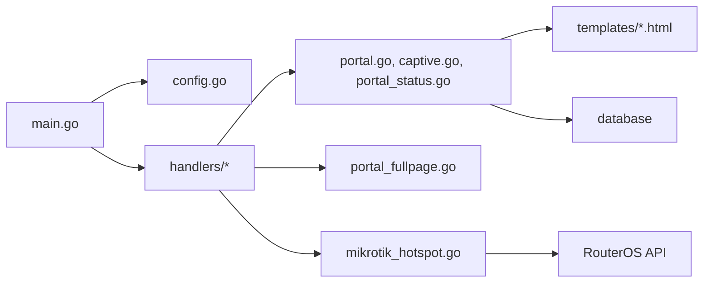

# Captive Portal Issues

<cite>
**Referenced Files in This Document**   
- [README.md](file://README.md)
- [main.go](file://main.go)
- [config.go](file://config.go)
- [handlers/captive.go](file://handlers/captive.go)
- [handlers/portal.go](file://handlers/portal.go)
- [handlers/portal_fullpage.go](file://handlers/portal_fullpage.go)
- [handlers/portal_status.go](file://handlers/portal_status.go)
- [handlers/mikrotik_hotspot.go](file://handlers/mikrotik_hotspot.go)
- [templates/captive.html](file://templates/captive.html)
- [templates/portal.html](file://templates/portal.html)
</cite>

## Table of Contents
1. [Introduction](#introduction)
2. [Project Structure](#project-structure)
3. [Core Components](#core-components)
4. [Architecture Overview](#architecture-overview)
5. [Detailed Component Analysis](#detailed-component-analysis)
6. [Dependency Analysis](#dependency-analysis)
7. [Performance Considerations](#performance-considerations)
8. [Troubleshooting Guide](#troubleshooting-guide)
9. [Conclusion](#conclusion)

## Introduction
This document is a focused troubleshooting guide for captive portal problems in the MikroTik controller. It explains how the portal loads, how MikroTik redirect parameters flow through the system, where redirects are resolved, and what happens when templates, static assets, or router integration fail. It also provides actionable steps for redirect loops, certificate warnings, mobile compatibility issues, CSS/JavaScript loading failures, template rendering errors, static asset path problems, session synchronization gaps, status page display issues, browser-specific behavior, responsive design fixes, and performance optimization.

## Project Structure
The captive portal experience is built from:
- A Go HTTP server that starts the application, parses embedded HTML templates, and mounts routes.
- Handlers for the welcome page, login form, authentication, session status, and full-page customization.
- RouterOS integration code that reads and writes hotspot configuration.
- Embedded HTML templates for the kiosk-style landing page and the standard sign-in layout.

**Diagram sources**
- [main.go:214-285](file://main.go#L214-L285)
- [handlers/captive.go:102-153](file://handlers/captive.go#L102-L153)
- [handlers/portal.go:85-114](file://handlers/portal.go#L85-L114)
- [handlers/mikrotik_hotspot.go:348-378](file://handlers/mikrotik_hotspot.go#L348-L378)

**Section sources**
- [main.go:1-350](file://main.go#L1-L350)
- [README.md:1-206](file://README.md#L1-L206)

## Core Components
- **Captive welcome handler**: Serves the root portal page and forwards clients with hotspot redirect parameters to the login form.
- **Portal login handler**: Renders the sign-in form, resolves the correct MikroTik router, validates input, and handles voucher or username/password authentication.
- **Authentication flow**: Redeems vouchers, performs password login, registers local sessions, and redirects to the original destination or fallback URL.
- **Full-page customization renderer**: Compiles and caches an operator-authored portal page; falls back to the built-in layout on errors.
- **Session status page**: Shows the guest’s current connection, elapsed time, allowance, and links to the login page.
- **MikroTik hotspot layer**: Reads and writes hotspot servers, profiles, user profiles, and walled garden rules via RouterOS.

**Section sources**
- [handlers/captive.go:10-212](file://handlers/captive.go#L10-L212)
- [handlers/portal.go:15-482](file://handlers/portal.go#L15-L482)
- [handlers/portal_fullpage.go:14-221](file://handlers/portal_fullpage.go#L14-L221)
- [handlers/portal_status.go:13-208](file://handlers/portal_status.go#L13-L208)
- [handlers/mikrotik_hotspot.go:269-599](file://handlers/mikrotik_hotspot.go#L269-L599)

## Architecture Overview
The portal request lifecycle is designed so that MikroTik redirect parameters are preserved end-to-end. If they are missing, the system still tries to recover by using the client’s source IP. Successful authentication either completes the login through the RouterOS API or falls back to a browser-based login-only URL. After success, the client is redirected to `link-orig` if safe, otherwise to a configured default.

**Diagram sources**
- [handlers/portal.go:85-194](file://handlers/portal.go#L85-L194)
- [handlers/portal.go:196-271](file://handlers/portal.go#L196-L271)
- [handlers/portal.go:306-329](file://handlers/portal.go#L306-L329)

## Detailed Component Analysis

### Captive Welcome Page
The root route serves a kiosk-style welcome page. When MikroTik appends redirect parameters, the handler immediately forwards the request to the login form instead of showing the welcome page. This avoids unnecessary round trips and keeps hotspot handshake data intact.

Key behaviors:
- Direct visits show the welcome page with branding, coin tab state, and optional router name.
- Visits with hotspot parameters go straight to `/portal/login`.
- The handler checks for an existing open session by client IP and shows a connected state when found.

Common failure points:
- Missing router resolution logs a warning but does not block the welcome page.
- Session lookup failures degrade gracefully to “not online.”

**Section sources**
- [handlers/captive.go:102-153](file://handlers/captive.go#L102-L153)
- [handlers/captive.go:155-185](file://handlers/captive.go#L155-L185)
- [handlers/captive.go:187-212](file://handlers/captive.go#L187-L212)

### Portal Login and Authentication
The login handler renders the sign-in form and carries hotspot parameters into the form action. On POST, it reads both query and body values so voucher submissions survive the round trip even when the redirect did not include all fields.

Important flows:
- Voucher redemption looks up the code, validates router scope, redeems against RouterOS, and registers a local session.
- Username/password login calls RouterOS directly; if the device expects browser-based login, credentials are passed through a fallback URL.
- Safe redirect logic only accepts absolute `http` or `https` URLs, preventing open redirects.

Error handling:
- Unknown voucher codes return a friendly message.
- Unreachable routers return service-unavailable hints.
- Missing router registration returns a clear operator-facing message.

**Section sources**
- [handlers/portal.go:85-114](file://handlers/portal.go#L85-L114)
- [handlers/portal.go:116-194](file://handlers/portal.go#L116-L194)
- [handlers/portal.go:196-271](file://handlers/portal.go#L196-L271)
- [handlers/portal.go:306-329](file://handlers/portal.go#L306-L329)
- [handlers/portal.go:346-402](file://handlers/portal.go#L346-L402)

### Full-Page Customization Renderer
Operators can enable a custom portal page. The renderer compiles the operator’s HTML once and caches it per source content. Every guest request uses the cached template unless the source changes.

Safety model:
- The operator’s markup is trusted because it is authored by authenticated staff.
- Data filled into the template is escaped.
- Content Security Policy forbids remote scripts and styles.
- Template compilation or execution errors fall back to the built-in portal page rather than exposing errors to guests.

Cache behavior:
- First request compiles and stores the template.
- Subsequent requests reuse the compiled template.
- Errors are recorded so the editor can surface them without requiring log inspection.

**Section sources**
- [handlers/portal_fullpage.go:14-125](file://handlers/portal_fullpage.go#L14-L125)
- [handlers/portal_fullpage.go:146-197](file://handlers/portal_fullpage.go#L146-L197)
- [handlers/portal_fullpage.go:199-221](file://handlers/portal_fullpage.go#L199-L221)

### Session Status Page
The guest session page displays connection identity, elapsed time, and allowance details. It is intentionally served at `/portal/session`, while `/portal/status` remains a JSON probe for operators.

Behavior:
- If no active session exists, the page still renders but shows offline state.
- Elapsed seconds are computed from the session start time, avoiding stutter caused by device polling intervals.
- Allowance information is derived from the voucher associated with the session when present.

**Section sources**
- [handlers/portal_status.go:13-54](file://handlers/portal_status.go#L13-L54)
- [handlers/portal_status.go:110-146](file://handlers/portal_status.go#L110-L146)
- [handlers/portal_status.go:148-208](file://handlers/portal_status.go#L148-L208)

### MikroTik Hotspot Integration
The hotspot layer provides RouterOS CRUD operations for hotspot servers, server profiles, user profiles, and walled garden rules. It builds arguments consistently and retries commands when RouterOS rejects unknown properties, logging which parameter was dropped.

Relevant areas:
- Hotspot server listing, creation, updates, and disable flags.
- Server profile properties including HTML directory, SSL certificate, login methods, and RADIUS settings.
- User profile properties such as shared users, rate limits, timeouts, queue placement, and open status page behavior.
- Walled garden rules controlling pre-auth access.

**Section sources**
- [handlers/mikrotik_hotspot.go:31-127](file://handlers/mikrotik_hotspot.go#L31-L127)
- [handlers/mikrotik_hotspot.go:180-250](file://handlers/mikrotik_hotspot.go#L180-L250)
- [handlers/mikrotik_hotspot.go:269-389](file://handlers/mikrotik_hotspot.go#L269-L389)
- [handlers/mikrotik_hotspot.go:407-599](file://handlers/mikrotik_hotspot.go#L407-L599)

## Dependency Analysis
The portal depends on several layers:
- **HTTP routing and server startup** in the main entry point.
- **Handler logic** for captive pages, login, authentication, status, and full-page rendering.
- **Template engine** parsing embedded HTML files.
- **Database** for sessions, vouchers, routers, portal settings, and coin balances.
- **RouterOS client** for hotspot configuration and authentication.

**Diagram sources**
- [main.go:214-285](file://main.go#L214-L285)
- [config.go:20-77](file://config.go#L20-L77)
- [handlers/portal.go:85-194](file://handlers/portal.go#L85-L194)
- [handlers/captive.go:102-153](file://handlers/captive.go#L102-L153)
- [handlers/portal_fullpage.go:146-197](file://handlers/portal_fullpage.go#L146-L197)
- [handlers/mikrotik_hotspot.go:348-378](file://handlers/mikrotik_hotspot.go#L348-L378)

**Section sources**
- [main.go:214-285](file://main.go#L214-L285)
- [config.go:20-77](file://config.go#L20-L77)
- [handlers/portal.go:85-194](file://handlers/portal.go#L85-L194)
- [handlers/captive.go:102-153](file://handlers/captive.go#L102-L153)
- [handlers/portal_fullpage.go:146-197](file://handlers/portal_fullpage.go#L146-L197)
- [handlers/mikrotik_hotspot.go:348-378](file://handlers/mikrotik_hotspot.go#L348-L378)

## Performance Considerations
- **Template caching**: The full-page renderer compiles the operator’s portal page once and reuses it. Broken templates fall back to the built-in page, avoiding repeated parse errors.
- **No-store policy**: The full-page response sets `Cache-Control: no-store`, ensuring guests always see the latest rendered portal content.
- **Graceful degradation**: Database read failures for portal settings or coin balances do not block page rendering; the UI degrades to defaults.
- **Server timeouts**: The HTTP server configures read, write, and idle timeouts to avoid hanging connections during slow hotspot responses.

Optimization recommendations:
- Keep the operator’s portal page small and avoid heavy inline JavaScript.
- Use relative paths for static assets inside the portal to reduce DNS/TLS overhead.
- Avoid excessive DOM manipulation in the portal script; prefer server-rendered values.
- Monitor RouterOS API timeout configuration and ensure the hotspot is reachable.

**Section sources**
- [handlers/portal_fullpage.go:67-111](file://handlers/portal_fullpage.go#L67-L111)
- [handlers/portal_fullpage.go:191-196](file://handlers/portal_fullpage.go#L191-L196)
- [handlers/portal_status.go:56-108](file://handlers/portal_status.go#L56-L108)
- [main.go:246-253](file://main.go#L246-L253)

## Troubleshooting Guide

### Portal Not Loading
Symptoms:
- The controller IP shows a blank page, a generic error, or never finishes loading.

Likely causes:
- The server is not listening on the expected address or port.
- Templates failed to parse during startup.
- The database could not be opened.
- The operator panel is mounted at the root, moving the captive portal away from `/`.

Checks:
- Verify the listen address and privileges for port 80.
- Check startup logs for template parsing or database errors.
- Confirm whether `DASHBOARD_AT_ROOT` is set, which moves the portal to `/portal`.
- Ensure `/healthz` and `/portal/status` respond.

Solutions:
- Start the service with the correct `ADDR`, or use a non-privileged port like `:8080`.
- Fix template syntax errors in the operator’s full-page portal.
- Restore database permissions or path.
- Access the portal at `/portal` when dashboard is at root.

**Section sources**
- [main.go:214-285](file://main.go#L214-L285)
- [config.go:35-46](file://config.go#L35-L46)
- [README.md:11-20](file://README.md#L11-L20)

### Redirect Loops
Symptoms:
- The browser repeatedly reloads the portal or jumps between the welcome page and login form.

Likely causes:
- MikroTik redirect parameters are missing or malformed.
- `link-orig` is unsafe or points back to the controller.
- The hotspot login form action does not preserve hotspot parameters.
- The controller cannot resolve a registered router for the request.

Checks:
- Inspect the URL after MikroTik redirect to confirm presence of `mac`, `ip`, `link-login`, `link-orig`, and related fields.
- Validate that the form action includes those parameters.
- Confirm router resolution order: server-name tag, `link-login` host, default portal, single router.
- Test `/portal/status` with `server-name` or `link-login` to verify router attribution.

Solutions:
- Update the MikroTik hotspot login form to forward all required variables.
- Set a safe `DEFAULT_REDIRECT` environment variable when `link-orig` is absent.
- Register the router and mark it as default or assign a portal tag matching `server-name`.
- Avoid setting `link-orig` to the controller itself.

**Section sources**
- [handlers/portal.go:19-63](file://handlers/portal.go#L19-L63)
- [handlers/portal.go:346-402](file://handlers/portal.go#L346-L402)
- [handlers/portal.go:404-451](file://handlers/portal.go#L404-L451)
- [handlers/portal.go:453-482](file://handlers/portal.go#L453-L482)

### Certificate Warnings
Symptoms:
- Browsers warn about invalid, self-signed, or mismatched certificates.

Likely causes:
- The controller is accessed over HTTPS with an untrusted certificate.
- The hotspot profile’s SSL certificate is misconfigured.
- Clients expect HTTPS but the controller is running on HTTP.

Checks:
- Confirm whether `SECURE_COOKIES` is enabled behind HTTPS.
- Verify the RouterOS hotspot profile’s `ssl-certificate` setting.
- Ensure the controller’s public address matches the certificate hostname.

Solutions:
- Install a trusted TLS certificate for the controller’s domain or IP.
- Configure the hotspot profile to use the same certificate.
- If using HTTP only, avoid enabling secure cookies and inform users about the lack of encryption.

**Section sources**
- [README.md:139-140](file://README.md#L139-L140)
- [handlers/mikrotik_hotspot.go:416-447](file://handlers/mikrotik_hotspot.go#L416-L447)
- [config.go:45-46](file://config.go#L45-L46)

### Mobile Device Compatibility Problems
Symptoms:
- Buttons are too small, forms do not submit, or the coin tab does not appear.

Likely causes:
- Missing viewport meta tag.
- Inline CSS or JavaScript conflicts with mobile browsers.
- The portal relies on features not supported by older devices.
- The kiosk layout assumes certain screen sizes.

Checks:
- Inspect the page source for the viewport meta tag.
- Test on iOS Safari and Android Chrome.
- Verify that the coin tab script runs without console errors.
- Confirm that the kiosk styles are applied.

Solutions:
- Keep the provided viewport meta tag.
- Avoid overriding `.kiosk` styles unless necessary.
- Test the portal’s responsive breakpoints and adjust only if needed.
- Disable custom portal mode temporarily to isolate template-related issues.

**Section sources**
- [templates/captive.html:1-10](file://templates/captive.html#L1-L10)
- [templates/captive.html:276-299](file://templates/captive.html#L276-L299)
- [templates/captive.html:450-518](file://templates/captive.html#L450-L518)

### CSS/JavaScript Loading Failures
Symptoms:
- Styles are missing, icons do not render, or interactive controls do nothing.

Likely causes:
- Static assets are referenced with incorrect paths.
- The operator’s custom portal references external resources blocked by CSP.
- The portal script fails before attaching event listeners.
- Browser security policies block inline scripts or styles.

Checks:
- Open developer tools and inspect network requests for 404 or CSP violations.
- Confirm that the portal’s inline styles and scripts are present.
- If using full-page customization, check the editor’s last compile error.
- Verify that the controller is not behind a proxy stripping headers.

Solutions:
- Use relative paths for assets hosted by the controller.
- Remove remote script/style references from the operator’s portal.
- Fix template syntax errors so the full-page renderer can compile successfully.
- Ensure the portal’s CSP allows only trusted local resources.

**Section sources**
- [handlers/portal_fullpage.go:113-125](file://handlers/portal_fullpage.go#L113-L125)
- [handlers/portal_fullpage.go:152-197](file://handlers/portal_fullpage.go#L152-L197)
- [templates/portal.html:1-10](file://templates/portal.html#L1-L10)

### Template Rendering Errors
Symptoms:
- The portal falls back to the built-in layout, or the operator sees a compile error in the editor.

Likely causes:
- Invalid Go template syntax in the custom portal page.
- Missing fields expected by the full-page context.
- Database read failure for portal settings.

Checks:
- Review the editor’s last error message.
- Temporarily disable full-page mode to confirm the built-in portal works.
- Check server logs for “failed to compile” or “failed to render” messages.

Solutions:
- Correct template syntax and field names.
- Save a minimal valid portal page first, then add complexity gradually.
- Ensure portal settings are readable; if unavailable, the system falls back to the built-in page.

**Section sources**
- [handlers/portal_fullpage.go:82-111](file://handlers/portal_fullpage.go#L82-L111)
- [handlers/portal_fullpage.go:152-197](file://handlers/portal_fullpage.go#L152-L197)
- [handlers/portal.go:273-304](file://handlers/portal.go#L273-L304)

### Static Asset Path Issues
Symptoms:
- Background images, logos, or other assets do not load.

Likely causes:
- Absolute paths pointing to another host.
- Paths not recognized by the embedded template system.
- Operator background image path not correctly stored in portal settings.

Checks:
- Inspect the rendered HTML for background image URLs.
- Confirm the controller serves the uploaded banner under the expected path.
- Verify that the operator’s theme CSS does not override asset paths unexpectedly.

Solutions:
- Use controller-relative asset paths.
- Re-upload the background image through the portal editor.
- Avoid external CDN links in the operator’s portal unless explicitly allowed.

**Section sources**
- [handlers/portal_fullpage.go:164-182](file://handlers/portal_fullpage.go#L164-L182)
- [templates/portal.html:10](file://templates/portal.html#L10)

### MikroTik Hotspot Integration Problems

#### Redirect URL Configuration
Symptoms:
- Clients are sent to the wrong page, or the login form lacks hotspot parameters.

Likely causes:
- The hotspot login form does not forward `mac`, `ip`, `username`, `link-login`, `link-login-only`, `link-orig`, `server-name`, and `error`.
- The controller address in the hotspot form is incorrect.

Checks:
- Compare the hotspot form action with the documented redirect pattern.
- Confirm the controller IP or hostname is reachable from the hotspot network.
- Test `/portal/status` with `server-name` or `link-login` to validate routing.

Solutions:
- Update the hotspot login form to forward all required variables.
- Point the form at the controller’s public address.
- Use `DEFAULT_REDIRECT` when `link-orig` is not available.

**Section sources**
- [README.md:167-186](file://README.md#L167-L186)
- [handlers/portal.go:39-63](file://handlers/portal.go#L39-L63)
- [handlers/portal.go:453-482](file://handlers/portal.go#L453-L482)

#### Session Synchronization Issues
Symptoms:
- The portal says the device is online, but browsing still hits the portal.
- The session timer shows zero or stale values.

Likely causes:
- Local session registration failed after successful RouterOS login.
- The client IP used for session lookup differs from the hotspot’s forwarded IP.
- The hotspot uses MAC-based or cookie-based login without API login support.

Checks:
- Verify that voucher redemption or password login registers a local session.
- Confirm the client IP normalization and MAC formatting.
- Check whether the router supports `/ip/hotspot/active/login`; if not, the fallback URL should complete the login in the browser.

Solutions:
- Ensure the controller can reach RouterOS within the API timeout.
- Use the fallback login URL when API login is unavailable.
- Align hotspot configuration so the controller receives the correct client IP and MAC.

**Section sources**
- [handlers/portal.go:116-194](file://handlers/portal.go#L116-L194)
- [handlers/portal.go:235-242](file://handlers/portal.go#L235-L242)
- [handlers/portal.go:331-344](file://handlers/portal.go#L331-L344)
- [handlers/portal.go:354-382](file://handlers/portal.go#L354-L382)

#### Status Page Display Problems
Symptoms:
- `/portal/session` shows offline or missing data.
- The elapsed timer does not update.

Likely causes:
- No open session found for the client IP.
- The voucher allowance is not attached to the session.
- The status page is being confused with the JSON `/portal/status` probe.

Checks:
- Confirm the guest is opening `/portal/session`, not `/portal/status`.
- Verify that a session exists for the current client IP.
- Check whether the session username corresponds to a voucher with an allowance.

Solutions:
- Complete the login flow so a local session is registered.
- Use voucher-based sessions when allowance display is required.
- Use `/portal/status` only for automated health checks.

**Section sources**
- [handlers/portal_status.go:13-54](file://handlers/portal_status.go#L13-L54)
- [handlers/portal_status.go:110-146](file://handlers/portal_status.go#L110-L146)

### Debugging Portal Customization
Steps:
1. Disable full-page customization and test the built-in portal.
2. Enable full-page mode again with a minimal template.
3. Add CSS and JavaScript incrementally.
4. Watch the editor’s last compile error and server logs.
5. Inspect browser developer tools for CSP violations and network errors.

Best practices:
- Do not embed remote scripts or styles.
- Keep the portal lightweight.
- Use server-rendered values for timers and allowances.
- Avoid mutating global state in ways that conflict with the controller’s scripts.

**Section sources**
- [handlers/portal_fullpage.go:113-125](file://handlers/portal_fullpage.go#L113-L125)
- [handlers/portal_fullpage.go:152-197](file://handlers/portal_fullpage.go#L152-L197)

### Resolving Browser-Specific Issues
Common cases:
- iOS Safari blocks autoplay or requires user gestures for some interactions.
- Android WebView may enforce stricter CSP.
- Older browsers may not support modern CSS features.

Mitigations:
- Avoid relying on unsupported CSS features.
- Provide graceful fallbacks when interactive elements fail.
- Test on real devices, not just desktop emulators.
- Keep inline scripts simple and defensive.

**Section sources**
- [templates/captive.html:450-518](file://templates/captive.html#L450-L518)

### Fixing Responsive Design Problems
Guidance:
- Respect the provided viewport meta tag.
- Use the kiosk media queries for narrow phones and landscape orientations.
- Avoid fixed widths that break on small screens.
- Test touch targets and keyboard navigation.

**Section sources**
- [templates/captive.html:276-299](file://templates/captive.html#L276-L299)

## Conclusion
Most captive portal issues trace back to one of three areas:
- **Redirect flow**: Missing or unsafe redirect parameters cause loops or failed handshakes.
- **Template and asset rendering**: Custom portal pages must compile safely and reference valid local assets.
- **RouterOS integration**: The controller needs a reachable router, correct hotspot configuration, and consistent session registration.

Use the status endpoints, router resolution logic, and fallback mechanisms to diagnose problems. When in doubt, disable full-page customization, verify the built-in portal, and then reintroduce customization incrementally. For MikroTik integration, ensure the hotspot login form forwards all required variables and that the controller can authenticate through the RouterOS API or complete the login via the browser fallback URL.