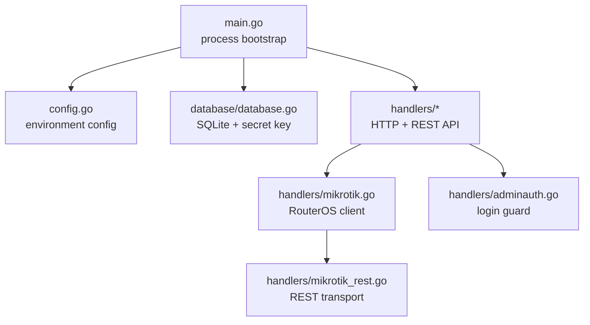
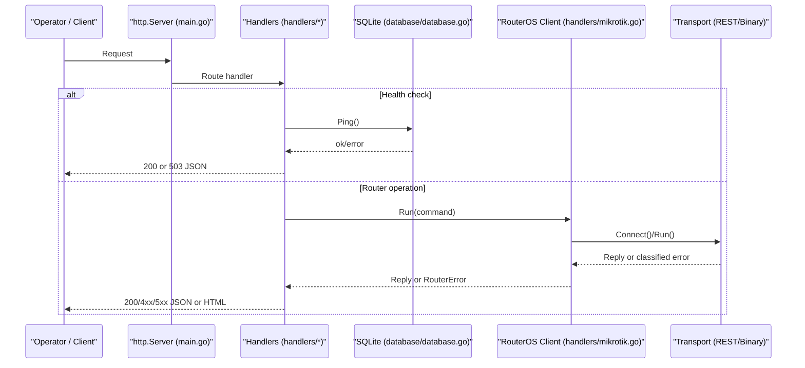
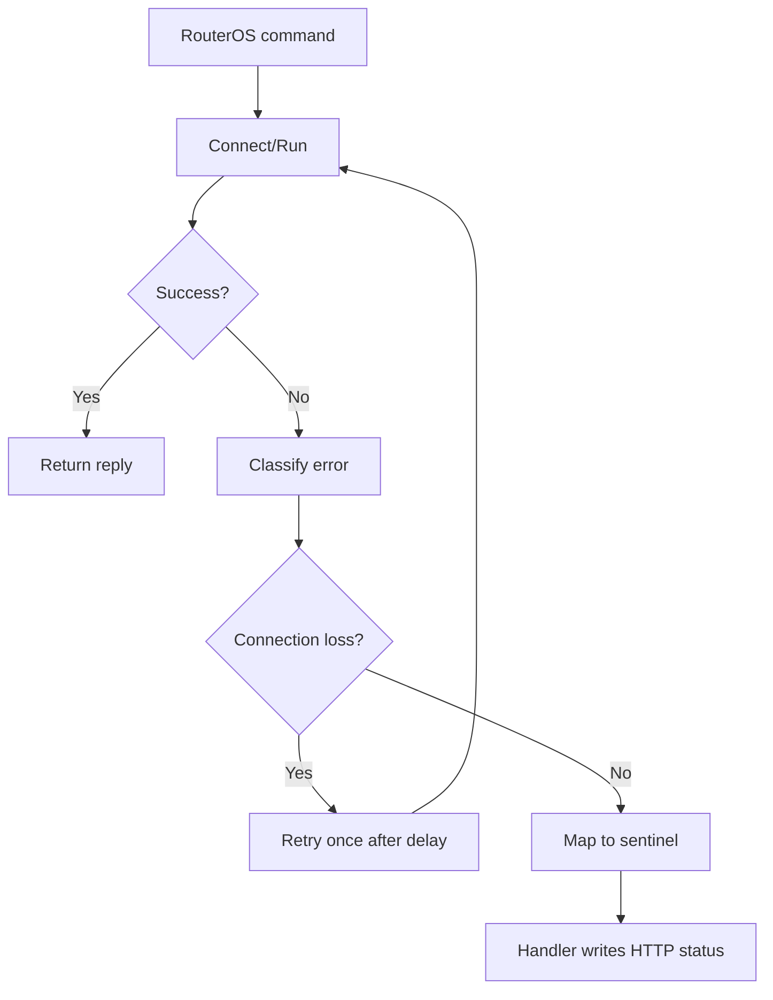
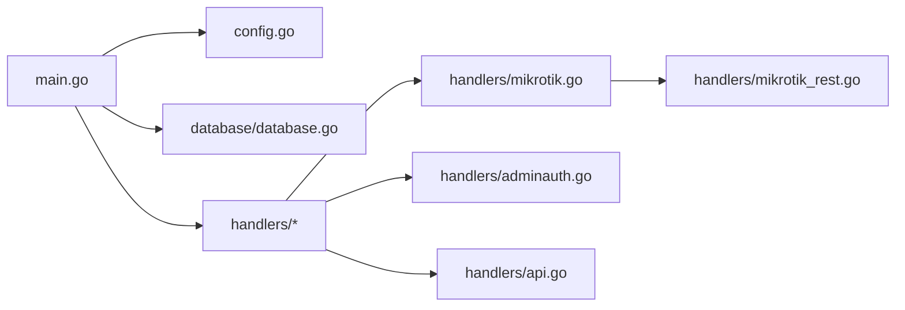

# Common Errors and Solutions

<cite>
**Referenced Files in This Document**   
- [main.go](file://main.go)
- [config.go](file://config.go)
- [database/database.go](file://database/database.go)
- [handlers/mikrotik.go](file://handlers/mikrotik.go)
- [handlers/api.go](file://handlers/api.go)
- [handlers/adminauth.go](file://handlers/adminauth.go)
- [handlers/handlers.go](file://handlers/handlers.go)
- [handlers/mikrotik_rest.go](file://handlers/mikrotik_rest.go)
- [README.md](file://README.md)
- [INSTALLATION.md](file://INSTALLATION.md)
</cite>

## Table of Contents
1. [Introduction](#introduction)
2. [Project Structure](#project-structure)
3. [Core Components](#core-components)
4. [Architecture Overview](#architecture-overview)
5. [Detailed Component Analysis](#detailed-component-analysis)
6. [Dependency Analysis](#dependency-analysis)
7. [Performance Considerations](#performance-considerations)
8. [Troubleshooting Guide](#troubleshooting-guide)
9. [Conclusion](#conclusion)
10. [Appendices](#appendices)

## Introduction
This document is a practical error-reference for the Aircoins MikroTik Controller. It consolidates startup failures, configuration parsing errors, runtime exceptions, file permission issues, disk space problems, service dependency failures, compilation and environment setup issues, HTTP status codes, database connection errors, RouterOS API failures, and API response failures. Each entry includes what the system reports, why it happens, and actionable remediation steps.

## Project Structure
The controller is a single Go binary with three main layers:
- Entry point and process lifecycle: `main.go`
- Environment-driven configuration: `config.go`
- Persistence layer: `database/` (SQLite, migrations, secret key box)
- Web/API handlers: `handlers/` (HTTP routes, admin auth, captive portal, RouterOS client)
- Templates: `templates/` (pure HTML)

**Diagram sources**
- [main.go:36-57](file://main.go#L36-L57)
- [config.go:20-77](file://config.go#L20-L77)
- [database/database.go:70-116](file://database/database.go#L70-L116)
- [handlers/mikrotik.go:186-240](file://handlers/mikrotik.go#L186-L240)
- [handlers/mikrotik_rest.go:446-476](file://handlers/mikrotik_rest.go#L446-L476)
- [handlers/adminauth.go:164-179](file://handlers/adminauth.go#L164-L179)

**Section sources**
- [README.md:197-206](file://README.md#L197-L206)

## Core Components
- Process entry point: parses subcommands (`--version`, `passwd`), loads configuration, opens SQLite, seeds templates, bootstraps the operator account, starts the HTTP server, and handles graceful shutdown.
- Configuration loader: validates environment variables such as `ADDR`, `DB_PATH`, `SECRET_KEY_PATH`, `API_TIMEOUT`, `ADMIN_SESSION_TTL`, coin-slot settings, and panel security flags.
- Database layer: creates directories, initializes the master key file, opens SQLite with WAL mode, pings the database, runs migrations, and exposes stores for routers, sessions, vouchers, coins, and rates.
- RouterOS client: selects transport (binary API or REST), dials with timeouts, retries transient connection loss once, classifies device errors into sentinel types, and returns friendly hints.
- API layer: standardizes JSON responses and errors, maps database and device errors to HTTP status codes, and provides health, router inventory, hotspot clients, bindings, interfaces, traffic, voucher, and portal endpoints.
- Admin authentication: enforces per-IP rate limiting and per-account lockout with exponential backoff; returns 429 with `Retry-After`.

**Section sources**
- [main.go:36-57](file://main.go#L36-L57)
- [main.go:214-285](file://main.go#L214-L285)
- [config.go:20-77](file://config.go#L20-L77)
- [database/database.go:70-116](file://database/database.go#L70-L116)
- [handlers/mikrotik.go:23-48](file://handlers/mikrotik.go#L23-L48)
- [handlers/api.go:24-42](file://handlers/api.go#L24-L42)
- [handlers/adminauth.go:18-68](file://handlers/adminauth.go#L18-L68)

## Architecture Overview
The controller boots, validates configuration, opens the database, renders embedded templates, ensures an operator account exists, and then serves both the web UI and the `/api/v1` REST API. Device operations go through a reconnecting RouterOS client that abstracts over legacy API and v7 REST transports.

**Diagram sources**
- [main.go:246-270](file://main.go#L246-L270)
- [handlers/api.go:138-146](file://handlers/api.go#L138-L146)
- [handlers/mikrotik.go:477-520](file://handlers/mikrotik.go#L477-L520)
- [handlers/mikrotik_rest.go:446-476](file://handlers/mikrotik_rest.go#L446-L476)

## Detailed Component Analysis

### Startup Failures

| Symptom | Likely Cause | Resolution |
|---|---|---|
| Service exits immediately after printing an error on stderr | Subcommand failure (`--version`, `passwd`) or early `run()` error | Check stderr output; for `passwd`, ensure the service is stopped before running it; verify environment variables are set correctly. |
| `listen on :80: permission denied` | Unprivileged process trying to bind port 80 | Use `ADDR=:8080`, run under systemd with `CAP_NET_BIND_SERVICE`, or use `sudo`; see INSTALLATION section F. |
| `invalid ADDR ...` | Bad listen address format or invalid port | Set `ADDR=host:port` or `:port` with a value between 1 and 65535. |
| `open database: ...` | SQLite path missing, directory not writable, or file locked | Ensure `DB_PATH` points to a writable location; create parent directories; check disk space and permissions. |
| `parse templates: ...` | Embedded template files are missing or malformed | Rebuild from the repository root so `embed` includes all templates. |
| `create admin account: ...` | Initial admin password too short or invalid | Provide a strong `ADMIN_PASSWORD` via environment; do not pass it as a command-line argument. |

**Section sources**
- [main.go:36-57](file://main.go#L36-L57)
- [main.go:214-285](file://main.go#L214-L285)
- [main.go:340-349](file://main.go#L340-L349)
- [config.go:20-77](file://config.go#L20-L77)
- [config.go:128-149](file://config.go#L128-L149)
- [database/database.go:70-116](file://database/database.go#L70-L116)
- [INSTALLATION.md:155-218](file://INSTALLATION.md#L155-L218)

### Configuration Parsing Errors

| Variable | Error Behavior | Fix |
|---|---|---|
| `API_TIMEOUT` | Fatal if not a positive duration | Set a valid duration like `12s`. |
| `ADMIN_SESSION_TTL` | Ignored with warning if invalid; does not stop boot | Set a positive duration like `12h`. |
| Coin slot integers (`COIN_SECONDS_PER_PULSE`, `COIN_CENTS_PER_PULSE`, `COIN_MAX_SESSION_MINUTES`) | Ignored with warning if non-positive; defaults used | Provide positive whole numbers. |
| Coin slot durations (`COIN_IDLE_TTL`) | Ignored with warning if invalid; defaults used | Provide a positive duration. |
| `ADDR` | Fatal if empty, out-of-range, or malformed | Use `:8080` or `0.0.0.0:8080`. |
| `SECURE_COOKIES` | Boolean flag; only meaningful behind HTTPS | Set to `1` when using TLS termination at a reverse proxy. |

**Section sources**
- [config.go:26-31](file://config.go#L26-L31)
- [config.go:48-57](file://config.go#L48-L57)
- [config.go:59-67](file://config.go#L59-L67)
- [config.go:95-126](file://config.go#L95-L126)
- [config.go:128-149](file://config.go#L128-L149)

### File Permission and Disk Space Issues

| Symptom | Explanation | Remediation |
|---|---|---|
| `database: create directory ...` | Parent directory of `DB_PATH` cannot be created | Create the directory manually with appropriate ownership; ensure the service user can write there. |
| `database: open ...` | SQLite cannot open the file | Check filesystem permissions, SELinux/AppArmor, mount options, and disk availability. |
| `database: ping ... (is the file writable?)` | SQLite opened but cannot write; often due to permissions or full disk | Free disk space, fix ownership/permissions, and restart the service. |
| Master key file not readable/writable | Secret key path must exist and be secure | Ensure `SECRET_KEY_PATH` points to a file owned by the service user with restrictive permissions. |

**Section sources**
- [database/database.go:78-84](file://database/database.go#L78-L84)
- [database/database.go:95-110](file://database/database.go#L95-L110)
- [INSTALLATION.md:101-105](file://INSTALLATION.md#L101-L105)

### Service Dependency Failures

| Dependency | Failure Mode | Action |
|---|---|---|
| SQLite | Cannot open, ping fails, migration fails | Validate `DB_PATH`, permissions, disk space, and WAL support. |
| RouterOS API | Connection refused, timeout, certificate verification failure, wrong port | Verify IP/port, firewall rules, API user permissions, and selected transport. For REST, enable `www` or `www-ssl` and set the correct web port. |
| Reverse proxy | Panel unreachable on expected host/port | Align proxy listener, `ADDR`, and walled-garden entries; terminate TLS and set `SECURE_COOKIES=1`. |
| ZeroTier helper | Missing CLI or sudoers rule | Re-run `install.sh` to provision the helper and sudoers entry. |

**Section sources**
- [handlers/mikrotik.go:186-240](file://handlers/mikrotik.go#L186-L240)
- [handlers/mikrotik_rest.go:446-476](file://handlers/mikrotik_rest.go#L446-L476)
- [INSTALLATION.md:86-99](file://INSTALLATION.md#L86-L99)
- [INSTALLATION.md:236-258](file://INSTALLATION.md#L236-L258)

### Compilation, Dependency, and Environment Setup Issues

| Issue | Cause | Solution |
|---|---|---|
| Unsupported CPU architecture | Running installer/binary on unsupported arch | Use a supported image (x86_64/aarch64 preferred). |
| Build OOM on small boards | Insufficient RAM during compile | Let installer add swap; build again. |
| Distro Go too old | Installed Go version below module requirement | Installer fetches the exact required Go tarball; otherwise install the version from `go.mod`. |
| Linker error with spaces in version | `-ldflags` received a version string containing spaces | Use sanitized version or set `AIRCOINS_VERSION=dev`. |
| Port 80 binding without privileges | Manual run lacks capability | Use `sudo`, set capability, or change `ADDR` to a high port. |

**Section sources**
- [INSTALLATION.md:123-133](file://INSTALLATION.md#L123-L133)
- [INSTALLATION.md:198-218](file://INSTALLATION.md#L198-L218)
- [README.md:50-58](file://README.md#L50-L58)

### Runtime Exceptions and Template Errors

| Symptom | Location | Meaning | Fix |
|---|---|---|---|
| `template error` 500 | Handler template rendering | Template execution failed | Rebuild from latest source; inspect template data passed to the failing template. |
| Panic in crypto routines | Password generation | Cryptographic randomness unavailable | Investigate OS entropy; restart the service. |
| Excessive login attempts | Admin login guard | Brute-force protection triggered | Wait for lockout or reset credentials via `passwd`. |

**Section sources**
- [handlers/handlers.go:764-769](file://handlers/handlers.go#L764-L769)
- [main.go:194-203](file://main.go#L194-L203)
- [handlers/adminauth.go:164-179](file://handlers/adminauth.go#L164-L179)

### RouterOS API Errors and Sentinels

| Sentinel | Typical Cause | HTTP Response | Operator Hint |
|---|---|---|---|
| `ErrRouterUnreachable` | TCP dial failed, connection lost, or HTTP 5xx from REST | 502 Bad Gateway | Check IP/port, firewall, and whether `www`/`www-ssl` is enabled. |
| `ErrRouterAuth` | Wrong username/password or REST auth rejected | 502 Bad Gateway | Correct API credentials; ensure REST user has required rights. |
| `ErrRouterTimeout` | No answer within configured timeout | 502 Bad Gateway | Increase `API_TIMEOUT`; check device load and network latency. |
| `ErrRouterNoCommand` | Command not available (e.g., hotspot disabled) | 502 Bad Gateway | Enable hotspot package or use a compatible RouterOS version. |
| `ErrRouterUnknownHost` | Client not yet in hotspot host table | 502 Bad Gateway | Wait for session creation; retry later. |
| `ErrRouterConflict` | Object already exists | 502 Bad Gateway | Update or remove the conflicting object. |
| `ErrRouterNotFound` | Object missing | 404 or 502 depending on context | Verify IDs and object existence. |
| `ErrRouterPermission` | API account lacks permission | 502 Bad Gateway | Grant read/write access to hotspot menus. |

**Diagram sources**
- [handlers/mikrotik.go:477-520](file://handlers/mikrotik.go#L477-L520)
- [handlers/mikrotik.go:522-584](file://handlers/mikrotik.go#L522-L584)
- [handlers/mikrotik.go:595-636](file://handlers/mikrotik.go#L595-L636)

**Section sources**
- [handlers/mikrotik.go:23-48](file://handlers/mikrotik.go#L23-L48)
- [handlers/mikrotik.go:477-520](file://handlers/mikrotik.go#L477-L520)
- [handlers/mikrotik.go:522-584](file://handlers/mikrotik.go#L522-L584)
- [handlers/mikrotik.go:595-636](file://handlers/mikrotik.go#L595-L636)
- [handlers/mikrotik_rest.go:408-444](file://handlers/mikrotik_rest.go#L408-L444)

### HTTP Status Codes and API Responses

| Code | Context | Meaning | Resolution |
|---|---|---|---|
| 200 OK | API success | Request succeeded | Inspect JSON payload. |
| 201 Created | Router created | New router registered | Use returned router object. |
| 204 No Content | Router deleted | Deletion succeeded | Refresh list. |
| 400 Bad Request | Invalid ID, missing fields, bad JSON | Input validation failed | Fix request body or path parameters. |
| 401 Unauthorized | Admin-only route without session | Not signed in | Sign in to the panel or authenticate via API. |
| 403 Forbidden | Session present but insufficient rights | Authorization failure | Review session and permissions. |
| 404 Not Found | Router, voucher, or interface missing | Resource does not exist | Verify IDs and device state. |
| 429 Too Many Requests | Admin login brute-force protection | Account or IP throttled | Wait for `Retry-After`; reset password if needed. |
| 500 Internal Server Error | Template render or unexpected server error | Internal failure | Check logs and rebuild if template-related. |
| 502 Bad Gateway | RouterOS query failed | Device communication error | Diagnose RouterOS connectivity and credentials. |
| 503 Service Unavailable | Health check fails | Database unreachable | Fix database connectivity and permissions. |

**Section sources**
- [handlers/api.go:31-42](file://handlers/api.go#L31-L42)
- [handlers/api.go:54-104](file://handlers/api.go#L54-L104)
- [handlers/api.go:138-146](file://handlers/api.go#L138-L146)
- [handlers/api.go:314-407](file://handlers/api.go#L314-L407)
- [handlers/api.go:409-502](file://handlers/api.go#L409-L502)
- [handlers/api.go:504-567](file://handlers/api.go#L504-L567)
- [handlers/api.go:569-745](file://handlers/api.go#L569-L745)
- [handlers/adminauth.go:164-179](file://handlers/adminauth.go#L164-L179)
- [handlers/handlers.go:764-785](file://handlers/handlers.go#L764-L785)

### Database Connection Errors

| Error | Cause | Fix |
|---|---|---|
| `database: path is required` | Empty `DB_PATH` | Set a valid path or `:memory:` for tests. |
| `database: create directory ...` | Missing or unwritable parent directory | Create directory with proper ownership and permissions. |
| `database: open ...` | SQLite driver cannot open file | Check filesystem permissions and disk space. |
| `database: ping ... (is the file writable?)` | Write failure after open | Resolve permissions, disk space, or concurrent locks. |

**Section sources**
- [database/database.go:70-116](file://database/database.go#L70-L116)

### Captive Portal and Router Wiring Issues

| Symptom | Cause | Fix |
|---|---|---|
| Portal “not linked” | Hotspot `server-name` does not match router portal tag | Set matching portal tag or mark default portal. |
| Clients cannot reach portal | Hotspot login form action or walled garden misconfigured | Point hotspot login to controller URL and allow controller IP in firewall. |
| Redirect parameters lost | Hotspot form not forwarding `mac`, `ip`, `link-login`, etc. | Use the documented form snippet that forwards all variables. |

**Section sources**
- [README.md:167-186](file://README.md#L167-L186)
- [INSTALLATION.md:146-153](file://INSTALLATION.md#L146-L153)

## Dependency Analysis

**Diagram sources**
- [main.go:26-28](file://main.go#L26-L28)
- [handlers/api.go:106-136](file://handlers/api.go#L106-L136)
- [handlers/mikrotik.go:186-240](file://handlers/mikrotik.go#L186-L240)
- [handlers/mikrotik_rest.go:446-476](file://handlers/mikrotik_rest.go#L446-L476)
- [handlers/adminauth.go:164-179](file://handlers/adminauth.go#L164-L179)

**Section sources**
- [main.go:26-28](file://main.go#L26-L28)
- [handlers/api.go:106-136](file://handlers/api.go#L106-L136)

## Performance Considerations
- SQLite uses WAL mode and a small connection pool; avoid increasing `MaxOpenConns` unnecessarily.
- RouterOS commands are retried once on transient connection loss; excessive retries may indicate unstable links.
- Traffic history keeps up to 60 samples per interface and prunes stale windows after 15 minutes.
- Admin login guard counters are in memory; restart clears them, which is acceptable given password rotation behavior.

[No sources needed since this section provides general guidance]

## Troubleshooting Guide

### Log Analysis Techniques
- Follow service logs: `journalctl -u aircoins -f`.
- Look for:
  - `aircoins controller listening` to confirm bound address.
  - `router transport selected` to see chosen protocol and port.
  - `routeros api connected` and reconnect warnings.
  - `render template` errors for template issues.
  - `admin login throttled` for brute-force protection events.
  - `write json response` errors when JSON encoding fails.

**Section sources**
- [main.go:264-265](file://main.go#L264-L265)
- [handlers/mikrotik.go:222-231](file://handlers/mikrotik.go#L222-L231)
- [handlers/mikrotik.go:455-459](file://handlers/mikrotik.go#L455-L459)
- [handlers/mikrotik.go:500-514](file://handlers/mikrotik.go#L500-L514)
- [handlers/handlers.go:764-769](file://handlers/handlers.go#L764-L769)
- [handlers/adminauth.go:174-179](file://handlers/adminauth.go#L174-L179)
- [handlers/api.go:31-37](file://handlers/api.go#L31-L37)

### Error Pattern Recognition
- Privileged port binding: look for `EACCES` or explicit messages about ports below 1024.
- Database writability: ping errors mentioning the DB path.
- Router connectivity: `connection refused`, `no route to host`, `network is unreachable`, or TLS certificate verification failures.
- Authentication failures: `invalid user name or password`, `bad username or password`, or HTTP 401/403 from REST.
- Command availability: `no such command`, `unknown command`, or HTTP 405/406 from REST.
- Object conflicts or missing objects: `already exists`, `does not exist`, `not found`.

**Section sources**
- [main.go:340-349](file://main.go#L340-L349)
- [database/database.go:105-110](file://database/database.go#L105-L110)
- [handlers/mikrotik.go:595-636](file://handlers/mikrotik.go#L595-L636)
- [handlers/mikrotik.go:564-584](file://handlers/mikrotik.go#L564-L584)
- [handlers/mikrotik_rest.go:408-444](file://handlers/mikrotik_rest.go#L408-L444)

### Automated Alerting Setup
- Liveness probe: poll `/healthz` or `/api/v1/health`; alert on non-200 responses.
- Router health: periodically call `/api/v1/routers/{id}/test`; alert on 502 or missing identity.
- Admin login spikes: monitor 429 responses and `admin login throttled` log lines.
- Template errors: alert on `render template` log entries.
- Database health: alert on 503 from health endpoint or repeated `database: ping` errors.

**Section sources**
- [handlers/api.go:138-146](file://handlers/api.go#L138-L146)
- [handlers/api.go:504-528](file://handlers/api.go#L504-L528)
- [handlers/adminauth.go:164-179](file://handlers/adminauth.go#L164-L179)
- [handlers/handlers.go:764-769](file://handlers/handlers.go#L764-L769)

## Conclusion
Most failures fall into predictable categories: environment configuration, file permissions/disk space, database readiness, RouterOS connectivity, and input validation. The controller surfaces these conditions through structured logs, standardized API error bodies, and clear HTTP status codes. Use the health endpoints and log patterns above to detect issues proactively and apply the targeted remediation steps for each category.

[No sources needed since this section summarizes without analyzing specific files]

## Appendices

### Quick Reference: Environment Variables That Can Stop Boot
- `API_TIMEOUT`: must be a positive duration.
- `ADDR`: must be a valid `:port` or `host:port`.
- `DB_PATH`: must be writable; parent directory must be creatable.
- `SECRET_KEY_PATH`: must be readable/writable by the service user.
- `ADMIN_PASSWORD`: must meet minimum length; otherwise initial account creation fails.

**Section sources**
- [config.go:26-31](file://config.go#L26-L31)
- [config.go:72-76](file://config.go#L72-L76)
- [database/database.go:70-116](file://database/database.go#L70-L116)
- [main.go:314-318](file://main.go#L314-L318)