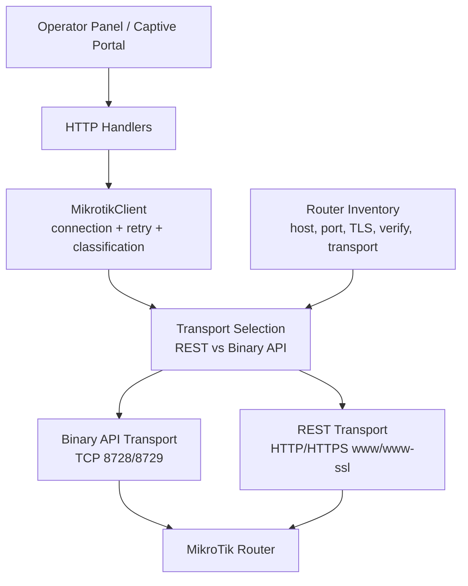
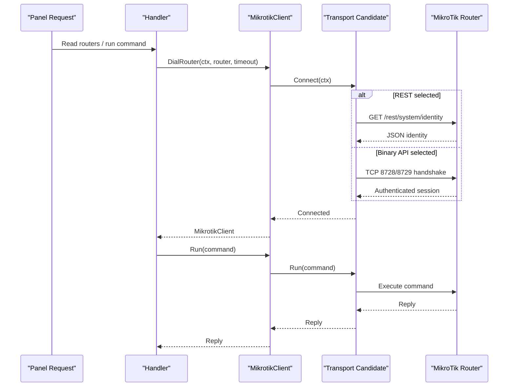
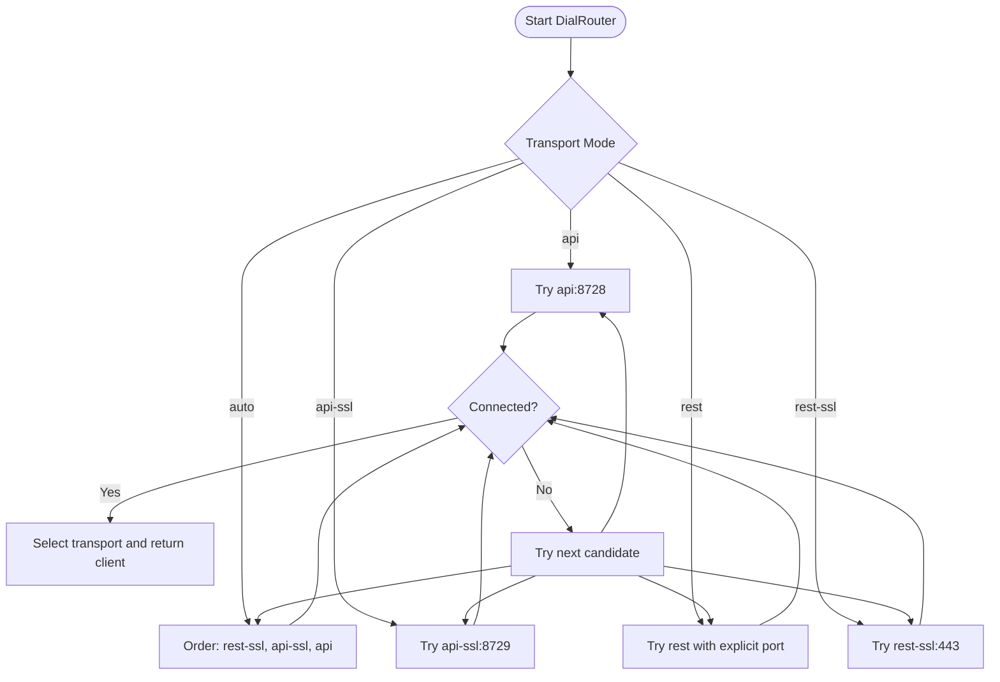
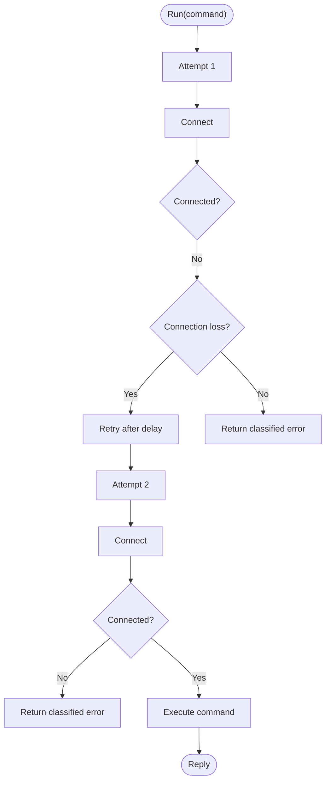
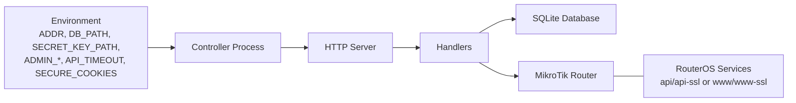

# Connectivity Issues

<cite>
**Referenced Files in This Document**
- [README.md](file://README.md)
- [INSTALLATION.md](file://INSTALLATION.md)
- [config.go](file://config.go)
- [database/routers.go](file://database/routers.go)
- [handlers/mikrotik.go](file://handlers/mikrotik.go)
- [handlers/mikrotik_ros.go](file://handlers/mikrotik_ros.go)
- [handlers/mikrotik_rest.go](file://handlers/mikrotik_rest.go)
- [handlers/routers.go](file://handlers/routers.go)
</cite>

## Table of Contents
1. [Introduction](#introduction)
2. [Project Structure](#project-structure)
3. [Core Components](#core-components)
4. [Architecture Overview](#architecture-overview)
5. [Detailed Component Analysis](#detailed-component-analysis)
6. [Dependency Analysis](#dependency-analysis)
7. [Performance Considerations](#performance-considerations)
8. [Troubleshooting Guide](#troubleshooting-guide)
9. [Conclusion](#conclusion)

## Introduction
This document explains how the Aircoins controller connects to MikroTik routers and provides a practical troubleshooting guide for connectivity problems. It covers API connection failures, SSL/TLS certificate errors, firewall blocking, timeouts, RouterOS version compatibility, authentication failures, rate limiting, proxy configuration, DNS resolution, and port forwarding requirements.

The controller supports two access paths:
- Legacy binary RouterOS API on TCP 8728 or 8729 (TLS).
- RouterOS v7 REST API over HTTP/HTTPS through the `www` or `www-ssl` service.

It also auto-detects the working transport when configured as `auto`, preferring secure transports first.

**Section sources**
- [README.md:167-185](file://README.md#L167-L185)
- [INSTALLATION.md:65-81](file://INSTALLATION.md#L65-L81)

## Project Structure
The connectivity logic is concentrated in the handlers layer, with router inventory and transport selection stored in the database model.

**Diagram sources**
- [handlers/mikrotik.go:160-240](file://handlers/mikrotik.go#L160-L240)
- [handlers/mikrotik_ros.go:10-31](file://handlers/mikrotik_ros.go#L10-L31)
- [handlers/mikrotik_rest.go:49-94](file://handlers/mikrotik_rest.go#L49-L94)
- [database/routers.go:19-29](file://database/routers.go#L19-L29)

**Section sources**
- [handlers/mikrotik.go:160-240](file://handlers/mikrotik.go#L160-L240)
- [database/routers.go:57-98](file://database/routers.go#L57-L98)

## Core Components
- **MikrotikClient**: owns per-router connection state, retries dropped connections once, classifies errors into sentinel types, and exposes commands such as device info, hotspot client listing, login, and IP binding management.
- **Transport selection**: chooses between REST and binary API based on the router’s configured transport mode, last successful transport, and security policy. Auto mode probes secure transports first.
- **Binary API transport**: uses the legacy RouterOS API over TCP, authenticating during the handshake.
- **REST transport**: speaks RouterOS v7 REST over HTTP/HTTPS, maps console commands to HTTP methods, and enriches traffic counters where needed.
- **Router inventory**: stores host, port, username, encrypted password, TLS settings, verification preference, transport mode, REST port, portal tag, and last status/error.

Key behaviors relevant to troubleshooting:
- Default timeout is 12 seconds unless overridden by `API_TIMEOUT`.
- Auto mode never sends credentials to an unconfigured plain HTTP REST endpoint; it requires an explicit port.
- TLS defaults to minimum TLS 1.2; certificate verification is opt-in because MikroTik ships self-signed certificates by default.
- Connection loss is retried once; other errors are returned immediately.

**Section sources**
- [handlers/mikrotik.go:23-48](file://handlers/mikrotik.go#L23-L48)
- [handlers/mikrotik.go:160-240](file://handlers/mikrotik.go#L160-L240)
- [handlers/mikrotik.go:413-460](file://handlers/mikrotik.go#L413-L460)
- [handlers/mikrotik.go:477-520](file://handlers/mikrotik.go#L477-L520)
- [handlers/mikrotik_ros.go:10-31](file://handlers/mikrotik_ros.go#L10-L31)
- [handlers/mikrotik_rest.go:49-94](file://handlers/mikrotik_rest.go#L49-L94)
- [database/routers.go:57-98](file://database/routers.go#L57-L98)

## Architecture Overview
The controller builds one `MikrotikClient` per registered router. When connecting, it enumerates candidate transports, dials each with a bounded timeout, authenticates, and remembers the winning transport. Subsequent commands reuse that transport and reconnect only when the underlying socket is lost.

**Diagram sources**
- [handlers/mikrotik.go:186-240](file://handlers/mikrotik.go#L186-L240)
- [handlers/mikrotik_rest.go:99-109](file://handlers/mikrotik_rest.go#L99-L109)
- [handlers/mikrotik_ros.go:25-31](file://handlers/mikrotik_ros.go#L25-L31)

**Section sources**
- [handlers/mikrotik.go:186-240](file://handlers/mikrotik.go#L186-L240)

## Detailed Component Analysis

### Error Classification and User-Facing Messages
The controller converts low-level network and RouterOS errors into typed sentinels so operators can understand what failed without parsing device text.

| Sentinel | Meaning | Typical Cause | Operator Hint |
|---|---|---|---|
| `ErrRouterUnreachable` | Device did not accept the API connection | Wrong IP/port, firewall block, disabled service, DNS failure | Check IP, port, `/ip/service`, firewall, and whether `www`/`www-ssl` or `api`/`api-ssl` is enabled. |
| `ErrRouterAuth` | Credentials rejected | Wrong username/password, wrong API user group, REST user lacks permission | Verify API user, password, and permissions. |
| `ErrRouterTimeout` | No response within timeout | Network delay, overloaded router, too short timeout | Increase `API_TIMEOUT`, check load, confirm reachability. |
| `ErrRouterNoCommand` | Command unavailable | Missing hotspot package, unsupported RouterOS build, wrong menu | Enable hotspot, use supported RouterOS version, or adjust command. |
| `ErrRouterPermission` | Account lacks required rights | API user missing read/write on hotspot menus | Grant appropriate permissions. |
| `ErrRouterNotFound` | Object does not exist | Missing profile/user/binding | Create the object or correct the identifier. |
| `ErrRouterConflict` | Object already exists | Duplicate add | Skip or update existing object. |
| `ErrRouterUnknownHost` | Hotspot does not know the client yet | Login before MAC/IP is known | Retry with MAC-only login path. |

**Section sources**
- [handlers/mikrotik.go:23-48](file://handlers/mikrotik.go#L23-L48)
- [handlers/mikrotik.go:89-113](file://handlers/mikrotik.go#L89-L113)
- [handlers/mikrotik.go:522-584](file://handlers/mikrotik.go#L522-L584)

### Transport Selection and Auto Mode
Auto mode tries secure REST first, then secure binary API, then plain binary API. Plain HTTP REST is deliberately excluded from automatic probing because sending credentials to an unrelated web server on port 80 would be unsafe. If REST over HTTP is explicitly selected, the operator must provide the actual `www` port.

**Diagram sources**
- [handlers/mikrotik.go:272-354](file://handlers/mikrotik.go#L272-L354)
- [handlers/mikrotik.go:202-240](file://handlers/mikrotik.go#L202-L240)

**Section sources**
- [handlers/mikrotik.go:272-354](file://handlers/mikrotik.go#L272-L354)
- [handlers/mikrotik.go:202-240](file://handlers/mikrotik.go#L202-L240)
- [database/routers.go:19-49](file://database/routers.go#L19-L49)

### TLS and Certificate Handling
- Minimum TLS version is 1.2.
- For both binary API-SSL and REST-SSL, certificate verification is disabled by default because MikroTik ships self-signed certificates.
- Operators can enable strict verification per router using the “Verify certificate” option.
- A certificate verification error is surfaced as an unreachable-style error with a hint to install a trusted certificate or disable verification.

**Section sources**
- [handlers/mikrotik.go:440-448](file://handlers/mikrotik.go#L440-L448)
- [handlers/mikrotik_rest.go:79-93](file://handlers/mikrotik_rest.go#L79-L93)
- [handlers/mikrotik_rest.go:452-457](file://handlers/mikrotik_rest.go#L452-L457)
- [database/routers.go:67-71](file://database/routers.go#L67-L71)

### Timeout Configuration and Retries
- The default per-call timeout is 12 seconds.
- `API_TIMEOUT` overrides this value.
- During auto probing, each candidate attempt is capped so multiple candidates do not multiply the total wait time excessively.
- A dropped connection is retried once after a short delay; non-retryable errors fail immediately.

**Diagram sources**
- [handlers/mikrotik.go:477-520](file://handlers/mikrotik.go#L477-L520)
- [handlers/mikrotik.go:151-158](file://handlers/mikrotik.go#L151-L158)
- [handlers/mikrotik.go:356-363](file://handlers/mikrotik.go#L356-L363)

**Section sources**
- [config.go:26-31](file://config.go#L26-L31)
- [handlers/mikrotik.go:151-158](file://handlers/mikrotik.go#L151-L158)
- [handlers/mikrotik.go:356-363](file://handlers/mikrotik.go#L356-L363)
- [handlers/mikrotik.go:477-520](file://handlers/mikrotik.go#L477-L520)

### REST vs Binary API Differences
- Binary API uses a persistent TCP socket and authenticates during the handshake.
- REST uses HTTP/HTTPS and Basic Authentication; it verifies credentials once per session by reading `/system/identity`.
- REST translates console commands to HTTP methods and falls back to the universal POST form when a menu rejects a CRUD verb.
- Traffic counters requiring the binary API’s `.sum` operator are enriched via `/interface/monitor-traffic` when possible.

**Section sources**
- [handlers/mikrotik_ros.go:10-31](file://handlers/mikrotik_ros.go#L10-L31)
- [handlers/mikrotik_rest.go:1-17](file://handlers/mikrotik_rest.go#L1-L17)
- [handlers/mikrotik_rest.go:99-146](file://handlers/mikrotik_rest.go#L99-L146)
- [handlers/mikrotik_rest.go:148-169](file://handlers/mikrotik_rest.go#L148-L169)

## Dependency Analysis
The controller depends on:
- RouterOS services: `api`/`api-ssl` for binary API, `www`/`www-ssl` for REST.
- Network stack: TCP connectivity, DNS resolution, TLS handshake.
- Environment configuration: listen address, database path, master key, API timeout, and optional reverse proxy headers.

**Diagram sources**
- [README.md:70-89](file://README.md#L70-L89)
- [INSTALLATION.md:101-105](file://INSTALLATION.md#L101-L105)
- [handlers/mikrotik.go:186-240](file://handlers/mikrotik.go#L186-L240)

**Section sources**
- [README.md:70-89](file://README.md#L70-L89)
- [INSTALLATION.md:101-105](file://INSTALLATION.md#L101-L105)

## Performance Considerations
- Keep `API_TIMEOUT` reasonable for your network and router load. Too low causes false timeouts; too high makes the panel feel sluggish.
- Prefer REST-SSL or API-SSL in production to avoid sending credentials over plain HTTP.
- Use `auto` transport only when unsure; once a transport succeeds, the controller records it and avoids repeated probing.
- Avoid unnecessary polling of hotspot clients or interface statistics; these call RouterOS APIs and may trigger additional REST calls for traffic enrichment.

[No sources needed since this section provides general guidance]

## Troubleshooting Guide

### 1. Router Is Offline or Unreachable
**Symptoms:**
- Dashboard shows offline.
- Errors mention the device being unreachable or nothing listening on the port.

**Likely Causes:**
- Wrong IP or port.
- Firewall blocks the controller IP.
- Required RouterOS service is disabled.
- DNS cannot resolve the hostname.
- REST selected but no `www`/`www-ssl` service is active.

**Diagnostic Steps:**
1. Confirm the controller can reach the router’s API port:
   - For binary API: test TCP 8728 or 8729.
   - For REST: test HTTP/HTTPS to the `www` or `www-ssl` port.
2. On the router, verify the service:
   - Binary API: `/ip service print` should show `api` or `api-ssl`.
   - REST: `/ip service print` should show `www` or `www-ssl`.
3. Allow the controller’s board IP under `/ip service`.
4. Check the controller logs for the endpoint it tried and the selected transport.

**Resolution:**
- Correct the host, port, and transport setting.
- Enable the required service and allow the controller IP.
- If using REST over HTTP, explicitly set the `Web port for REST`; auto mode will not guess port 80.

**Section sources**
- [handlers/mikrotik_rest.go:461-468](file://handlers/mikrotik_rest.go#L461-L468)
- [handlers/mikrotik.go:202-210](file://handlers/mikrotik.go#L202-L210)
- [INSTALLATION.md:65-81](file://INSTALLATION.md#L65-L81)
- [INSTALLATION.md:148-152](file://INSTALLATION.md#L148-L152)

### 2. API Authentication Failed
**Symptoms:**
- Error indicates authentication was rejected.
- REST returns unauthorized or forbidden.
- Binary API handshake fails.

**Likely Causes:**
- Wrong username or password.
- API user lacks required permissions.
- REST user lacks permission for the target menu.
- Using the wrong transport for the configured service.

**Diagnostic Steps:**
1. Verify the API username and decrypted password are correct.
2. Ensure the API user has read/write access to hotspot menus.
3. For REST, confirm the user has permission for the requested menu.
4. Confirm the transport matches the enabled service:
   - `api`/`api-ssl` for binary API.
   - `rest`/`rest-ssl` for REST.

**Resolution:**
- Fix credentials or reset the router API password.
- Grant the API user appropriate permissions.
- Select the correct transport mode in the router inventory.

**Section sources**
- [handlers/mikrotik.go:23-48](file://handlers/mikrotik.go#L23-L48)
- [handlers/mikrotik.go:563-584](file://handlers/mikrotik.go#L563-L584)
- [handlers/mikrotik_rest.go:393-444](file://handlers/mikrotik_rest.go#L393-L444)

### 3. SSL/TLS Certificate Errors
**Symptoms:**
- HTTPS connection fails with certificate verification error.
- API-SSL or REST-SSL dial fails.

**Likely Causes:**
- Self-signed certificate not trusted.
- Hostname mismatch.
- TLS version too old.
- Verification enabled but certificate chain incomplete.

**Diagnostic Steps:**
1. Check whether the router presents a self-signed certificate.
2. Verify the hostname used for TLS matches the certificate.
3. Confirm minimum TLS 1.2 is supported.
4. Decide whether to trust the router’s certificate or install a CA-signed certificate.

**Resolution:**
- For quick setups, leave certificate verification disabled per router.
- For production, install a trusted certificate and enable verification.
- Ensure the controller trusts the issuing CA if verification is enabled.

**Section sources**
- [handlers/mikrotik.go:440-448](file://handlers/mikrotik.go#L440-L448)
- [handlers/mikrotik_rest.go:79-93](file://handlers/mikrotik_rest.go#L79-L93)
- [handlers/mikrotik_rest.go:452-457](file://handlers/mikrotik_rest.go#L452-L457)
- [database/routers.go:67-71](file://database/routers.go#L67-L71)

### 4. Firewall Blocking
**Symptoms:**
- Connection refused or no route to host.
- Port appears closed.
- Controller logs show dial failures.

**Likely Causes:**
- RouterOS firewall blocks the controller IP.
- Host firewall blocks outbound or inbound traffic.
- Reverse proxy or NAT misconfiguration.

**Diagnostic Steps:**
1. From the controller host, try reaching the router’s API port directly.
2. On the router, check `/ip firewall filter` and `/ip service`.
3. If behind a reverse proxy, ensure the proxy forwards to the correct internal address.

**Resolution:**
- Add an allow rule for the controller IP to the router’s API service.
- Open the necessary ports on the host firewall.
- Configure DNAT or port forwarding consistently with the controller’s expected address.

**Section sources**
- [handlers/mikrotik.go:595-621](file://handlers/mikrotik.go#L595-L621)
- [handlers/mikrotik_rest.go:461-468](file://handlers/mikrotik_rest.go#L461-L468)
- [INSTALLATION.md:264-283](file://INSTALLATION.md#L264-L283)

### 5. Timeout Issues
**Symptoms:**
- Errors indicate the request timed out or took too long.
- Page loads hang briefly before failing.

**Likely Causes:**
- Network latency or packet loss.
- Overloaded router.
- Timeout too short for the environment.
- Auto probing multiple transports adds latency.

**Diagnostic Steps:**
1. Check `API_TIMEOUT`.
2. Reduce transport probing by selecting the exact transport instead of `auto`.
3. Monitor router CPU load and uptime.
4. Test API responsiveness manually.

**Resolution:**
- Increase `API_TIMEOUT` if the network is slow.
- Pin the transport to the working protocol.
- Investigate router performance issues.

**Section sources**
- [config.go:26-31](file://config.go#L26-L31)
- [handlers/mikrotik.go:356-363](file://handlers/mikrotik.go#L356-L363)
- [handlers/mikrotik.go:522-560](file://handlers/mikrotik.go#L522-L560)

### 6. RouterOS Version Compatibility
**Symptoms:**
- Commands fail with “unknown command”.
- Hotspot features are missing.
- REST endpoints return method not allowed or not acceptable.

**Likely Causes:**
- Hotspot package disabled.
- Older RouterOS version lacking REST support.
- Unsupported command syntax.

**Diagnostic Steps:**
1. Check the router version and installed packages.
2. Confirm hotspot is enabled.
3. Try the same command over the binary API if REST fails.
4. Use `auto` transport to let the controller pick the best available protocol.

**Resolution:**
- Enable the hotspot package.
- Upgrade RouterOS if REST is required.
- Fall back to binary API on older devices.

**Section sources**
- [handlers/mikrotik.go:34-36](file://handlers/mikrotik.go#L34-L36)
- [handlers/mikrotik.go:563-584](file://handlers/mikrotik.go#L563-L584)
- [handlers/mikrotik_rest.go:134-146](file://handlers/mikrotik_rest.go#L134-L146)
- [INSTALLATION.md:70-81](file://INSTALLATION.md#L70-L81)

### 7. Rate Limiting Problems
**Symptoms:**
- Frequent connection drops or transient failures.
- UI reports connection loss repeatedly.

**Likely Causes:**
- Excessive polling of hotspot clients or interface stats.
- Repeated manual operations causing rapid API calls.
- Router throttling or resource exhaustion.

**Diagnostic Steps:**
1. Review how often the controller polls live data.
2. Avoid triggering many write operations in quick succession.
3. Check router CPU and memory usage.

**Resolution:**
- Reduce polling frequency where possible.
- Batch operations carefully.
- Investigate router capacity and hotspot scale.

**Section sources**
- [handlers/mikrotik.go:477-520](file://handlers/mikrotik.go#L477-L520)
- [handlers/mikrotik.go:595-621](file://handlers/mikrotik.go#L595-L621)

### 8. Proxy Configuration Issues
**Symptoms:**
- Panel works only through a reverse proxy.
- Client IPs appear as proxy addresses.
- Secure cookies behave unexpectedly.

**Likely Causes:**
- Controller running behind nginx/Caddy without proper headers.
- `SECURE_COOKIES` not set when terminating TLS at the proxy.
- `ADDR` bound to localhost while external access expects the proxy.

**Diagnostic Steps:**
1. Confirm the proxy forwards `Host`, `X-Real-IP`, `X-Forwarded-For`, and `X-Forwarded-Proto`.
2. Set `SECURE_COOKIES=1` when TLS terminates at the proxy.
3. Bind `ADDR` appropriately, e.g., `127.0.0.1:8080`, and expose it only through the proxy.

**Resolution:**
- Update proxy configuration to forward required headers.
- Restart the controller after changing environment variables.

**Section sources**
- [INSTALLATION.md:236-258](file://INSTALLATION.md#L236-L258)
- [README.md:139-140](file://README.md#L139-L140)

### 9. DNS Resolution Problems
**Symptoms:**
- Controller cannot resolve the router hostname.
- Hotspot redirect points to a name that resolves differently.

**Likely Causes:**
- Missing or incorrect DNS entries.
- DHCP handing out the controller’s address dynamically.
- Router resolving the portal name differently than clients.

**Diagnostic Steps:**
1. Resolve the controller hostname from the router and from clients.
2. Pin the controller’s DHCP lease if it changes.
3. Add a static DNS entry for the controller on the router if needed.

**Resolution:**
- Make the controller address static.
- Add a DNS record pointing the desired name to the controller IP.
- Ensure hotspot redirect parameters preserve the intended host.

**Section sources**
- [INSTALLATION.md:264-283](file://INSTALLATION.md#L264-L283)
- [README.md:167-185](file://README.md#L167-L185)

### 10. Port Forwarding Requirements
**Symptoms:**
- Clients cannot reach the captive portal through the router’s public address.
- Panel is reachable locally but not remotely.

**Likely Causes:**
- Router’s own port 80 is owned by the hotspot service.
- No DNAT rule for the panel.
- External firewall blocks the forwarded port.

**Diagnostic Steps:**
1. Determine which address clients use to reach the portal.
2. Check whether the router’s port 80 is intercepted by the hotspot.
3. Add a DNAT rule to forward a free port to the controller.
4. Verify external firewall rules.

**Resolution:**
- Use DNAT to forward a dedicated port to the controller’s port 80 or alternate port.
- Keep the hotspot login page action synchronized with the address clients actually use.

**Section sources**
- [INSTALLATION.md:264-283](file://INSTALLATION.md#L264-L283)

### 11. Manual Endpoint Testing Procedures
Use these steps to isolate whether the problem is network, authentication, or command-related.

**Binary API (8728/8729):**
1. Confirm TCP connectivity to 8728 or 8729.
2. If using TLS, verify certificate trust or temporary verification behavior.
3. Test login with the configured API user.
4. Run a simple command such as `/system/identity/print`.

**REST API (www/www-ssl):**
1. Confirm HTTP/HTTPS connectivity to the `www` or `www-ssl` port.
2. Send a basic authenticated request to `/rest/system/identity`.
3. If using HTTPS, validate the certificate chain.
4. Try a hotspot command such as `/ip/hotspot/active/print`.

**Expected Outcomes:**
- Successful identity response means connectivity and authentication work.
- Unauthorized or forbidden means credential or permission issues.
- Method not allowed or not acceptable suggests REST mapping or RouterOS version differences.
- Connection refused or timeout means network/service availability issues.

**Section sources**
- [handlers/mikrotik_rest.go:99-109](file://handlers/mikrotik_rest.go#L99-L109)
- [handlers/mikrotik_rest.go:346-391](file://handlers/mikrotik_rest.go#L346-L391)
- [handlers/mikrotik_ros.go:25-46](file://handlers/mikrotik_ros.go#L25-L46)

### 12. Error Message Reference and Resolutions
| Error Area | Example Meaning | Step-by-Step Resolution |
|---|---|---|
| Device unreachable | Nothing is listening on that port or the device is not reachable. | Verify IP/port, enable `www`/`www-ssl` or `api`/`api-ssl`, allow controller IP, check firewall. |
| Authentication failed | Username or password rejected. | Reset API password, verify user group, confirm transport matches service. |
| Timeout | Device did not answer in time. | Increase `API_TIMEOUT`, reduce probe count, check router load. |
| Unknown command | RouterOS does not recognize the command. | Enable hotspot, upgrade RouterOS, or use binary API fallback. |
| Permission denied | API account lacks permission. | Grant read/write on hotspot menus. |
| Object not found | Profile, user, or binding missing. | Create the object or correct the ID. |
| Certificate rejected | HTTPS certificate verification failed. | Install trusted certificate or disable verification for self-signed setup. |
| REST requires explicit port | Plain HTTP REST was selected without a port. | Enter the actual `www` port or switch to HTTPS REST. |

**Section sources**
- [handlers/mikrotik.go:89-113](file://handlers/mikrotik.go#L89-L113)
- [handlers/mikrotik.go:522-584](file://handlers/mikrotik.go#L522-L584)
- [handlers/mikrotik_rest.go:393-476](file://handlers/mikrotik_rest.go#L393-L476)
- [handlers/mikrotik.go:202-210](file://handlers/mikrotik.go#L202-L210)

## Conclusion
Most MikroTik connectivity issues fall into three categories: network/service availability, authentication/permissions, and TLS/certificate configuration. The controller’s transport selection, error classification, and timeout handling make it resilient to transient failures, but accurate router inventory, correct service exposure, and sensible timeout values are essential. Use the diagnostic steps above to isolate the failure point, then apply the corresponding resolution.

[No sources needed since this section summarizes without analyzing specific files]