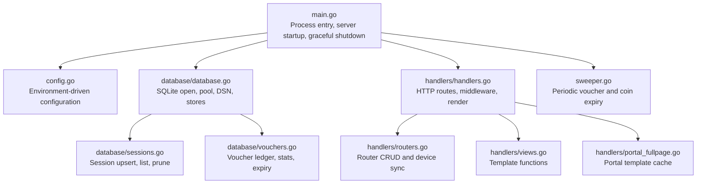
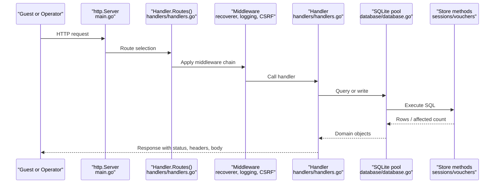
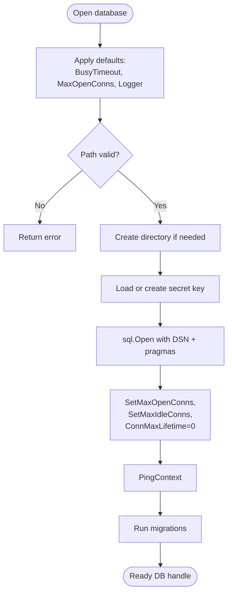
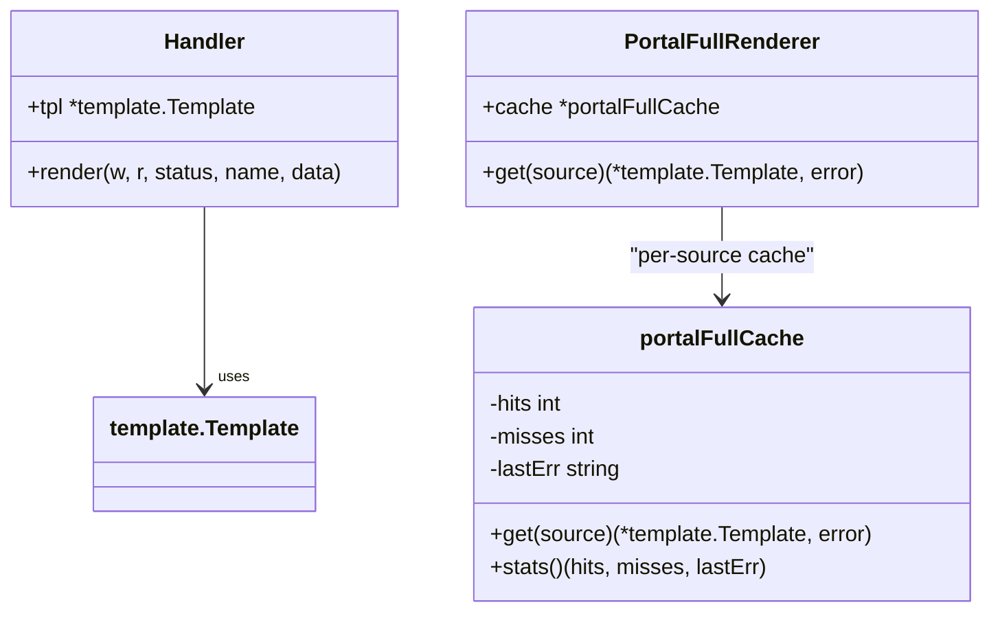
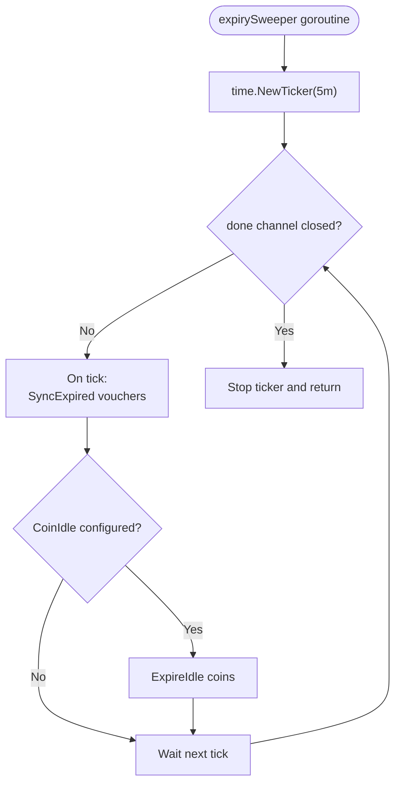
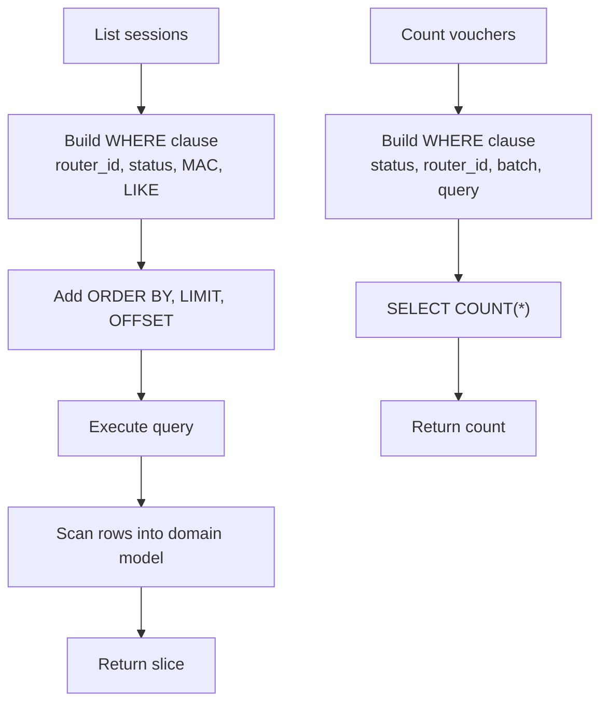
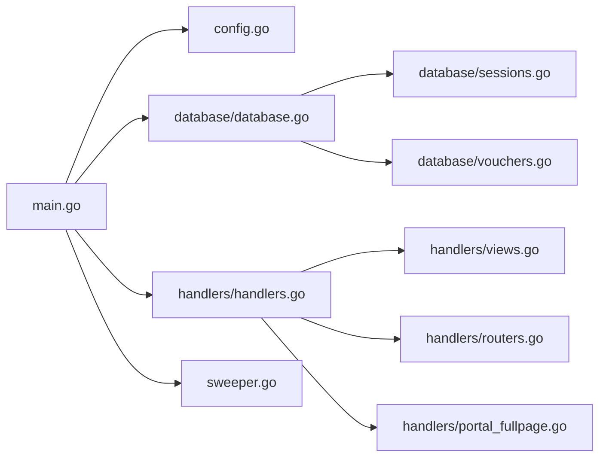

# Performance and Scalability

<cite>
**Referenced Files in This Document**
- [main.go](file://main.go)
- [config.go](file://config.go)
- [sweeper.go](file://sweeper.go)
- [database/database.go](file://database/database.go)
- [database/sessions.go](file://database/sessions.go)
- [database/vouchers.go](file://database/vouchers.go)
- [handlers/handlers.go](file://handlers/handlers.go)
- [handlers/routers.go](file://handlers/routers.go)
- [handlers/portal_fullpage.go](file://handlers/portal_fullpage.go)
- [handlers/views.go](file://handlers/views.go)
</cite>

## Table of Contents
1. [Introduction](#introduction)
2. [Project Structure](#project-structure)
3. [Core Components](#core-components)
4. [Architecture Overview](#architecture-overview)
5. [Detailed Component Analysis](#detailed-component-analysis)
6. [Dependency Analysis](#dependency-analysis)
7. [Performance Considerations](#performance-considerations)
8. [Troubleshooting Guide](#troubleshooting-guide)
9. [Conclusion](#conclusion)
10. [Appendices](#appendices)

## Introduction
This document explains how to identify and resolve performance bottlenecks and scalability issues in the Aircoins MikroTik Controller. It focuses on:
- Memory leak detection and CPU usage optimization
- Database query performance tuning for SQLite
- Slow response time diagnosis
- Connection pool exhaustion prevention
- Background task scheduling reliability
- Multi-instance deployment, load balancing, and monitoring
- Profiling, query analysis, template rendering optimization
- Capacity planning and production monitoring setup

The controller is a single-process Go HTTP server backed by SQLite, with an admin dashboard, captive portal, voucher engine, and router inventory management. Its design favors small connection pools, bounded request timeouts, embedded templates, and periodic background maintenance.

## Project Structure
At a high level, the application consists of:
- Entry point and lifecycle management
- Configuration loading from environment variables
- HTTP handler layer with middleware
- SQLite persistence layer
- Background expiry sweeper
- Embedded HTML templates

**Diagram sources**
- [main.go:214-285](file://main.go#L214-L285)
- [config.go:20-77](file://config.go#L20-L77)
- [database/database.go:70-116](file://database/database.go#L70-L116)
- [handlers/handlers.go:222-303](file://handlers/handlers.go#L222-L303)
- [handlers/routers.go:187-227](file://handlers/routers.go#L187-L227)
- [handlers/views.go:12-41](file://handlers/views.go#L12-L41)
- [handlers/portal_fullpage.go:113-130](file://handlers/portal_fullpage.go#L113-L130)
- [database/sessions.go:101-178](file://database/sessions.go#L101-L178)
- [database/vouchers.go:561-576](file://database/vouchers.go#L561-L576)

**Section sources**
- [main.go:1-57](file://main.go#L1-L57)
- [config.go:14-77](file://config.go#L14-L77)
- [handlers/handlers.go:1-173](file://handlers/handlers.go#L1-L173)

## Core Components
Key components that most directly affect performance and scalability:
- HTTP server lifecycle and timeouts
- SQLite connection pool and pragmas
- Request logging and recovery middleware
- Template parsing and caching
- Background expiry sweeper
- Session and voucher database operations

Important characteristics:
- The server uses bounded read/write/idle timeouts and graceful shutdown.
- SQLite uses a small default connection pool and WAL mode.
- Templates are parsed once at startup; the operator’s custom portal page is cached per source.
- Background tasks run every five minutes and use short-lived contexts.
- Requests log method, path, status, bytes, client IP, and duration.

**Section sources**
- [main.go:246-285](file://main.go#L246-L285)
- [database/database.go:49-60](file://database/database.go#L49-L60)
- [database/database.go:118-133](file://database/database.go#L118-L133)
- [handlers/handlers.go:443-496](file://handlers/handlers.go#L443-L496)
- [handlers/portal_fullpage.go:104-130](file://handlers/portal_fullpage.go#L104-L130)
- [sweeper.go:11-52](file://sweeper.go#L11-L52)

## Architecture Overview
The runtime architecture centers on one process serving two audiences:
- Guests through the captive portal
- Operators through the admin panel

**Diagram sources**
- [main.go:246-285](file://main.go#L246-L285)
- [handlers/handlers.go:222-303](file://handlers/handlers.go#L222-L303)
- [handlers/handlers.go:443-496](file://handlers/handlers.go#L443-L496)
- [database/database.go:70-116](file://database/database.go#L70-L116)
- [database/sessions.go:248-269](file://database/sessions.go#L248-L269)
- [database/vouchers.go:305-354](file://database/vouchers.go#L305-L354)

## Detailed Component Analysis

### HTTP Server Lifecycle and Timeouts
The server sets explicit timeouts for header reading, reads, writes, and idle connections. It starts a background sweeper, registers signal handling, and performs graceful shutdown.

Performance implications:
- Short read timeouts protect against slow clients.
- Write timeouts bound long-running responses.
- Idle timeout controls connection reuse under reverse proxies.
- Graceful shutdown ensures in-flight requests can finish within a bounded window.

Recommended tuning:
- Increase `ReadTimeout` and `WriteTimeout` only if backend calls (RouterOS API, database) legitimately take longer.
- Keep `IdleTimeout` aligned with reverse proxy keepalive settings.
- Monitor `duration_ms` in access logs to detect slow endpoints.

**Section sources**
- [main.go:246-285](file://main.go#L246-L285)

### Configuration and Resource Controls
Configuration is loaded from environment variables. Notable performance-related options include:
- `API_TIMEOUT`: bounds RouterOS API calls.
- `ADMIN_SESSION_TTL`: session lifetime.
- `COIN_IDLE_TTL`: balance release window.
- `ADDR`: listen address.

Recommendations:
- Set `API_TIMEOUT` based on observed RouterOS latency.
- Avoid excessively large session TTLs if memory pressure exists.
- Validate `ADDR` and ensure it does not conflict with other services.

**Section sources**
- [config.go:20-77](file://config.go#L20-L77)

### SQLite Connection Pool and Pragma Settings
The database package opens a pooled SQLite connection with:
- Small default pool size
- Busy timeout
- WAL journal mode
- Foreign keys enabled
- Normal synchronous setting

**Diagram sources**
- [database/database.go:49-60](file://database/database.go#L49-L60)
- [database/database.go:70-116](file://database/database.go#L70-L116)
- [database/database.go:118-133](file://database/database.go#L118-L133)

Key guidance:
- Do not increase `MaxOpenConns` blindly; SQLite serializes writers, so a small pool is often faster.
- Tune `BusyTimeout` when contention occurs during concurrent writes.
- Use WAL mode for better concurrency between readers and writers.
- Monitor disk I/O and file lock waits.

**Section sources**
- [database/database.go:30-47](file://database/database.go#L30-L47)
- [database/database.go:70-116](file://database/database.go#L70-L116)
- [database/database.go:118-133](file://database/database.go#L118-L133)

### Request Logging, Recovery, and Security Middleware
The handler layer wraps all routes with:
- Panic recovery
- Access logging including duration
- Security headers
- CSRF protection
- Body size limits

Performance considerations:
- Logging adds overhead; consider structured JSON logging in production.
- CSRF parsing may trigger form parsing; ensure multipart uploads are limited.
- Body size limits prevent memory exhaustion from large POSTs.

Optimization tips:
- Use sampling for high-volume endpoints.
- Avoid heavy work in middleware.
- Ensure CSP and headers do not cause excessive revalidation.

**Section sources**
- [handlers/handlers.go:443-590](file://handlers/handlers.go#L443-L590)
- [handlers/handlers.go:479-496](file://handlers/handlers.go#L479-L496)

### Template Rendering and Caching
Templates are parsed once at startup using embedded filesystem. The operator’s full-page portal template is compiled and cached per source.

**Diagram sources**
- [handlers/handlers.go:748-775](file://handlers/handlers.go#L748-L775)
- [handlers/portal_fullpage.go:104-130](file://handlers/portal_fullpage.go#L104-L130)

Guidance:
- Keep templates lean; avoid expensive computations inside templates.
- Precompute values in handlers before rendering.
- Use the portal template cache to avoid repeated compilation.
- Monitor template errors and invalidation behavior.

**Section sources**
- [handlers/views.go:12-41](file://handlers/views.go#L12-L41)
- [handlers/handlers.go:748-775](file://handlers/handlers.go#L748-L775)
- [handlers/portal_fullpage.go:104-130](file://handlers/portal_fullpage.go#L104-L130)

### Background Task Scheduling
The expiry sweeper runs every five minutes to:
- Expire vouchers
- Release idle coin balances

**Diagram sources**
- [sweeper.go:11-52](file://sweeper.go#L11-L52)

Best practices:
- Always cancel contexts used by background tasks.
- Bound background work with timeouts.
- Log failures without blocking the ticker.
- Ensure cleanup paths close tickers and channels.

**Section sources**
- [sweeper.go:11-52](file://sweeper.go#L11-L52)

### Database Query Performance
Session and voucher stores use parameterized queries, pagination, and aggregation.

Key patterns:
- Session listing uses LIMIT/OFFSET with normalized limits.
- Voucher listing and counting support filters and pagination.
- Stats queries aggregate counts and monetary totals.
- Sync operations use transactions and upserts.

**Diagram sources**
- [database/sessions.go:248-269](file://database/sessions.go#L248-L269)
- [database/sessions.go:281-310](file://database/sessions.go#L281-L310)
- [database/vouchers.go:305-354](file://database/vouchers.go#L305-L354)
- [database/vouchers.go:356-389](file://database/vouchers.go#L356-L389)

Optimization recommendations:
- Add indexes for frequently filtered columns such as `router_id`, `ended_at`, `status`, and lookup keys.
- Avoid unbounded LIKE searches; prefer exact matches where possible.
- Use pagination and limit results in UI lists.
- Batch updates and deletes where safe.
- Monitor slow queries and adjust `BusyTimeout`.

**Section sources**
- [database/sessions.go:248-310](file://database/sessions.go#L248-L310)
- [database/vouchers.go:305-389](file://database/vouchers.go#L305-L389)
- [database/vouchers.go:705-713](file://database/vouchers.go#L705-L713)

### Router Inventory and Device Sync
Router handlers perform multiple database reads and optional RouterOS API calls. They also synchronize live sessions.

Performance risks:
- Multiple sequential database queries per request.
- Network calls to RouterOS with timeouts.
- Large snapshot processing.

Mitigations:
- Keep RouterOS calls within `APITimeout`.
- Cache non-critical data where appropriate.
- Limit snapshot sizes and avoid unnecessary fields.
- Handle partial failures gracefully.

**Section sources**
- [handlers/routers.go:187-227](file://handlers/routers.go#L187-L227)
- [handlers/routers.go:383-425](file://handlers/routers.go#L383-L425)
- [handlers/routers.go:481-553](file://handlers/routers.go#L481-L553)

## Dependency Analysis
High-level dependencies:
- `main` depends on configuration, database, handlers, and sweeper.
- Handlers depend on database stores and template engine.
- Database package provides pooled SQLite access and store interfaces.
- Background sweeper depends on database stores.

**Diagram sources**
- [main.go:10-28](file://main.go#L10-L28)
- [handlers/handlers.go:9-26](file://handlers/handlers.go#L9-L26)
- [database/database.go:9-21](file://database/database.go#L9-L21)

Potential coupling concerns:
- Heavy database reads in common pages can become bottlenecks.
- RouterOS network calls add latency and failure modes.
- Background tasks must not block request handling.

**Section sources**
- [main.go:214-285](file://main.go#L214-L285)
- [handlers/handlers.go:222-303](file://handlers/handlers.go#L222-L303)
- [database/database.go:70-116](file://database/database.go#L70-L116)

## Performance Considerations

### Memory Leak Detection
Symptoms:
- Growing RSS over time
- Increasing heap allocations
- Goroutine leaks causing memory growth

Detection steps:
- Enable pprof endpoints behind authentication or internal networks.
- Compare heap profiles across restarts and sustained load.
- Inspect goroutine profiles for leaked goroutines.
- Review background goroutines and their cleanup paths.

Repository-relevant areas:
- Background sweeper goroutine and ticker cleanup
- HTTP server goroutines
- Template parsing and caching
- Database connection pool lifecycle

Actions:
- Ensure tickers and channels are closed on shutdown.
- Avoid storing large request-scoped objects in global caches.
- Reuse buffers where safe.
- Profile after deployments and under realistic traffic.

**Section sources**
- [main.go:255-285](file://main.go#L255-L285)
- [sweeper.go:19-52](file://sweeper.go#L19-L52)
- [handlers/portal_fullpage.go:104-130](file://handlers/portal_fullpage.go#L104-L130)

### CPU Usage Optimization
Common causes:
- Excessive template computation
- Large result set processing
- Frequent RouterOS API calls
- Inefficient database queries

Optimization strategies:
- Precompute values in handlers instead of templates.
- Reduce payload sizes and limit list results.
- Cache stable data such as router profiles and rates.
- Batch RouterOS calls where supported.
- Add database indexes for frequent filters.

**Section sources**
- [handlers/handlers.go:748-775](file://handlers/handlers.go#L748-L775)
- [handlers/routers.go:555-594](file://handlers/routers.go#L555-L594)
- [database/sessions.go:248-269](file://database/sessions.go#L248-L269)

### Database Query Performance Tuning
Focus areas:
- Pagination and limits
- Filtered queries
- Aggregations
- Transaction boundaries

Recommendations:
- Add indexes for:
  - `active_sessions.router_id`
  - `active_sessions.ended_at`
  - `vouchers.status`
  - `vouchers.router_id`
  - Lookup keys for voucher codes
- Avoid scanning entire tables for dashboards; use precomputed counters where feasible.
- Use WAL mode and tune busy timeout for write-heavy workloads.
- Monitor slow queries and adjust limits.

**Section sources**
- [database/database.go:118-133](file://database/database.go#L118-L133)
- [database/sessions.go:248-310](file://database/sessions.go#L248-L310)
- [database/vouchers.go:305-389](file://database/vouchers.go#L305-L389)

### Slow Response Times
Diagnosis checklist:
- Check access log `duration_ms` for hot endpoints.
- Identify RouterOS API latency and failures.
- Measure database query times.
- Inspect template rendering cost.
- Verify reverse proxy timeouts and buffering.

Remediation:
- Bound external calls with timeouts.
- Paginate and limit results.
- Cache stable data.
- Optimize queries and add indexes.
- Tune server timeouts and idle connections.

**Section sources**
- [handlers/handlers.go:479-496](file://handlers/handlers.go#L479-L496)
- [handlers/routers.go:383-425](file://handlers/routers.go#L383-L425)

### Connection Pool Exhaustion
Causes:
- Too many concurrent writers
- Long-running transactions
- Leaked connections
- Misconfigured pool size

Prevention:
- Keep `MaxOpenConns` small for SQLite.
- Avoid holding connections across long operations.
- Use short-lived contexts.
- Close rows and statements promptly.
- Monitor active connections and wait times.

**Section sources**
- [database/database.go:49-60](file://database/database.go#L49-L60)
- [database/database.go:95-116](file://database/database.go#L95-L116)

### Background Task Scheduling Problems
Issues:
- Ticker not stopped
- Context not canceled
- Blocking operations delaying next tick
- Errors swallowed without visibility

Fixes:
- Defer ticker stop.
- Use context timeouts.
- Log errors and continue.
- Ensure done channel closes cleanly.

**Section sources**
- [sweeper.go:19-52](file://sweeper.go#L19-L52)

### Scaling Considerations
Multi-instance deployment:
- SQLite is file-based; sharing one file across instances requires careful locking and WAL tuning.
- Prefer one instance per node or shared storage with strong consistency guarantees.
- Use health checks and readiness probes.

Load balancing:
- Sticky sessions are not required because sessions are stored in the database.
- Ensure consistent configuration across instances.
- Distribute traffic evenly and monitor per-instance metrics.

Resource utilization monitoring:
- Track CPU, memory, goroutines, and disk I/O.
- Monitor database locks and WAL size.
- Alert on slow requests and error rates.

**Section sources**
- [database/database.go:118-133](file://database/database.go#L118-L133)
- [handlers/handlers.go:296-303](file://handlers/handlers.go#L296-L303)

## Troubleshooting Guide

### Diagnosing High Memory Usage
Steps:
- Capture heap profile under load.
- Compare snapshots before and after restarts.
- Check for growing caches or unbounded collections.
- Review background goroutines and cleanup paths.

Relevant code areas:
- Background sweeper
- Template cache
- Request-scoped buffers

**Section sources**
- [sweeper.go:19-52](file://sweeper.go#L19-L52)
- [handlers/portal_fullpage.go:104-130](file://handlers/portal_fullpage.go#L104-L130)

### Diagnosing High CPU Usage
Steps:
- Capture CPU profile.
- Identify hot functions.
- Check template helpers and loops.
- Review RouterOS API call frequency.

Relevant code areas:
- Template rendering
- Router device snapshot loading
- Session and voucher list processing

**Section sources**
- [handlers/handlers.go:748-775](file://handlers/handlers.go#L748-L775)
- [handlers/routers.go:555-594](file://handlers/routers.go#L555-L594)
- [database/sessions.go:248-269](file://database/sessions.go#L248-L269)

### Resolving Slow Database Queries
Steps:
- Enable query logging in development.
- Analyze EXPLAIN plans for slow queries.
- Add indexes for filtered columns.
- Reduce result sets with pagination.

Relevant code areas:
- Session list and count
- Voucher list and count
- Stats aggregation

**Section sources**
- [database/sessions.go:248-310](file://database/sessions.go#L248-L310)
- [database/vouchers.go:305-389](file://database/vouchers.go#L305-L389)

### Fixing Connection Pool Exhaustion
Steps:
- Review `MaxOpenConns` and workload concurrency.
- Ensure connections are released.
- Avoid long transactions.
- Monitor pool metrics.

**Section sources**
- [database/database.go:49-60](file://database/database.go#L49-L60)
- [database/database.go:95-116](file://database/database.go#L95-L116)

### Recovering from Background Task Failures
Steps:
- Check logs for sweep failures.
- Verify database connectivity.
- Confirm ticker and context lifecycle.
- Restart service if necessary.

**Section sources**
- [sweeper.go:19-52](file://sweeper.go#L19-L52)

## Conclusion
The Aircoins MikroTik Controller is designed for simplicity and safety with SQLite, small connection pools, bounded timeouts, and embedded templates. For production performance and scalability:
- Profile memory and CPU regularly.
- Tune SQLite pragmas and connection pool settings for your workload.
- Optimize queries and add indexes.
- Keep templates lightweight and leverage caching.
- Ensure background tasks are robust and observable.
- Plan multi-instance deployments around SQLite constraints and use health checks and monitoring.

[No sources needed since this section summarizes without analyzing specific files]

## Appendices

### Production Monitoring Setup Checklist
- Enable structured logging and centralize logs.
- Expose pprof endpoints securely.
- Monitor:
  - Request rate, latency, and error rate
  - CPU, memory, goroutines
  - Disk I/O and SQLite WAL size
  - Database locks and slow queries
- Set alerts for:
  - High error rates
  - Slow requests
  - Connection pool saturation
  - Background task failures

[No sources needed since this section provides general guidance]