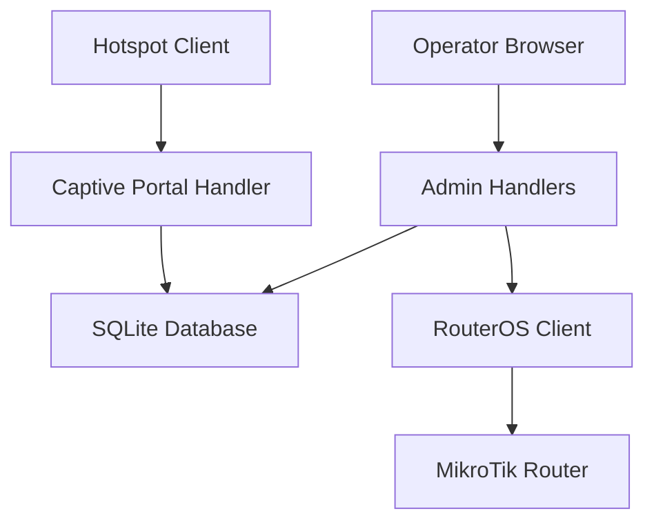
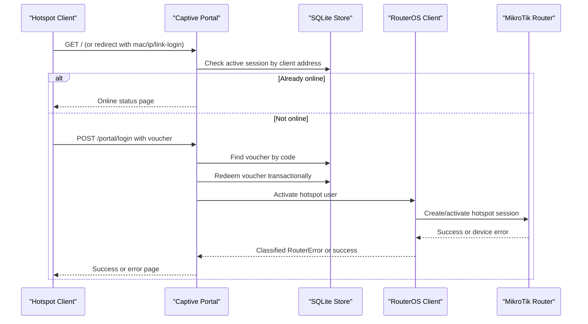
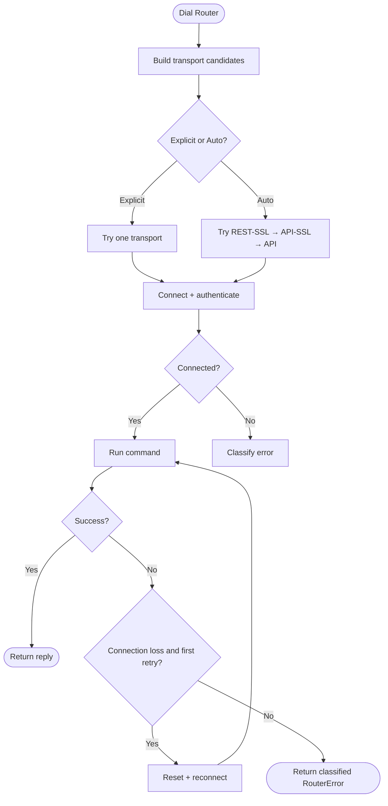
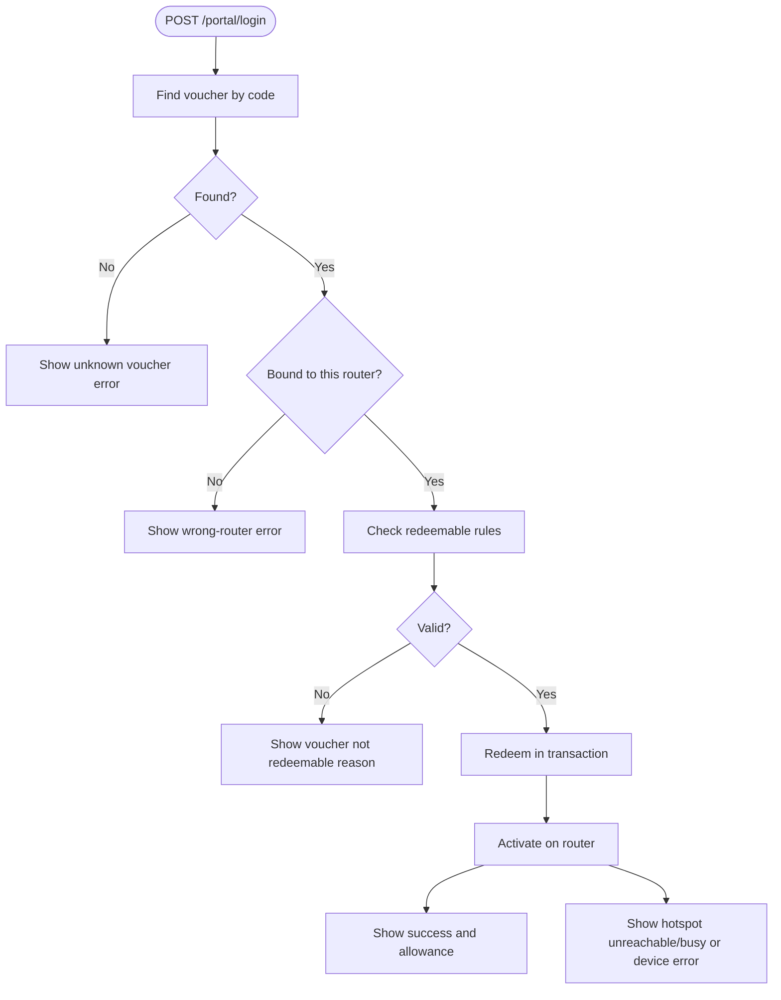
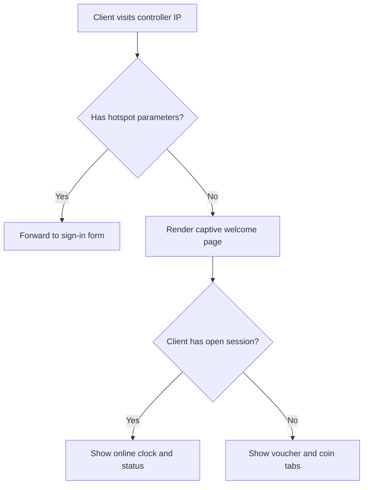
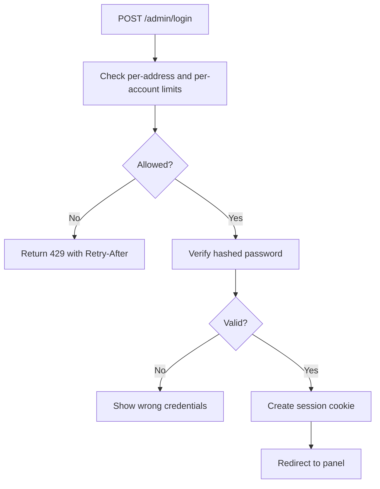
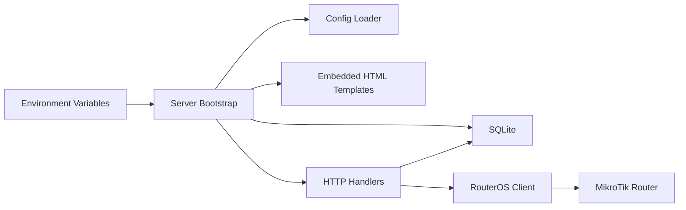

# Troubleshooting & FAQ

<cite>
**Referenced Files in This Document**   
- [README.md](file://README.md)
- [INSTALLATION.md](file://INSTALLATION.md)
- [main.go](file://main.go)
- [config.go](file://config.go)
- [database/database.go](file://database/database.go)
- [handlers/mikrotik.go](file://handlers/mikrotik.go)
- [handlers/mikrotik_rest.go](file://handlers/mikrotik_rest.go)
- [handlers/captive.go](file://handlers/captive.go)
- [handlers/portal.go](file://handlers/portal.go)
- [handlers/vouchers.go](file://handlers/vouchers.go)
- [database/vouchers.go](file://database/vouchers.go)
- [handlers/adminauth.go](file://handlers/adminauth.go)
</cite>

## Table of Contents
1. [Introduction](#introduction)
2. [Project Structure](#project-structure)
3. [Core Components](#core-components)
4. [Architecture Overview](#architecture-overview)
5. [Detailed Component Analysis](#detailed-component-analysis)
6. [Dependency Analysis](#dependency-analysis)
7. [Performance Considerations](#performance-considerations)
8. [Troubleshooting Guide](#troubleshooting-guide)
9. [Conclusion](#conclusion)
10. [Appendices](#appendices)

## Introduction
This document is the operational troubleshooting and FAQ guide for the Aircoins MikroTik Controller. It focuses on the most common failure modes: router connectivity, voucher redemption, captive portal redirection, and operator authentication. For each area it provides diagnostic procedures, log analysis techniques, error message interpretation, step-by-step resolutions, and performance or scalability considerations.

The controller exposes two main front doors:
- The captive portal at the board IP, used by hotspot clients.
- The operator panel under `/admin`, protected by a session-based login.

Configuration is environment-driven, so most deployment issues can be diagnosed through environment variables, systemd logs, SQLite health, and RouterOS API status.

**Section sources**
- [README.md:10-49](file://README.md#L10-L49)
- [README.md:70-109](file://README.md#L70-L109)

## Project Structure
At a high level, the system consists of:
- A Go HTTP server that loads configuration, opens SQLite, boots the admin account, and starts the web server.
- A handler layer for routes such as the captive portal, operator dashboard, routers, vouchers, sessions, and tools.
- A database layer backed by modernc.org/sqlite with migrations, encrypted router credentials, and stores for routers, sessions, vouchers, coins, and rates.
- A RouterOS client abstraction supporting both the legacy binary API and the v7 REST API.

**Diagram sources**
- [main.go:214-284](file://main.go#L214-L284)
- [handlers/captive.go:95-153](file://handlers/captive.go#L95-L153)
- [database/database.go:70-116](file://database/database.go#L70-L116)
- [handlers/mikrotik.go:183-240](file://handlers/mikrotik.go#L183-L240)

**Section sources**
- [main.go:1-57](file://main.go#L1-L57)
- [main.go:214-284](file://main.go#L214-L284)
- [database/database.go:1-21](file://database/database.go#L1-L21)

## Core Components
- **Server bootstrap**: Loads environment configuration, opens the database, parses embedded templates, seeds the admin account, and starts the HTTP server with timeouts and graceful shutdown.
- **Configuration loader**: Reads `ADDR`, `DB_PATH`, `SECRET_KEY_PATH`, `API_TIMEOUT`, portal branding, admin credentials, coin slot settings, and other runtime options.
- **Database layer**: Opens SQLite with WAL mode, foreign keys, busy timeout, connection pooling, secret key management, and migration execution.
- **RouterOS client**: Selects between REST over HTTPS, REST over HTTP, API-SSL, and API; retries transient connection losses once; classifies device errors into sentinels such as unreachable, auth, timeout, permission, not found, conflict, unknown host, and command unavailable.
- **Captive portal**: Serves the welcome page, forwards hotspot redirects to the sign-in form, detects already-online clients, and renders coin-slot state when configured.
- **Voucher engine**: Generates batches, optionally provisions hotspot users on the router, redeems codes, tracks uses/expiry, and surfaces validation diagnostics.
- **Admin authentication**: Uses PBKDF2 password hashing, HttpOnly cookies, per-address and per-account brute-force protection, and lockout backoff.

**Section sources**
- [main.go:214-284](file://main.go#L214-L284)
- [config.go:20-77](file://config.go#L20-L77)
- [database/database.go:70-116](file://database/database.go#L70-L116)
- [handlers/mikrotik.go:23-48](file://handlers/mikrotik.go#L23-L48)
- [handlers/mikrotik.go:183-240](file://handlers/mikrotik.go#L183-L240)
- [handlers/captive.go:95-153](file://handlers/captive.go#L95-L153)
- [handlers/vouchers.go:293-370](file://handlers/vouchers.go#L293-L370)
- [handlers/adminauth.go:155-190](file://handlers/adminauth.go#L155-L190)

## Architecture Overview
The controller sits between MikroTik hotspots and their clients. Clients are redirected to the controller’s portal; the portal validates vouchers against the local ledger and then calls the selected router transport to activate the session. Operators use the panel to manage routers, vouchers, sessions, and settings.

**Diagram sources**
- [handlers/captive.go:95-153](file://handlers/captive.go#L95-L153)
- [handlers/portal.go:201-233](file://handlers/portal.go#L201-L233)
- [database/vouchers.go:439-495](file://database/vouchers.go#L439-L495)
- [handlers/mikrotik.go:477-520](file://handlers/mikrotik.go#L477-L520)

## Detailed Component Analysis

### Router Connectivity Diagnostics
Common symptoms include routers showing offline, API calls timing out, REST connections failing, or certificate verification errors.

Key behaviors:
- Auto mode tries secure REST first, then API-SSL, then API, preferring the last successful transport when safe.
- Plain REST over HTTP requires an explicitly set web port; it is never auto-selected for security reasons.
- Connection loss is retried once after a short delay.
- Transport-level failures are classified into sentinels: timeout, unreachable, certificate rejection, dial failure, EOF/reset, and generic device error.

**Diagram sources**
- [handlers/mikrotik.go:183-240](file://handlers/mikrotik.go#L183-L240)
- [handlers/mikrotik.go:280-354](file://handlers/mikrotik.go#L280-L354)
- [handlers/mikrotik.go:477-520](file://handlers/mikrotik.go#L477-L520)
- [handlers/mikrotik.go:522-561](file://handlers/mikrotik.go#L522-L561)

#### Diagnostic Procedure
1. Check the service log line that prints the listening address and version.
2. Open `/healthz` from the board itself and from the hotspot subnet.
3. Inspect the router inventory page and note the selected transport and latency.
4. Confirm the MikroTik `/ip service` entry allows the controller IP.
5. If using REST, verify the correct `www` or `www-ssl` service is enabled and the Web port matches the configuration.
6. If using API-SSL, decide whether to trust the default self-signed certificate or install a trusted one.
7. Review the last error shown for the router and match it to the sentinel classification.

#### Error Message Interpretation
- “device did not answer in time”: network timeout or overloaded router; increase `API_TIMEOUT` cautiously and check router load.
- “nothing is listening on that port”: wrong port, disabled `www`/`www-ssl`, or firewall block.
- “HTTPS certificate was rejected”: untrusted certificate or hostname mismatch; disable verification only if you understand the risk.
- “authentication failed”: wrong API username/password or insufficient group permissions.
- “account lacks permission”: API user needs read/write access to hotspot menus.
- “command unavailable on this device”: hotspot package disabled or unsupported RouterOS build.
- “client is not known to the hotspot”: the MAC/IP has not been added to the hotspot host table yet.

**Section sources**
- [main.go:262-265](file://main.go#L262-L265)
- [handlers/mikrotik.go:23-48](file://handlers/mikrotik.go#L23-L48)
- [handlers/mikrotik.go:183-240](file://handlers/mikrotik.go#L183-L240)
- [handlers/mikrotik.go:280-354](file://handlers/mikrotik.go#L280-L354)
- [handlers/mikrotik.go:477-520](file://handlers/mikrotik.go#L477-L520)
- [handlers/mikrotik.go:522-561](file://handlers/mikrotik.go#L522-L561)
- [handlers/mikrotik_rest.go:446-476](file://handlers/mikrotik_rest.go#L446-L476)

### Voucher Redemption Failures
Redemption involves three layers:
1. Local ledger lookup and validation.
2. Transactional redemption update.
3. Router activation via the selected transport.

**Diagram sources**
- [handlers/portal.go:201-233](file://handlers/portal.go#L201-L233)
- [database/vouchers.go:141-160](file://database/vouchers.go#L141-L160)
- [database/vouchers.go:439-495](file://database/vouchers.go#L439-L495)
- [handlers/mikrotik.go:477-520](file://handlers/mikrotik.go#L477-L520)

#### Common Causes and Fixes
- **Unknown voucher code**: Typo, wrong batch, or code generated for another location. Verify spelling and router binding.
- **Wrong router**: The voucher is bound to a different device. Generate or assign a voucher for the correct router.
- **Disabled, expired, or fully used**: The ledger rejects redemption. Check voucher status, expiry, and remaining uses.
- **Hotspot unreachable or busy**: Temporary API failure. The portal tells the customer the voucher was not used and they can retry.
- **Device reported an error**: Permission denied, missing profile, duplicate object, or unsupported command. Use the voucher validation tool to inspect ledger and device state.

#### Diagnostic Procedure
1. Open the voucher listing and filter by code or batch.
2. Use the voucher validation action to see ledger status and device state.
3. If the device is unreachable, check router connectivity first.
4. If the device reports a missing profile or permission issue, fix the hotspot user spec or API account rights.
5. If the ledger says the voucher is expired or used, generate a new voucher rather than editing the old one.

**Section sources**
- [handlers/portal.go:201-233](file://handlers/portal.go#L201-L233)
- [database/vouchers.go:141-160](file://database/vouchers.go#L141-L160)
- [database/vouchers.go:439-495](file://database/vouchers.go#L439-L495)
- [handlers/vouchers.go:570-630](file://handlers/vouchers.go#L570-L630)

### Captive Portal Issues
Symptoms include clients seeing the operator login instead of the voucher form, portal parameters being lost, or the landing page not greeting an already-online client.

Key behaviors:
- Hotspot redirects with `mac`, `ip`, `link-login`, and `link-orig` are forwarded directly to the sign-in form.
- Direct visits to the root show the captive portal, not the admin panel.
- An existing session for the client’s address is detected and displayed as online.
- The captive portal probe endpoint answers cheaply without logging repeated “no router” warnings.

**Diagram sources**
- [handlers/captive.go:95-153](file://handlers/captive.go#L95-L153)
- [handlers/captive.go:155-185](file://handlers/captive.go#L155-L185)
- [handlers/captive.go:187-211](file://handlers/captive.go#L187-L211)

#### Resolution Steps
1. Ensure the hotspot login form posts to `/portal/login` and preserves `mac`, `ip`, `link-login`, `link-orig`, and related variables.
2. Confirm the controller is reachable at the address configured in the hotspot redirect.
3. If guests see the operator login, verify the redirect target is not pointing at the panel’s admin route.
4. If the portal does not greet an online client, check that the controller can resolve the client’s source address and query active sessions.
5. If the portal shows “not linked,” configure a matching router portal tag or mark the router as the default portal.

**Section sources**
- [README.md:167-186](file://README.md#L167-L186)
- [handlers/captive.go:95-153](file://handlers/captive.go#L95-L153)
- [handlers/captive.go:155-185](file://handlers/captive.go#L155-L185)
- [handlers/captive.go:187-211](file://handlers/captive.go#L187-L211)

### Authentication Problems
Symptoms include being unable to log into the operator panel, receiving throttling messages, or losing sessions unexpectedly.

Key behaviors:
- Passwords are hashed with PBKDF2-HMAC-SHA256 and a fresh salt.
- Sessions are random tokens stored as SHA-256 hashes in the database.
- Brute-force protection applies both per address and per account, with exponential backoff capped at a maximum delay.
- Changing the password revokes all existing sessions.
- On first boot, if no admin account exists, a random password is generated and logged once unless `ADMIN_PASSWORD` is set.

**Diagram sources**
- [handlers/adminauth.go:155-190](file://handlers/adminauth.go#L155-L190)
- [README.md:111-140](file://README.md#L111-L140)
- [main.go:287-327](file://main.go#L287-L327)

#### Resolution Steps
1. Recover a locked-out operator account using the `passwd` subcommand while the service is stopped.
2. Check `journalctl -u aircoins` for the initial password if `ADMIN_PASSWORD` was unset.
3. Avoid passing passwords as process arguments; prefer environment variables or interactive generation.
4. If behind HTTPS, enable `SECURE_COOKIES=1` so session cookies are marked secure.
5. If sessions keep expiring, review `ADMIN_SESSION_TTL` and reverse proxy headers.
6. If brute-force lockouts are frequent, investigate unauthorized access attempts and tighten firewall rules.

**Section sources**
- [README.md:21-43](file://README.md#L21-L43)
- [README.md:111-140](file://README.md#L111-L140)
- [main.go:46-57](file://main.go#L46-L57)
- [main.go:82-191](file://main.go#L82-L191)
- [handlers/adminauth.go:155-190](file://handlers/adminauth.go#L155-L190)

## Dependency Analysis
The controller depends on:
- Environment configuration for listen address, database path, master key, API timeout, portal branding, and coin slot behavior.
- SQLite with WAL mode and a small connection pool.
- RouterOS API or REST endpoints exposed by MikroTik devices.
- Optional ZeroTier integration managed through the Tools page.

**Diagram sources**
- [main.go:214-284](file://main.go#L214-L284)
- [config.go:20-77](file://config.go#L20-L77)
- [database/database.go:70-116](file://database/database.go#L70-L116)

**Section sources**
- [main.go:214-284](file://main.go#L214-L284)
- [config.go:20-77](file://config.go#L20-L77)
- [database/database.go:70-116](file://database/database.go#L70-L116)

## Performance Considerations
- **SQLite concurrency**: The driver uses a small connection pool because SQLite serializes writers. Increasing `MaxOpenConns` beyond what the disk and workload need can hurt performance.
- **WAL mode**: Enabled by default for better concurrent reads and reduced locking contention.
- **Busy timeout**: Controls how long a connection waits for a locked database; tune if you see frequent write contention.
- **Router API timeout**: `API_TIMEOUT` controls per-call budget; increasing it too much can make UI pages feel sluggish during router outages.
- **Voucher batch size**: Generation is capped at 500 per batch to avoid accidental large inserts.
- **Session paging**: Listing endpoints use pagination to avoid loading huge result sets.
- **Background sweeper**: Coin credit idle balances are cleaned up according to `COIN_IDLE_TTL`.

Recommendations:
- Keep `DB_PATH` on reliable storage with adequate IOPS.
- Monitor SQLite file size and journal growth.
- Avoid extremely large voucher batches; split into smaller groups if provisioning takes too long.
- Use Auto transport mode initially to reduce probing overhead.
- Place the controller behind a reverse proxy only if needed, and ensure proper headers for client IP resolution.

**Section sources**
- [database/database.go:30-47](file://database/database.go#L30-L47)
- [database/database.go:118-133](file://database/database.go#L118-L133)
- [handlers/vouchers.go:17-19](file://handlers/vouchers.go#L17-L19)
- [config.go:26-31](file://config.go#L26-L31)
- [config.go:59-67](file://config.go#L59-L67)

## Troubleshooting Guide

### Router Connectivity Problems

**Symptoms**
- Router shows offline in the panel.
- API calls fail with timeout or unreachable errors.
- REST returns certificate or dial errors.
- Commands report missing profiles, permissions, or unsupported features.

**Diagnostic Checklist**
1. Check `systemctl status aircoins` and `journalctl -u aircoins -f`.
2. Confirm the controller is listening on the expected address.
3. Verify MikroTik `/ip service` allows the controller IP.
4. For REST, confirm `www` or `www-ssl` is enabled and the Web port matches the router configuration.
5. For API-SSL, decide whether to trust the default self-signed certificate or install a trusted CA.
6. Test the selected transport manually if possible.
7. Review the router’s last error and classify it using the sentinel meanings.

**Resolution Paths**
- Wrong port or disabled service: Enable the correct service and set the explicit port.
- Certificate rejection: Install a trusted certificate or adjust verification policy carefully.
- Authentication failure: Reset the API user credentials and ensure the group includes hotspot read/write.
- Permission denied: Grant the API user sufficient rights for hotspot menus.
- Command unavailable: Enable the hotspot package or use a supported RouterOS build.
- Unknown host: Wait for the client to appear in the hotspot host table before activating its session.

**Section sources**
- [INSTALLATION.md:123-153](file://INSTALLATION.md#L123-L153)
- [handlers/mikrotik.go:183-240](file://handlers/mikrotik.go#L183-L240)
- [handlers/mikrotik.go:280-354](file://handlers/mikrotik.go#L280-L354)
- [handlers/mikrotik.go:522-561](file://handlers/mikrotik.go#L522-L561)
- [handlers/mikrotik_rest.go:446-476](file://handlers/mikrotik_rest.go#L446-L476)

### Voucher Redemption Failures

**Symptoms**
- “That voucher code was not recognised.”
- “That voucher belongs to a different hotspot.”
- “Voucher cannot be redeemed.”
- “The hotspot is busy or unreachable.”
- “That voucher could not be activated.”

**Diagnostic Checklist**
1. Search the voucher by code in the voucher listing.
2. Check whether it is unused, active, used, expired, or disabled.
3. Confirm it is bound to the router where the client is connecting.
4. Use the voucher validation action to inspect ledger and device state.
5. If the device is unreachable, diagnose router connectivity first.
6. If the device reports a missing profile or permission issue, provision or fix the hotspot user.

**Resolution Paths**
- Unknown code: Correct the spelling or generate a new voucher.
- Wrong router: Assign the voucher to the correct router or create a new one.
- Expired or used: Issue a replacement voucher.
- Unreachable hotspot: Fix API connectivity and retry.
- Device error: Fix profile, permissions, or conflicting objects on the router.

**Section sources**
- [handlers/portal.go:201-233](file://handlers/portal.go#L201-L233)
- [database/vouchers.go:141-160](file://database/vouchers.go#L141-L160)
- [database/vouchers.go:439-495](file://database/vouchers.go#L439-L495)
- [handlers/vouchers.go:570-630](file://handlers/vouchers.go#L570-L630)

### Captive Portal Issues

**Symptoms**
- Guests see the operator login instead of the voucher form.
- Hotspot redirect parameters are lost.
- The portal does not greet an already-online client.
- The portal shows “not linked.”

**Diagnostic Checklist**
1. Confirm the hotspot login form posts to `/portal/login` with required parameters.
2. Confirm the controller IP and port match the hotspot redirect.
3. Check whether the request reaches the captive portal or the admin panel.
4. Verify the portal can resolve the client’s source address.
5. Configure a matching router portal tag or mark the router as default.

**Resolution Paths**
- Redirect points to admin route: Change the hotspot login form action to `/portal/login`.
- Parameters lost: Ensure the form preserves `mac`, `ip`, `link-login`, and `link-orig`.
- Not greeted as online: Check session lookup and client address resolution.
- Not linked: Set the router portal tag or default portal.

**Section sources**
- [README.md:167-186](file://README.md#L167-L186)
- [handlers/captive.go:95-153](file://handlers/captive.go#L95-L153)
- [handlers/captive.go:155-185](file://handlers/captive.go#L155-L185)
- [handlers/captive.go:187-211](file://handlers/captive.go#L187-L211)

### Authentication Problems

**Symptoms**
- Cannot log into the operator panel.
- Repeatedly receives “Too many failed attempts.”
- Initial password is unknown.
- Sessions expire unexpectedly.

**Diagnostic Checklist**
1. Check whether the admin account exists.
2. Look for the initial password in the service logs if `ADMIN_PASSWORD` was unset.
3. Review brute-force throttling counters and recent failed attempts.
4. Confirm `SECURE_COOKIES=1` when behind HTTPS.
5. Review `ADMIN_SESSION_TTL` and reverse proxy headers.

**Resolution Paths**
- Locked out: Stop the service and run the `passwd` subcommand to reset the operator password.
- Brute-force lockout: Wait for the backoff period or clear the attack source.
- Lost initial password: Use `passwd` to generate or set a new one.
- Cookie issues: Terminate TLS at a reverse proxy and enable secure cookies.

**Section sources**
- [README.md:21-43](file://README.md#L21-L43)
- [README.md:111-140](file://README.md#L111-L140)
- [main.go:46-57](file://main.go#L46-L57)
- [main.go:82-191](file://main.go#L82-L191)
- [handlers/adminauth.go:155-190](file://handlers/adminauth.go#L155-L190)

### Database Corruption and SQLite Issues

**Symptoms**
- Service fails to start.
- Health check fails.
- Write operations fail intermittently.
- Migrations do not apply.

**Diagnostic Checklist**
1. Check the service log for database open or ping errors.
2. Verify `DB_PATH` directory exists and is writable by the service user.
3. Confirm the master key file exists and has restrictive permissions.
4. Check SQLite file integrity and disk space.
5. Review migration history and schema version.

**Resolution Paths**
- Directory not writable: Fix ownership and permissions for the data directory.
- Master key missing: Restore `/var/lib/aircoins/secret.key` from backup; without it, router passwords are unrecoverable.
- Corrupted database: Restore from a known-good backup; do not edit SQLite files manually.
- Migration failure: Inspect the migration error and restore the database from backup before reapplying migrations.

**Section sources**
- [INSTALLATION.md:101-105](file://INSTALLATION.md#L101-L105)
- [INSTALLATION.md:123-153](file://INSTALLATION.md#L123-L153)
- [database/database.go:70-116](file://database/database.go#L70-L116)
- [database/database.go:118-133](file://database/database.go#L118-L133)

### Performance Bottlenecks, Memory Leaks, and Scalability

**Bottlenecks**
- Slow SQLite writes due to disk latency or excessive concurrent writers.
- Long RouterOS API calls blocking UI responses.
- Large voucher batches overwhelming the router or the database.

**Memory and Concurrency**
- SQLite connection pool is intentionally small.
- Background sweeper cleans coin credits based on idle TTL.
- Router client retries transient connection loss once.

**Scalability Guidance**
- One controller instance per SQLite database file.
- Prefer multiple controllers behind a reverse proxy only if you also scale the database backend; the current design uses SQLite.
- Limit voucher batch sizes and spread provisioning across maintenance windows.
- Monitor router CPU load and uptime; heavy hotspot fleets may need more responsive devices.

**Section sources**
- [database/database.go:30-47](file://database/database.go#L30-L47)
- [database/database.go:118-133](file://database/database.go#L118-L133)
- [handlers/mikrotik.go:151-158](file://handlers/mikrotik.go#L151-L158)
- [handlers/vouchers.go:17-19](file://handlers/vouchers.go#L17-L19)
- [main.go:255-257](file://main.go#L255-L257)

## Conclusion
Most operational problems fall into four categories: router connectivity, voucher redemption, captive portal routing, and operator authentication. The controller provides strong error classification, transactional voucher accounting, and defensive defaults such as secure transport selection and captive portal separation from the admin panel. When diagnosing, follow the layered approach: verify the service and database, validate the router transport, inspect the voucher ledger, and finally examine the device-side error. For recovery, prefer documented commands like `passwd`, backup restoration, and controlled reconfiguration rather than manual edits.

[No sources needed since this section summarizes without analyzing specific files]

## Appendices

### Frequently Asked Questions

**Q: Why does the captive portal show the operator login?**  
A: The hotspot redirect may point at the panel’s admin route. Point the login form to `/portal/login` and preserve hotspot parameters.

**Q: How do I recover the initial admin password?**  
A: If `ADMIN_PASSWORD` was unset, the initial password was logged once. Otherwise, stop the service and run the `passwd` subcommand.

**Q: What should I do if a voucher says it is not redeemable?**  
A: Check whether it is disabled, expired, or fully used. If it belongs to another router, generate a voucher for the correct device.

**Q: Why does REST require an explicit web port?**  
A: Plain REST over HTTP is deliberately not auto-selected to avoid sending credentials to an unrelated public web server.

**Q: How do I move off port 80?**  
A: Set `ADDR` to a non-privileged port such as `:8080`, restart the service, and optionally redirect port 80 with iptables or a reverse proxy.

**Q: Can I use a self-signed certificate for API-SSL?**  
A: Yes, by default verification is skipped for convenience. For production, install a trusted certificate and enable verification.

**Q: How do I protect against brute-force attacks on the panel?**  
A: The controller already enforces per-address and per-account limits with exponential backoff. Also place the panel behind HTTPS and restrict access by firewall.

**Section sources**
- [README.md:10-49](file://README.md#L10-L49)
- [README.md:70-109](file://README.md#L70-L109)
- [README.md:111-140](file://README.md#L111-L140)
- [INSTALLATION.md:155-258](file://INSTALLATION.md#L155-L258)
- [handlers/mikrotik.go:280-354](file://handlers/mikrotik.go#L280-L354)
- [handlers/adminauth.go:155-190](file://handlers/adminauth.go#L155-L190)