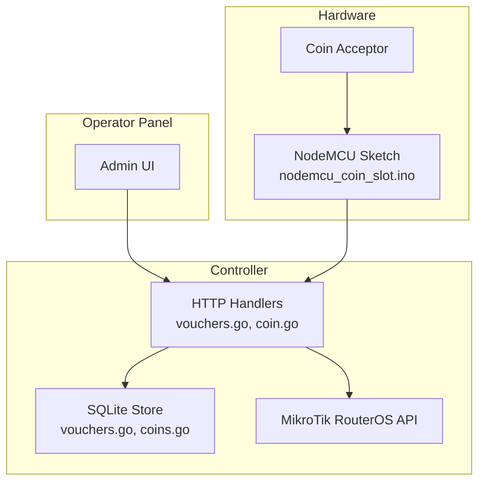
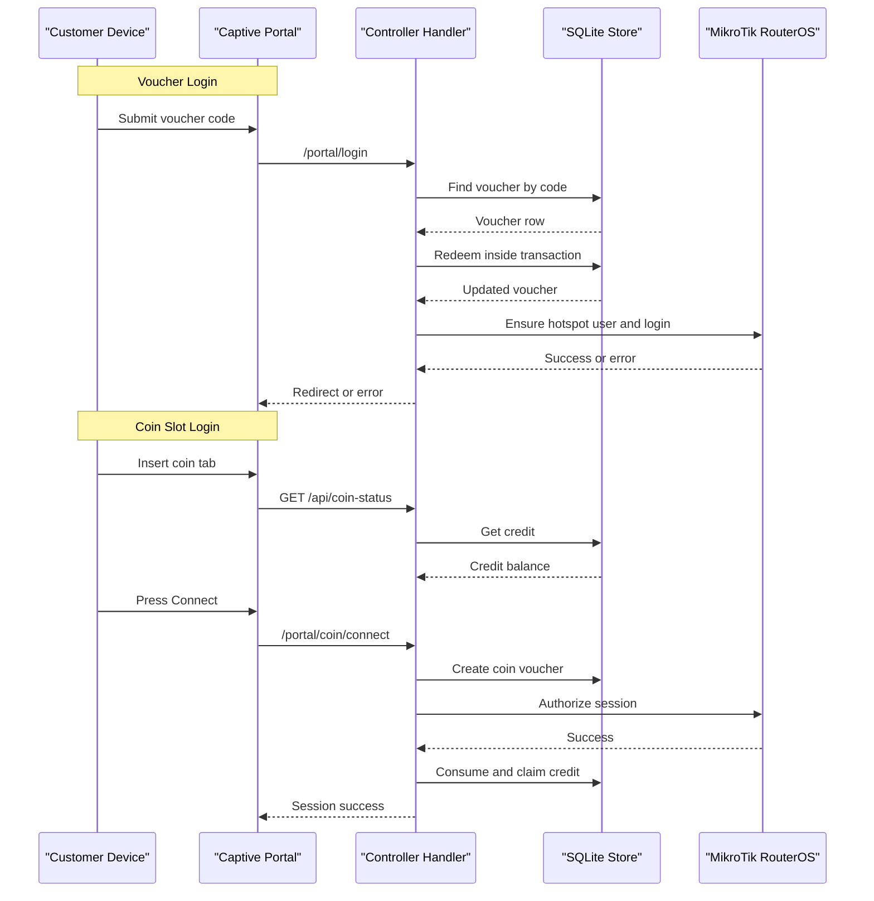
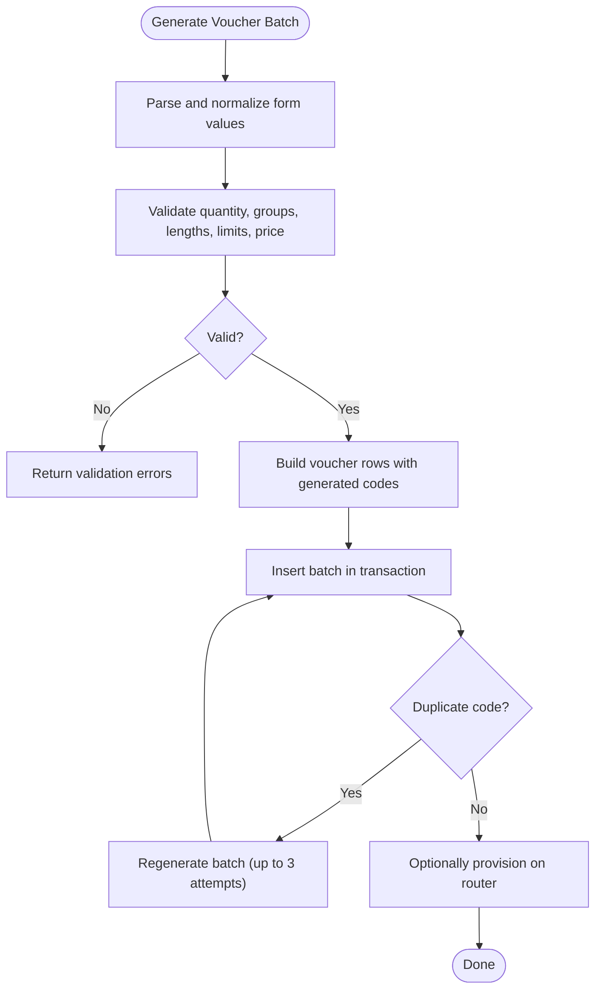
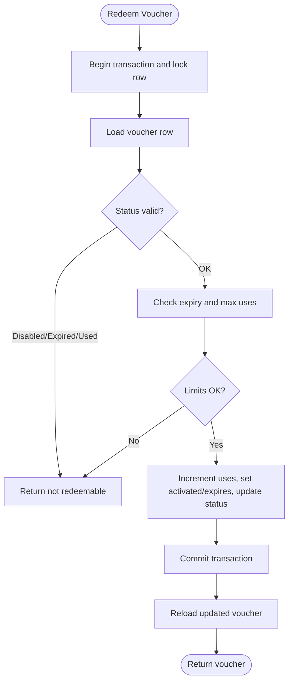
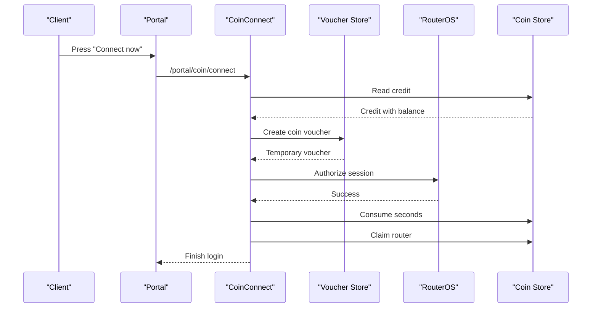
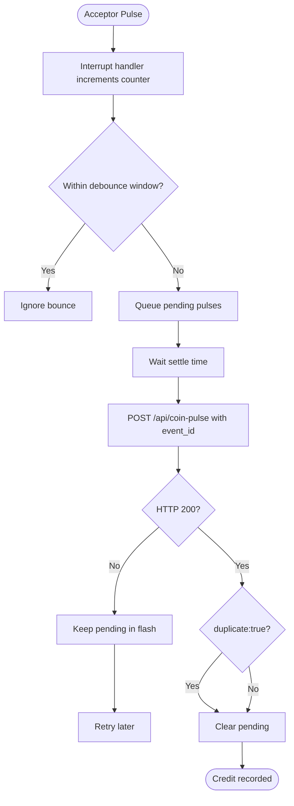
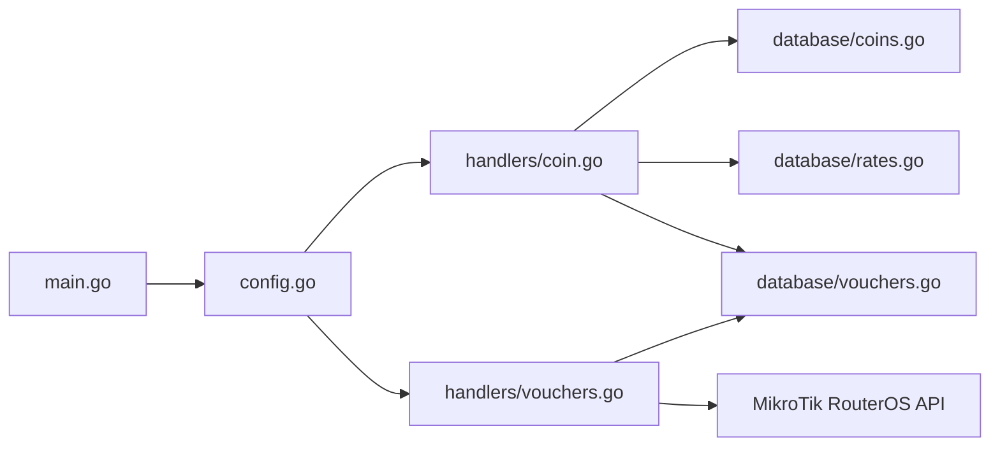

# Voucher System Troubleshooting

<cite>
**Referenced Files in This Document**   
- [README.md](file://README.md)
- [main.go](file://main.go)
- [config.go](file://config.go)
- [database/vouchers.go](file://database/vouchers.go)
- [database/voucher_code.go](file://database/voucher_code.go)
- [handlers/vouchers.go](file://handlers/vouchers.go)
- [database/coins.go](file://database/coins.go)
- [handlers/coin.go](file://handlers/coin.go)
- [hardware/nodemcu_coin_slot/nodemcu_coin_slot.ino](file://hardware/nodemcu_coin_slot/nodemcu_coin_slot.ino)
- [hardware/nodemcu_coin_slot/README.md](file://hardware/nodemcu_coin_slot/README.md)
</cite>

## Table of Contents
1. [Introduction](#introduction)
2. [Project Structure](#project-structure)
3. [Core Components](#core-components)
4. [Architecture Overview](#architecture-overview)
5. [Detailed Component Analysis](#detailed-component-analysis)
6. [Dependency Analysis](#dependency-analysis)
7. [Performance Considerations](#performance-considerations)
8. [Troubleshooting Guide](#troubleshooting-guide)
9. [Conclusion](#conclusion)

## Introduction
This document provides operational troubleshooting guidance for the voucher and coin-slot subsystems of the Aircoins MikroTik Controller. It focuses on:

- Voucher code generation, duplicate detection, validation, redemption, and lifecycle tracking.
- Time, data, device-limit enforcement and session creation flows.
- Coin slot integration, including pulse detection, credit allocation, idle expiry, and hardware communication.
- Database consistency, batch processing, export/import behavior, and reporting accuracy.
- Step-by-step diagnostics for portal logins, coin sessions, and router provisioning.

The controller uses SQLite for persistence, a captive portal for guest access, an operator panel for administration, and MikroTik RouterOS API calls to provision hotspot users and enforce limits.

**Section sources**
- [README.md:1-10](file://README.md#L1-L10)
- [README.md:187-195](file://README.md#L187-L195)

## Project Structure
The relevant subsystems are split across three layers:

- **Database layer**: voucher models, stores, code formatting, coin credit model, and coin store.
- **Handler layer**: HTTP endpoints for voucher management, portal login, coin-pulse ingestion, coin status polling, and coin-to-session conversion.
- **Hardware layer**: NodeMCU sketch that counts acceptor pulses, debounces them, persists pending events, and reports credits to the controller.

**Diagram sources**
- [handlers/vouchers.go:293-370](file://handlers/vouchers.go#L293-L370)
- [handlers/coin.go:123-220](file://handlers/coin.go#L123-L220)
- [database/vouchers.go:224-277](file://database/vouchers.go#L224-L277)
- [database/coins.go:139-223](file://database/coins.go#L139-L223)
- [hardware/nodemcu_coin_slot/nodemcu_coin_slot.ino:374-450](file://hardware/nodemcu_coin_slot/nodemcu_coin_slot.ino#L374-L450)

**Section sources**
- [README.md:197-205](file://README.md#L197-L205)
- [main.go:214-285](file://main.go#L214-L285)

## Core Components
- **Voucher engine**: generates batches, enforces local ledger rules, provisions hotspot users, tracks activation/expiry, and supports export/import and batch deletion.
- **Coin slot pipeline**: accepts authenticated pulse reports, prices pulses against configured rates, deduplicates events, maintains per-client credit balances, expires idle credits, and converts credits into voucher-backed sessions.
- **RouterOS integration**: creates or updates hotspot users with time/data/device limits; controller-side redemption is only finalized after successful device authorization.
- **Configuration**: environment variables control listen address, database path, API timeout, coin token, pricing fallback, idle TTL, and session caps.

Key responsibilities by file:

| Area | Primary File | Responsibility |
|---|---|---|
| Voucher model and store | `database/vouchers.go` | Lifecycle states, validation, batch insert, redeem, stats, export helpers |
| Voucher code formatting | `database/voucher_code.go` | Normalized code rendering and batch label generation |
| Voucher handlers | `handlers/vouchers.go` | Generation, push/provision, validate, status changes, delete, export |
| Coin credit model and store | `database/coins.go` | Pulse credit, deduplication, consumption, claim, idle expiry, subject keys |
| Coin handlers | `handlers/coin.go` | Pulse endpoint, status endpoint, connect flow, rate pricing, node auth |
| Hardware sketch | `hardware/nodemcu_coin_slot/nodemcu_coin_slot.ino` | Interrupt counting, debouncing, flash journal, retry, event IDs |
| Configuration | `config.go` | Environment parsing, coin defaults, timeouts, addresses |
| Entry point | `main.go` | Server bootstrap, admin bootstrap, sweeper start |

**Section sources**
- [database/vouchers.go:12-30](file://database/vouchers.go#L12-L30)
- [database/vouchers.go:78-102](file://database/vouchers.go#L78-L102)
- [database/vouchers.go:141-160](file://database/vouchers.go#L141-L160)
- [database/vouchers.go:224-277](file://database/vouchers.go#L224-L277)
- [database/vouchers.go:439-495](file://database/vouchers.go#L439-L495)
- [database/voucher_code.go:98-109](file://database/voucher_code.go#L98-L109)
- [handlers/vouchers.go:17-19](file://handlers/vouchers.go#L17-L19)
- [handlers/vouchers.go:293-370](file://handlers/vouchers.go#L293-L370)
- [handlers/vouchers.go:452-516](file://handlers/vouchers.go#L452-L516)
- [database/coins.go:12-39](file://database/coins.go#L12-L39)
- [database/coins.go:41-79](file://database/coins.go#L41-L79)
- [database/coins.go:139-223](file://database/coins.go#L139-L223)
- [handlers/coin.go:27-55](file://handlers/coin.go#L27-L55)
- [handlers/coin.go:115-123](file://handlers/coin.go#L115-L123)
- [handlers/coin.go:334-353](file://handlers/coin.go#L334-L353)
- [config.go:59-67](file://config.go#L59-L67)
- [main.go:255-257](file://main.go#L255-L257)

## Architecture Overview
The system has two main user journeys:

1. **Voucher login**: operator generates vouchers → customer enters code → controller validates ledger → provisions hotspot user → logs in client → records redemption.
2. **Coin slot login**: NodeMCU counts pulses → controller prices pulses → credit balance grows → customer presses Connect → controller creates a temporary voucher → authorizes session → settles credit.

**Diagram sources**
- [handlers/vouchers.go:570-630](file://handlers/vouchers.go#L570-L630)
- [database/vouchers.go:439-495](file://database/vouchers.go#L439-L495)
- [handlers/coin.go:334-454](file://handlers/coin.go#L334-L454)
- [database/coins.go:261-319](file://database/coins.go#L261-L319)

**Section sources**
- [README.md:187-195](file://README.md#L187-L195)
- [handlers/coin.go:334-353](file://handlers/coin.go#L334-L353)

## Detailed Component Analysis

### Voucher Generation and Batch Processing
Voucher generation builds a batch of rows with randomized codes, normalizes input, applies defaults, and inserts them in one transaction. A unique constraint on the code column detects collisions. The handler retries the entire batch up to three times when a duplicate code is reported.

Common problems:
- Empty or malformed code fields.
- Quantity outside the allowed range.
- Invalid group count or group length.
- Negative price or non-numeric limit values.
- Duplicate code collision during batch insert.

Resolution steps:
1. Check form validation errors returned by the voucher generation handler.
2. Confirm quantity is between 1 and the configured maximum batch size.
3. Validate group configuration: number of groups and group length bounds.
4. Verify numeric fields such as duration, data limit, device limit, max uses, and price.
5. If a duplicate code error occurs, allow the handler to regenerate the batch automatically; repeated failures indicate a code generator or uniqueness issue.

**Diagram sources**
- [handlers/vouchers.go:145-174](file://handlers/vouchers.go#L145-L174)
- [handlers/vouchers.go:293-370](file://handlers/vouchers.go#L293-L370)
- [handlers/vouchers.go:372-406](file://handlers/vouchers.go#L372-L406)
- [database/vouchers.go:224-277](file://database/vouchers.go#L224-L277)

**Section sources**
- [handlers/vouchers.go:17-19](file://handlers/vouchers.go#L17-L19)
- [handlers/vouchers.go:145-174](file://handlers/vouchers.go#L145-L174)
- [handlers/vouchers.go:293-370](file://handlers/vouchers.go#L293-L370)
- [database/vouchers.go:194-195](file://database/vouchers.go#L194-L195)
- [database/vouchers.go:224-277](file://database/vouchers.go#L224-L277)

### Duplicate Code Detection
Duplicate detection is enforced at the database level through a unique constraint on the voucher code. The store wraps insertion errors so callers can distinguish duplicates from other database failures. The handler treats a duplicate as a transient condition and regenerates the batch rather than failing permanently.

Symptoms:
- Batch creation fails with a duplicate code error.
- Operator sees a warning about storing the voucher batch.
- Multiple retries appear in logs.

Resolution:
- Do not manually edit stored codes.
- Allow automatic regeneration.
- Investigate whether custom prefixes or external imports could produce colliding codes.
- Use batch labels and notes to trace which generation run produced the conflict.

**Section sources**
- [database/vouchers.go:194-195](file://database/vouchers.go#L194-L195)
- [database/vouchers.go:262-269](file://database/vouchers.go#L262-L269)
- [handlers/vouchers.go:324-349](file://handlers/vouchers.go#L324-L349)

### Voucher Validation and Redemption
Redemption is atomic: it reads the voucher, checks redeemability, increments usage, sets activation/expiry timestamps, updates status, and commits before returning the updated row. This prevents two simultaneous portal logins from consuming the same single-use key.

Redeemability checks include:
- Disabled vouchers cannot be redeemed.
- Expired vouchers cannot be redeemed.
- Fully used vouchers cannot be redeemed.
- Explicit validity window expiry is respected.
- Max uses remaining must be greater than zero.

Common redemption failures:
- Voucher disabled by an operator.
- Voucher expired before use.
- Single-use voucher already consumed.
- No redemptions left due to max uses.
- Local ledger says usable but device-side hotspot user is missing or disabled.

Resolution:
- Use the voucher validation endpoint to inspect both ledger state and device state.
- Re-enable or recreate vouchers if they were mistakenly disabled or expired.
- Provision the hotspot user on the router if the device side is missing the user.
- Check router reachability and API credentials when device queries fail.

**Diagram sources**
- [database/vouchers.go:141-160](file://database/vouchers.go#L141-L160)
- [database/vouchers.go:439-495](file://database/vouchers.go#L439-L495)

**Section sources**
- [database/vouchers.go:141-160](file://database/vouchers.go#L141-L160)
- [database/vouchers.go:439-495](file://database/vouchers.go#L439-L495)
- [handlers/vouchers.go:570-630](file://handlers/vouchers.go#L570-L630)

### Time, Data, and Device Limit Enforcement
Time and data limits are primarily enforced on the MikroTik device via hotspot user profiles and limits. The controller’s local ledger tracks uses, activation, expiry, and push status. Device-side enforcement includes:

- `limit-uptime` for time allowance.
- `limit-bytes-total` for data allowance.
- Device limit for shared-user/session constraints.

If the portal shows a voucher as active but the device disconnects early:
- Inspect the hotspot user on the router.
- Compare the voucher’s profile and limits with the router’s actual user.
- Reprovision the voucher if the device-side user is missing or misconfigured.

**Section sources**
- [README.md:187-195](file://README.md#L187-L195)
- [handlers/vouchers.go:452-469](file://handlers/vouchers.go#L452-L469)
- [handlers/vouchers.go:471-516](file://handlers/vouchers.go#L471-L516)

### Session Creation and Portal Login Flow
For voucher logins, the controller:
1. Finds the voucher by normalized code.
2. Validates the local ledger.
3. Provisions or confirms the hotspot user.
4. Logs the client into the hotspot.
5. Records the portal session and redirects the client.

For coin logins, the controller:
1. Reads the credit balance.
2. Creates a temporary voucher representing the spent credit.
3. Authorizes the session on the router.
4. Only then consumes and claims the credit.
5. Registers the portal session and finishes the login.

Failure handling:
- Unreachable router leaves coin credit untouched.
- Non-redeemable voucher returns a readable error.
- Timeout or unreachable router surfaces a service-unavailable message.

**Diagram sources**
- [handlers/coin.go:334-454](file://handlers/coin.go#L334-L454)
- [handlers/coin.go:500-549](file://handlers/coin.go#L500-L549)
- [database/coins.go:261-319](file://database/coins.go#L261-L319)

**Section sources**
- [handlers/coin.go:334-454](file://handlers/coin.go#L334-L454)
- [handlers/coin.go:456-498](file://handlers/coin.go#L456-L498)

### Coin Slot Integration: Pulse Detection, Credit Allocation, and Hardware Communication
The NodeMCU sketch:
- Uses an interrupt to detect acceptor pulses.
- Debounces edges using a time window.
- Batches pulses and sends POST requests to `/api/coin-pulse`.
- Persists pending pulses and event IDs to flash.
- Retries failed requests and recognizes duplicate responses.

The controller:
- Requires a shared secret header or query parameter.
- Decodes JSON or form bodies.
- Prices pulses using configured rates or environment fallback.
- Applies hard caps on pulses, cents, and granted seconds.
- Deduplicates by event ID.
- Returns current balance and duplicate flag.

Common hardware problems:
- Missing or wrong `COIN_NODE_TOKEN`.
- Wrong MAC/IP subject.
- Acceptors wired without pull-up resistor.
- Incorrect debounce timing causing double-counting or missed pulses.
- Wi-Fi association failures or controller timeouts.
- Event ID reuse or mismatched monotonic counters.

Resolution:
1. Verify the controller rejects unauthenticated requests when no token is configured.
2. Confirm the NodeMCU sends the correct token header.
3. Test `/api/coin-pulse` manually with curl.
4. Check serial output for FATAL token warnings, connection errors, and duplicate responses.
5. Inspect wiring: signal pin, GND, pull-up resistor, and voltage divider for 5 V acceptors.
6. Adjust debounce timing only after measuring acceptor behavior.
7. Use `/api/coin-status` to confirm the expected subject and balance.

**Diagram sources**
- [hardware/nodemcu_coin_slot/nodemcu_coin_slot.ino:220-234](file://hardware/nodemcu_coin_slot/nodemcu_coin_slot.ino#L220-L234)
- [hardware/nodemcu_coin_slot/nodemcu_coin_slot.ino:374-450](file://hardware/nodemcu_coin_slot/nodemcu_coin_slot.ino#L374-L450)
- [hardware/nodemcu_coin_slot/nodemcu_coin_slot.ino:515-576](file://hardware/nodemcu_coin_slot/nodemcu_coin_slot.ino#L515-L576)
- [handlers/coin.go:123-220](file://handlers/coin.go#L123-L220)

**Section sources**
- [hardware/nodemcu_coin_slot/README.md:1-24](file://hardware/nodemcu_coin_slot/README.md#L1-L24)
- [hardware/nodemcu_coin_slot/README.md:26-49](file://hardware/nodemcu_coin_slot/README.md#L26-L49)
- [hardware/nodemcu_coin_slot/README.md:50-87](file://hardware/nodemcu_coin_slot/README.md#L50-L87)
- [hardware/nodemcu_coin_slot/README.md:98-117](file://hardware/nodemcu_coin_slot/README.md#L98-L117)
- [hardware/nodemcu_coin_slot/nodemcu_coin_slot.ino:67-99](file://hardware/nodemcu_coin_slot/nodemcu_coin_slot.ino#L67-L99)
- [hardware/nodemcu_coin_slot/nodemcu_coin_slot.ino:152-185](file://hardware/nodemcu_coin_slot/nodemcu_coin_slot.ino#L152-L185)
- [handlers/coin.go:551-572](file://handlers/coin.go#L551-L572)

### Idle Balance Expiry and Usage Tracking
Idle coin balances expire after a configurable TTL. The store marks inactive balances as expired and clears connected timestamps so the next customer does not inherit previous credit. The controller also caps the session created from a coin balance to prevent jammed acceptors from granting excessive time.

Symptoms:
- A customer inserts coins but never connects; the next user sees no balance.
- A balance appears to disappear after some time.
- A jammed acceptor grants too much time in one session.

Resolution:
- Confirm the idle TTL setting.
- Check the credit status and expiration timestamp.
- Review the per-session cap for coin connections.
- Reinsert coins if the balance expired before connection.

**Section sources**
- [database/coins.go:321-348](file://database/coins.go#L321-L348)
- [handlers/coin.go:484-498](file://handlers/coin.go#L484-L498)
- [config.go:63-67](file://config.go#L63-L67)

### Export, Import, and Reporting Accuracy
Voucher export streams CSV with code, batch, router, profile, limits, price, status, uses, timestamps, push status, and note. Stats aggregate totals, pushed counts, billed cents, face value, and per-status counts.

Reporting inaccuracies usually come from:
- Filtering mismatches between listing and export.
- Stale status badges before expiry sync.
- Pushed-at timestamps lagging behind actual router provisioning.
- Face value vs billed value confusion.

Resolution:
- Apply the same filters to listing, stats, and export.
- Refresh the voucher page to trigger expiry sync.
- Use the validation endpoint to reconcile local and device state.
- Treat `pushed_to_router` as a local record, not proof that every future redemption will succeed.

**Section sources**
- [handlers/vouchers.go:201-269](file://handlers/vouchers.go#L201-L269)
- [handlers/vouchers.go:732-794](file://handlers/vouchers.go#L732-L794)
- [database/vouchers.go:578-645](file://database/vouchers.go#L578-L645)

## Dependency Analysis
The following diagram shows how handlers depend on stores and external systems.

**Diagram sources**
- [handlers/vouchers.go:293-516](file://handlers/vouchers.go#L293-L516)
- [handlers/coin.go:123-220](file://handlers/coin.go#L123-L220)
- [handlers/coin.go:265-298](file://handlers/coin.go#L265-L298)
- [config.go:20-77](file://config.go#L20-L77)
- [main.go:214-285](file://main.go#L214-L285)

**Section sources**
- [handlers/vouchers.go:293-516](file://handlers/vouchers.go#L293-L516)
- [handlers/coin.go:123-220](file://handlers/coin.go#L123-L220)
- [config.go:20-77](file://config.go#L20-L77)

## Performance Considerations
- Voucher batch size is capped to avoid accidental large inserts.
- Voucher list queries use normalized limits and pagination.
- Voucher export is limited to a safe maximum row count.
- Coin pulse validation applies strict upper bounds on pulses, cents, and granted seconds.
- Router API calls use configurable timeouts.
- Idle credit expiry runs periodically to release stale balances.

Operational recommendations:
- Keep batch sizes reasonable.
- Avoid exporting very large filtered result sets repeatedly.
- Monitor router API timeouts and connectivity.
- Tune coin slot settings only after observing real acceptor behavior.

[No sources needed since this section provides general guidance]

## Troubleshooting Guide

### Voucher Code Generation Failures
**Symptoms:**
- Form validation errors.
- Batch creation fails.
- Duplicate code warnings.

**Steps:**
1. Open the voucher generation page and review field-level errors.
2. Confirm quantity is within the allowed range.
3. Validate group count and group length.
4. Check numeric limits and price format.
5. If duplicate code errors occur, allow automatic regeneration.
6. If regeneration keeps failing, check whether external imports or custom prefixes create collisions.

**Section sources**
- [handlers/vouchers.go:145-174](file://handlers/vouchers.go#L145-L174)
- [handlers/vouchers.go:293-370](file://handlers/vouchers.go#L293-L370)
- [database/vouchers.go:224-277](file://database/vouchers.go#L224-L277)

### Duplicate Code Detection Issues
**Symptoms:**
- Batch insert fails with duplicate code.
- Logs show batch regeneration.

**Steps:**
1. Confirm the failure is a duplicate code error, not a generic database error.
2. Do not manually alter stored codes.
3. Let the handler retry with fresh randomness.
4. Investigate batch naming and prefix configuration if collisions recur.

**Section sources**
- [database/vouchers.go:194-195](file://database/vouchers.go#L194-L195)
- [database/vouchers.go:262-269](file://database/vouchers.go#L262-L269)
- [handlers/vouchers.go:324-349](file://handlers/vouchers.go#L324-L349)

### Time/Data Limit Enforcement Problems
**Symptoms:**
- Voucher works locally but disconnects early.
- Device-side limits differ from voucher settings.
- Profile or device limit appears incorrect.

**Steps:**
1. Use the voucher validation endpoint to compare ledger and device state.
2. Check the hotspot user profile and limits on the router.
3. Reprovision the voucher if the device-side user is missing or misconfigured.
4. Confirm the voucher’s profile matches the intended rate plan.

**Section sources**
- [handlers/vouchers.go:452-469](file://handlers/vouchers.go#L452-L469)
- [handlers/vouchers.go:471-516](file://handlers/vouchers.go#L471-L516)
- [handlers/vouchers.go:570-630](file://handlers/vouchers.go#L570-L630)

### Voucher Redemption Failures
**Symptoms:**
- “Voucher cannot be redeemed” messages.
- Single-use voucher rejected on second attempt.
- Expired or disabled voucher.

**Steps:**
1. Check voucher status: unused, active, used, expired, disabled.
2. Check uses and max uses.
3. Check activation and expiry timestamps.
4. If the ledger says usable but the device rejects login, check router reachability and hotspot user state.
5. Reprovision or re-create the voucher if necessary.

**Section sources**
- [database/vouchers.go:141-160](file://database/vouchers.go#L141-L160)
- [database/vouchers.go:439-495](file://database/vouchers.go#L439-L495)
- [handlers/vouchers.go:570-630](file://handlers/vouchers.go#L570-L630)

### Session Creation Issues
**Symptoms:**
- Portal login succeeds locally but client is not redirected.
- Coin Connect shows gateway unreachable.
- Session not registered.

**Steps:**
1. Confirm the router is reachable and API credentials are valid.
2. For coin sessions, verify credit exists and has remaining seconds.
3. Check whether the voucher was created and redeemed.
4. Review portal session registration after successful redemption.
5. Retry coin Connect only after the router becomes reachable; credit remains until authorized.

**Section sources**
- [handlers/coin.go:334-454](file://handlers/coin.go#L334-L454)
- [handlers/coin.go:456-498](file://handlers/coin.go#L456-L498)

### Usage Tracking Discrepancies
**Symptoms:**
- Uses count differs from expected.
- Activation or expiry timestamps look off.
- Last-used timestamp missing.

**Steps:**
1. Inspect the voucher row for uses, max uses, activated_at, expires_at, last_used_at.
2. Confirm redemption occurred in a transaction.
3. Check whether the voucher was marked used after reaching max uses.
4. Compare local ledger with device-side usage if available.

**Section sources**
- [database/vouchers.go:78-102](file://database/vouchers.go#L78-L102)
- [database/vouchers.go:439-495](file://database/vouchers.go#L439-L495)

### Coin Slot Pulse Detection Failures
**Symptoms:**
- Serial shows no pulses or repeated spurious pulses.
- Controller rejects pulse reports.
- Balance does not increase.

**Steps:**
1. Check wiring: signal pin, GND, pull-up resistor, and voltage divider for 5 V acceptors.
2. Verify interrupt pin configuration.
3. Check debounce timing; too short causes double-counting, too long merges coins.
4. Confirm the controller receives the request and responds with 200 or a specific error.
5. Use manual curl tests to isolate hardware vs controller issues.

**Section sources**
- [hardware/nodemcu_coin_slot/README.md:26-49](file://hardware/nodemcu_coin_slot/README.md#L26-L49)
- [hardware/nodemcu_coin_slot/nodemcu_coin_slot.ino:220-234](file://hardware/nodemcu_coin_slot/nodemcu_coin_slot.ino#L220-L234)
- [hardware/nodemcu_coin_slot/nodemcu_coin_slot.ino:152-185](file://hardware/nodemcu_coin_slot/nodemcu_coin_slot.ino#L152-L185)
- [handlers/coin.go:123-220](file://handlers/coin.go#L123-L220)

### Credit Allocation Errors
**Symptoms:**
- Pulses accepted but no time added.
- Amount cents and seconds do not match expectations.
- Rates page not configured.

**Steps:**
1. Check whether active rates exist; otherwise the environment fallback is used.
2. Confirm the node sends pulses, seconds, or amount_cents consistently.
3. Verify hard caps on granted seconds and amount cents.
4. Inspect the returned balance and duplicate flag.
5. If no rates are configured, add tiers on the Rates page.

**Section sources**
- [handlers/coin.go:154-182](file://handlers/coin.go#L154-L182)
- [handlers/coin.go:265-298](file://handlers/coin.go#L265-L298)
- [database/coins.go:139-223](file://database/coins.go#L139-L223)

### Hardware Communication Timeouts
**Symptoms:**
- NodeMCU reports connection failures.
- Controller returns 503 or timeout.
- Pending pulses remain in flash.

**Steps:**
1. Check Wi-Fi association on the NodeMCU.
2. Verify controller host and port configuration.
3. Confirm the controller is listening and reachable.
4. Inspect pending journal entries on the NodeMCU.
5. Retry after network recovery; the sketch preserves pending pulses and event IDs.

**Section sources**
- [hardware/nodemcu_coin_slot/nodemcu_coin_slot.ino:301-343](file://hardware/nodemcu_coin_slot/nodemcu_coin_slot.ino#L301-L343)
- [hardware/nodemcu_coin_slot/nodemcu_coin_slot.ino:374-450](file://hardware/nodemcu_coin_slot/nodemcu_coin_slot.ino#L374-L450)
- [hardware/nodemcu_coin_slot/nodemcu_coin_slot.ino:515-576](file://hardware/nodemcu_coin_slot/nodemcu_coin_slot.ino#L515-L576)

### Debugging Voucher Lifecycle
**Recommended workflow:**
1. Generate a small test batch with a known prefix and batch label.
2. Export the batch to CSV and verify codes and limits.
3. Use the validation endpoint to check ledger and device state.
4. Attempt redemption from the portal.
5. If redemption fails, check voucher status, expiry, uses, and router reachability.
6. If device state is inconsistent, reprovision the voucher.

**Section sources**
- [handlers/vouchers.go:293-370](file://handlers/vouchers.go#L293-L370)
- [handlers/vouchers.go:570-630](file://handlers/vouchers.go#L570-L630)
- [handlers/vouchers.go:732-794](file://handlers/vouchers.go#L732-L794)

### Analyzing Redemption Logs
**What to look for:**
- Voucher code and batch.
- Status transitions: unused → active → used.
- Activation and expiry timestamps.
- Pushed-at timestamp for device provisioning.
- Error messages from router API calls.

**Where to look:**
- Voucher table columns for code, batch, status, uses, timestamps.
- Handler logs for provisioning and redemption errors.
- Router API logs for hotspot user creation and login results.

**Section sources**
- [database/vouchers.go:78-102](file://database/vouchers.go#L78-L102)
- [handlers/vouchers.go:471-516](file://handlers/vouchers.go#L471-L516)
- [handlers/coin.go:422-447](file://handlers/coin.go#L422-L447)

### Resolving Database Consistency Issues
**Symptoms:**
- Voucher says usable but device rejects login.
- Pushed-at timestamp missing while hotspot user exists.
- Coin credit shows granted seconds but used seconds exceeds expectation.

**Steps:**
1. For vouchers, reconcile local ledger with router hotspot user state.
2. For coin credits, verify granted_seconds, used_seconds, status, and connected_at.
3. Check whether consume happened after successful router authorization.
4. If consumed but not claimed, attribute the credit to the router.
5. If consumed incorrectly, investigate concurrent Connect taps and rely on the bounded update logic.

**Section sources**
- [handlers/vouchers.go:570-630](file://handlers/vouchers.go#L570-L630)
- [database/coins.go:261-319](file://database/coins.go#L261-L319)
- [handlers/coin.go:437-447](file://handlers/coin.go#L437-L447)

### Batch Processing Problems
**Symptoms:**
- Batch partially inserted.
- Batch deletion removes more or fewer rows than expected.
- Audit trail lost after batch cleanup.

**Steps:**
1. Confirm batch label and filter before deletion.
2. Use “only unused” carefully; redeemed keys are preserved when this option is enabled.
3. Check affected row count returned by the store.
4. Export before destructive operations to preserve audit data.

**Section sources**
- [handlers/vouchers.go:710-730](file://handlers/vouchers.go#L710-L730)
- [database/vouchers.go:541-559](file://database/vouchers.go#L541-L559)

### Export/Import Failures
**Symptoms:**
- CSV missing rows.
- Header present but no data.
- Timestamps or labels unexpected.

**Steps:**
1. Confirm filters applied to export match the desired dataset.
2. Check for database read errors during export.
3. Validate CSV columns: code, batch, router, profile, limits, price, status, uses, timestamps, push status, note.
4. Re-export after refreshing the voucher page to ensure expiry sync.

**Section sources**
- [handlers/vouchers.go:732-794](file://handlers/vouchers.go#L732-L794)
- [handlers/vouchers.go:201-269](file://handlers/vouchers.go#L201-L269)

### Reporting Inaccuracies
**Symptoms:**
- Dashboard stats do not match voucher table.
- Billed cents differ from face value.
- Pushed count seems low.

**Steps:**
1. Trigger expiry sync by loading the voucher page.
2. Compare total, unused, active, used, expired, disabled counts.
3. Distinguish billed cents (uses > 0) from face value (all generated vouchers).
4. Treat pushed count as a local provisioning marker, not a guarantee of future usability.

**Section sources**
- [handlers/vouchers.go:201-269](file://handlers/vouchers.go#L201-L269)
- [database/vouchers.go:578-645](file://database/vouchers.go#L578-L645)

## Conclusion
The voucher and coin-slot subsystems are designed around durability and safety:

- Voucher redemption is transactional and ledger-first.
- Coin credits are persisted, deduplicated, and only spent after successful device authorization.
- Hardware retries and flash journals protect against power loss and network failures.
- Router-side limits enforce time, data, and device constraints.

When troubleshooting, follow the layered approach:
1. Validate inputs and configuration.
2. Inspect local ledger state.
3. Check device-side state.
4. Review logs and exports.
5. Reprovision or recreate resources only after confirming root cause.