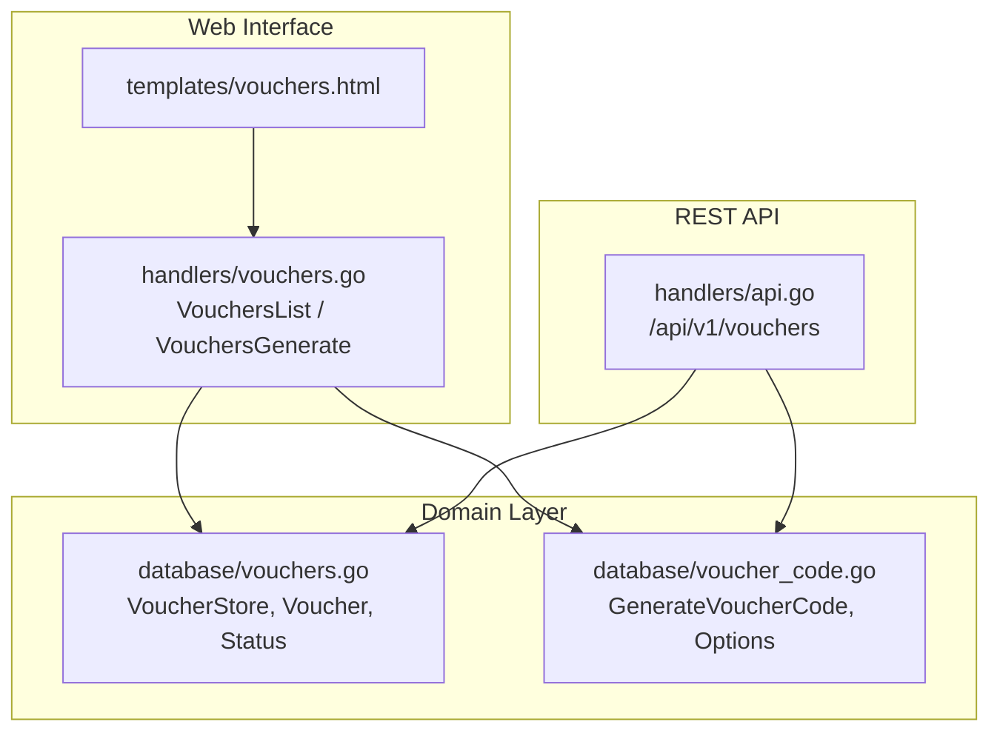
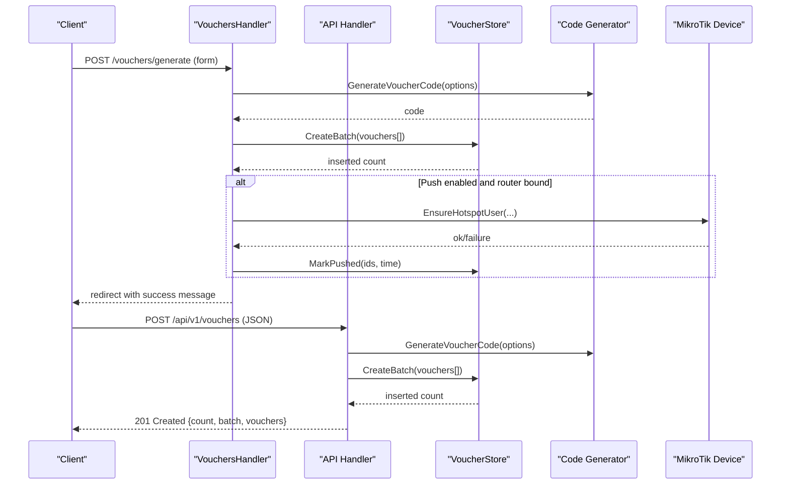
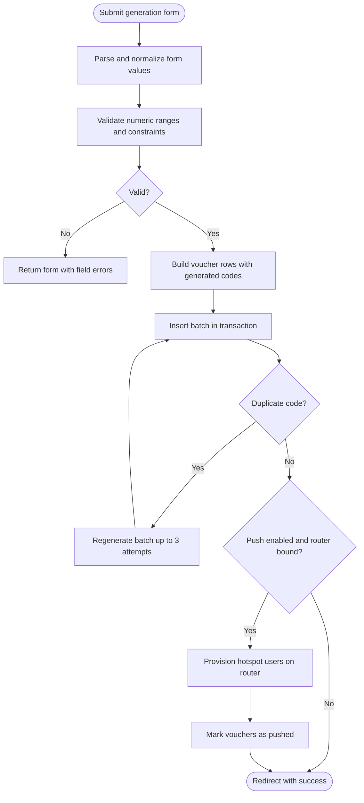
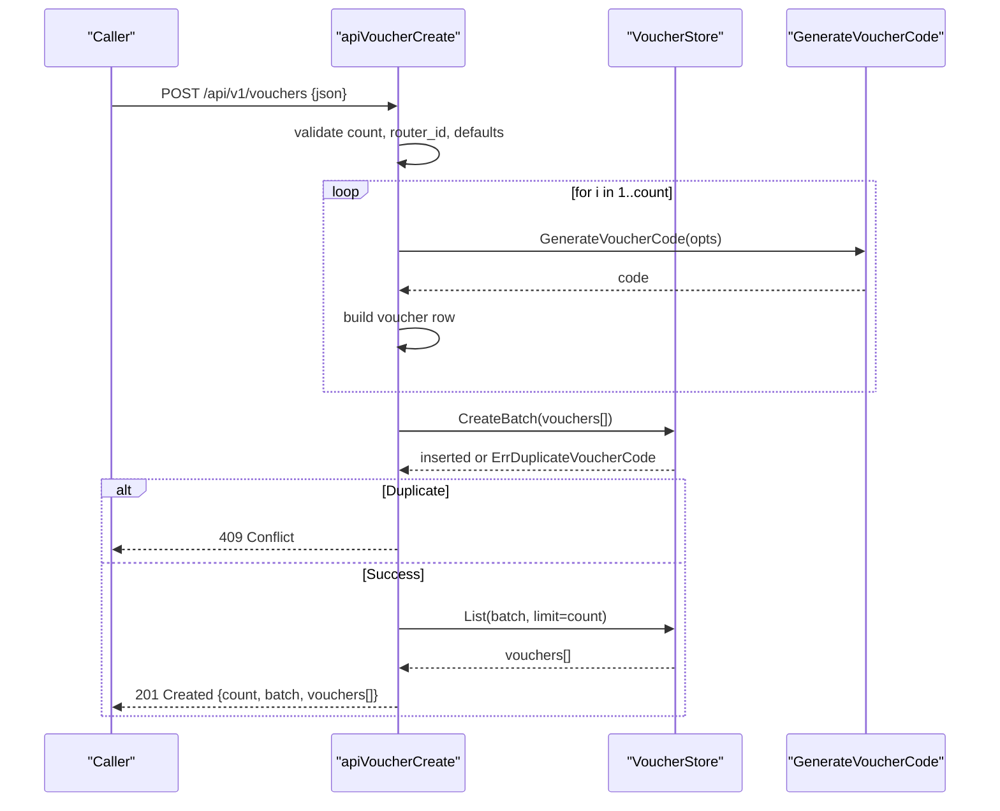
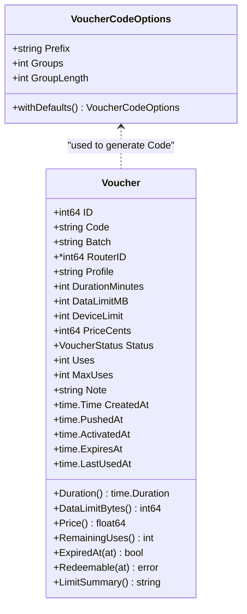
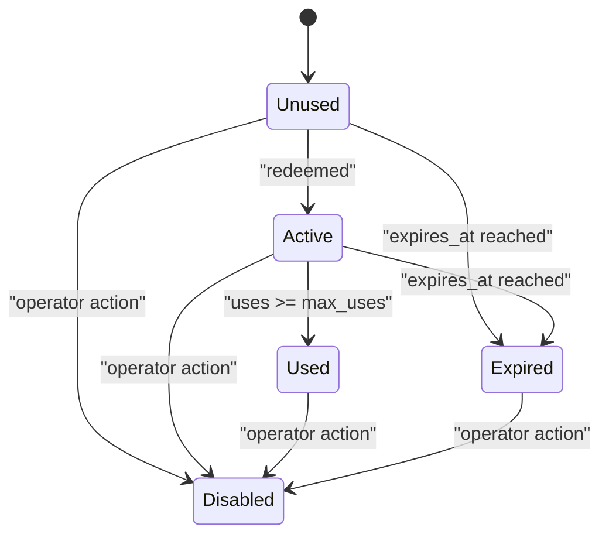
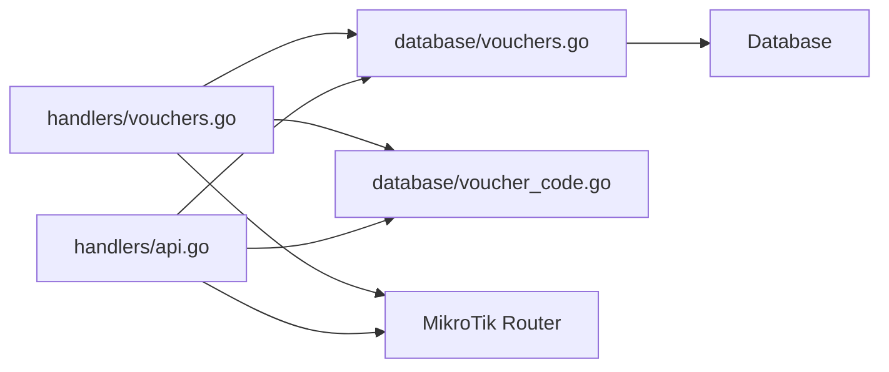

# Voucher Generation

<cite>
**Referenced Files in This Document**   
- [handlers/vouchers.go](file://handlers/vouchers.go)
- [database/vouchers.go](file://database/vouchers.go)
- [database/voucher_code.go](file://database/voucher_code.go)
- [handlers/api.go](file://handlers/api.go)
- [templates/vouchers.html](file://templates/vouchers.html)
</cite>

## Table of Contents
1. [Introduction](#introduction)
2. [Project Structure](#project-structure)
3. [Core Components](#core-components)
4. [Architecture Overview](#architecture-overview)
5. [Detailed Component Analysis](#detailed-component-analysis)
6. [Dependency Analysis](#dependency-analysis)
7. [Performance Considerations](#performance-considerations)
8. [Troubleshooting Guide](#troubleshooting-guide)
9. [Conclusion](#conclusion)

## Introduction
This document explains the prepaid voucher generation system used by the Aircoins Mikrotik Controller. It covers how to create batches of vouchers through the web interface and REST API, documents all generation parameters, describes batch processing, validation rules, error handling, code generation uniqueness guarantees, collision handling, maximum batch size limits, and performance considerations for large-scale creation.

The system supports:
- Web UI batch generation with optional immediate provisioning on a selected router.
- A machine-readable REST API for automated voucher creation.
- Time-based, data-capped, multi-use, and device-limited voucher configurations.
- Collision-safe code generation backed by database uniqueness enforcement.

## Project Structure
The voucher feature spans handlers, database models, code generation utilities, and templates:

**Diagram sources**
- [handlers/vouchers.go:176-370](file://handlers/vouchers.go#L176-L370)
- [handlers/api.go:926-1085](file://handlers/api.go#L926-L1085)
- [database/vouchers.go:78-195](file://database/vouchers.go#L78-L195)
- [database/voucher_code.go:18-76](file://database/voucher_code.go#L18-L76)
- [templates/vouchers.html:26-106](file://templates/vouchers.html#L26-L106)

**Section sources**
- [handlers/vouchers.go:176-370](file://handlers/vouchers.go#L176-L370)
- [handlers/api.go:926-1085](file://handlers/api.go#L926-L1085)
- [database/vouchers.go:78-195](file://database/vouchers.go#L78-L195)
- [database/voucher_code.go:18-76](file://database/voucher_code.go#L18-L76)
- [templates/vouchers.html:26-106](file://templates/vouchers.html#L26-L106)

## Core Components
- Voucher model and lifecycle states: unused, active, used, expired, disabled.
- Voucher store: transactional batch insert, listing, filtering, redemption, status updates, deletion, and statistics.
- Code generator: cryptographically random alphanumeric codes grouped into dash-separated segments with an optional prefix.
- Web handler: form parsing, validation, batch building, persistence, optional router provisioning, CSV export, and administrative actions.
- REST API: JSON endpoints for listing, creating, retrieving, redeeming, and deleting vouchers.

Key responsibilities:
- Validation and defaults are applied before persistence.
- Batch inserts are atomic; duplicate codes trigger retry or conflict responses.
- Router provisioning is optional and separate from ledger creation.
- Redemption enforces controller-side limits while RouterOS enforces device-side limits.

**Section sources**
- [database/vouchers.go:12-195](file://database/vouchers.go#L12-L195)
- [database/voucher_code.go:10-76](file://database/voucher_code.go#L10-L76)
- [handlers/vouchers.go:145-406](file://handlers/vouchers.go#L145-L406)
- [handlers/api.go:926-1085](file://handlers/api.go#L926-L1085)

## Architecture Overview
The voucher generation flow has two entry points:

- Web UI: POST /vouchers/generate
- REST API: POST /api/v1/vouchers

Both build a list of voucher records, generate unique codes, persist them atomically, and optionally push them to a MikroTik hotspot user table.

**Diagram sources**
- [handlers/vouchers.go:293-406](file://handlers/vouchers.go#L293-L406)
- [handlers/api.go:979-1085](file://handlers/api.go#L979-L1085)
- [database/vouchers.go:224-277](file://database/vouchers.go#L224-L277)
- [database/voucher_code.go:53-76](file://database/voucher_code.go#L53-L76)

## Detailed Component Analysis

### Web Interface: Batch Generation Form
The voucher generation page renders a form that collects:
- Router binding
- Quantity
- Batch name
- Hotspot profile
- Duration minutes
- Data limit MB
- Devices per key
- Logins allowed (max uses)
- Price
- Code prefix
- Random groups
- Characters per group
- Optional note
- Provision immediately checkbox

Validation rules:
- Quantity must be between 1 and the configured maximum batch size.
- Numeric fields duration_minutes, data_limit_mb, device_limit, max_uses must be whole numbers; zero means unlimited where applicable.
- Group length must be between 3 and 8 characters.
- Number of groups must be between 1 and 6.
- Price must be a non-negative decimal number.

On successful validation:
- Codes are generated using the configured prefix, groups, and group length.
- Each voucher record includes profile, duration, data limit, device limit, price, max uses, note, and status unused.
- The batch is inserted atomically.
- If push is enabled and a router is bound, the handler provisions each voucher as a hotspot user and marks them pushed.

**Diagram sources**
- [handlers/vouchers.go:145-174](file://handlers/vouchers.go#L145-L174)
- [handlers/vouchers.go:293-406](file://handlers/vouchers.go#L293-L406)

**Section sources**
- [templates/vouchers.html:26-106](file://templates/vouchers.html#L26-L106)
- [handlers/vouchers.go:91-174](file://handlers/vouchers.go#L91-L174)
- [handlers/vouchers.go:293-406](file://handlers/vouchers.go#L293-L406)

### REST API: Batch Creation
Endpoint: POST /api/v1/vouchers

Request body fields:
- router_id: optional integer ID of the target router
- count: number of vouchers to create; defaults to 10 if omitted
- batch: optional batch label; auto-generated if omitted
- profile: hotspot profile string
- duration_minutes: integer minutes; zero means unlimited
- data_limit_mb: integer megabytes; zero means unlimited
- device_limit: integer devices per key; defaults to 1 if omitted
- price_cents: integer cents
- max_uses: integer logins allowed; defaults to 1 if omitted
- note: optional text
- prefix: optional code prefix; default options apply otherwise

Response:
- 201 Created with count, batch, and array of created vouchers
- 400 Bad Request for validation failures
- 409 Conflict when a generated code already exists
- 500 Internal Server Error for unexpected failures

Behavior:
- Validates router existence when provided.
- Enforces maximum batch size.
- Generates codes using default options with optional prefix override.
- Persists the batch atomically.
- Returns the newly created vouchers after insertion.

**Diagram sources**
- [handlers/api.go:979-1085](file://handlers/api.go#L979-L1085)
- [database/vouchers.go:224-277](file://database/vouchers.go#L224-L277)
- [database/voucher_code.go:53-76](file://database/voucher_code.go#L53-L76)

**Section sources**
- [handlers/api.go:979-1085](file://handlers/api.go#L979-L1085)

### Code Generation Algorithm and Uniqueness Guarantees
Algorithm characteristics:
- Alphabet excludes visually similar characters to reduce misreading.
- Codes consist of an optional uppercase prefix followed by N dash-separated groups.
- Each group contains M cryptographically random characters chosen from the safe alphabet.
- Default configuration produces approximately 6.9e11 combinations.
- Generated codes are normalized to uppercase and dash-separated format for storage.
- User input is normalized for lookup by uppercasing and removing dashes/spaces.

Uniqueness guarantees:
- Database enforces a unique constraint on the normalized code column.
- On duplicate detection during batch insert, the web handler retries the entire batch up to three times.
- The API returns a 409 Conflict response indicating a generated code already exists and should be retried.

Collision handling:
- Web UI: automatic regeneration of the full batch with fresh randomness.
- API: caller receives a clear conflict error and can retry the request.

**Diagram sources**
- [database/voucher_code.go:18-76](file://database/voucher_code.go#L18-L76)
- [database/vouchers.go:78-195](file://database/vouchers.go#L78-L195)

**Section sources**
- [database/voucher_code.go:10-109](file://database/voucher_code.go#L10-L109)
- [handlers/vouchers.go:324-345](file://handlers/vouchers.go#L324-L345)
- [handlers/api.go:1055-1065](file://handlers/api.go#L1055-L1065)

### Voucher Lifecycle and Limits
Lifecycle states:
- Unused: never redeemed.
- Active: redeemed and still usable.
- Used: all allowed redemptions consumed.
- Expired: validity window lapsed without use.
- Disabled: operator blocked the key.

Controller-side checks at redemption:
- Disabled keys cannot be redeemed.
- Expired keys cannot be redeemed.
- Keys marked used cannot be redeemed.
- Keys with remaining uses enforced by max_uses and uses counter.

Device-side enforcement:
- RouterOS hotspot user entries enforce uptime and byte limits.
- Device limit controls concurrent sessions per hotspot user.

**Diagram sources**
- [database/vouchers.go:12-58](file://database/vouchers.go#L12-L58)
- [database/vouchers.go:141-160](file://database/vouchers.go#L141-L160)

**Section sources**
- [database/vouchers.go:12-195](file://database/vouchers.go#L12-L195)

### Example Configurations
Time-based vouchers:
- Set duration_minutes to a positive value.
- Leave data_limit_mb at zero for unlimited data.
- Use device_limit of 1 for single-device access.
- Use max_uses of 1 for one-time login.

Data-capped vouchers:
- Set data_limit_mb to a positive value.
- Leave duration_minutes at zero for unlimited time.
- Optionally set device_limit greater than 1 for shared access.

Multi-use vouchers:
- Set max_uses to a value greater than 1.
- Configure duration_minutes and/or data_limit_mb according to policy.
- Use device_limit to control concurrent usage.

Prefix and grouping examples:
- Prefix "AIR", groups 2, group_length 4 produces codes like "AIR-XXXX-XXXX".
- Increase groups or group_length to expand the code space.
- Keep group_length between 3 and 8 and groups between 1 and 6.

These configurations map directly to the web form fields and API request fields described above.

[No sources needed since this section provides conceptual examples based on documented parameters]

## Dependency Analysis
Component relationships:
- Web handler depends on VoucherStore and code generator.
- API handler depends on VoucherStore and code generator.
- VoucherStore implements persistence and business rules for vouchers.
- Code generator provides safe, randomized codes and normalization helpers.

**Diagram sources**
- [handlers/vouchers.go:1-15](file://handlers/vouchers.go#L1-L15)
- [handlers/api.go:11-22](file://handlers/api.go#L11-L22)
- [database/vouchers.go:1-10](file://database/vouchers.go#L1-L10)
- [database/voucher_code.go:1-8](file://database/voucher_code.go#L1-L8)

**Section sources**
- [handlers/vouchers.go:1-15](file://handlers/vouchers.go#L1-L15)
- [handlers/api.go:11-22](file://handlers/api.go#L11-L22)
- [database/vouchers.go:1-10](file://database/vouchers.go#L1-L10)
- [database/voucher_code.go:1-8](file://database/voucher_code.go#L1-L8)

## Performance Considerations
Maximum batch size:
- The web handler caps one generation run to prevent accidental large-scale creation.
- The API also enforces the same maximum batch size.

Batch processing:
- Batch inserts occur in a single transaction for atomicity.
- Duplicate code detection triggers batch regeneration in the web handler up to three attempts.
- Optional router provisioning iterates over vouchers and stops early after five errors to avoid long-running requests.

Large-scale creation recommendations:
- Prefer the API for automation and predictable JSON responses.
- Split very large campaigns into multiple batches to keep requests manageable.
- Avoid enabling immediate provisioning for extremely large batches; provision later in controlled jobs.
- Monitor database load and RouterOS API timeouts when pushing many keys.

Query limits:
- Listing and export operations cap limits to protect performance.

**Section sources**
- [handlers/vouchers.go:17-19](file://handlers/vouchers.go#L17-L19)
- [handlers/vouchers.go:324-345](file://handlers/vouchers.go#L324-L345)
- [handlers/vouchers.go:471-516](file://handlers/vouchers.go#L471-L516)
- [handlers/api.go:1002-1006](file://handlers/api.go#L1002-L1006)
- [database/vouchers.go:705-713](file://database/vouchers.go#L705-L713)

## Troubleshooting Guide
Common issues and resolutions:
- Validation errors on the web form: check quantity range, numeric fields, group length, groups, and price format.
- Duplicate code conflicts:
  - Web UI: automatically regenerates the batch up to three times.
  - API: returns 409 Conflict; retry the request.
- Router provisioning failures:
  - Check router connectivity and credentials.
  - Review first failure message returned by the handler.
  - Remember that provisioning is optional; vouchers remain valid in the ledger even if not pushed.
- Redemption errors:
  - Not redeemable due to disabled, expired, used, or no remaining uses.
  - No router assigned: bind the voucher to a router or configure a default portal device.
- Export limitations:
  - Export queries are capped; paginate or filter to smaller sets if needed.

Operational tips:
- Use batch names to organize and audit print runs.
- Use notes to identify sales channels or campaigns.
- Use CSV export for printing or POS integration.
- Use status filters to find unused, active, used, expired, or disabled vouchers.

**Section sources**
- [handlers/vouchers.go:145-174](file://handlers/vouchers.go#L145-L174)
- [handlers/vouchers.go:324-345](file://handlers/vouchers.go#L324-L345)
- [handlers/vouchers.go:471-516](file://handlers/vouchers.go#L471-L516)
- [handlers/api.go:1055-1065](file://handlers/api.go#L1055-L1065)
- [database/vouchers.go:141-160](file://database/vouchers.go#L141-L160)

## Conclusion
The voucher generation system provides robust, configurable batch creation via both the web interface and REST API. It enforces strict validation, ensures code uniqueness through cryptographic randomness and database constraints, and separates ledger persistence from device provisioning. Operators can tailor vouchers for time-based, data-capped, and multi-use scenarios while maintaining clear auditability through batches, notes, and status tracking. For large-scale deployments, prefer the API, split workloads across batches, and manage provisioning carefully to balance reliability and performance.