# Voucher Lifecycle Management

<cite>
**Referenced Files in This Document**   
- [database/vouchers.go](file://database/vouchers.go)
- [handlers/vouchers.go](file://handlers/vouchers.go)
- [templates/vouchers.html](file://templates/vouchers.html)
</cite>

## Table of Contents
1. [Introduction](#introduction)
2. [Project Structure](#project-structure)
3. [Core Components](#core-components)
4. [Architecture Overview](#architecture-overview)
5. [Detailed Component Analysis](#detailed-component-analysis)
6. [Dependency Analysis](#dependency-analysis)
7. [Performance Considerations](#performance-considerations)
8. [Troubleshooting Guide](#troubleshooting-guide)
9. [Conclusion](#conclusion)
10. [Appendices](#appendices)

## Introduction
This document explains how prepaid vouchers are created, tracked, validated, expired, and managed throughout their lifecycle. It focuses on the administrative workflow: generating batches, enabling or disabling keys, changing status manually, deleting records with optional router cleanup, exporting data, and reviewing usage statistics. It also documents automatic expiration, usage tracking, and the validation interface used for troubleshooting voucher problems.

## Project Structure
The voucher system spans three main layers:

- Data model and persistence layer: defines voucher states, limits, redemption logic, batch operations, expiration synchronization, and statistics.
- HTTP handler layer: exposes administrative endpoints for listing, filtering, generating, provisioning, validating, updating status, deleting, batch deletion, and CSV export.
- User interface template: renders the voucher management page, generation form, filters, actions, and batch deletion controls.

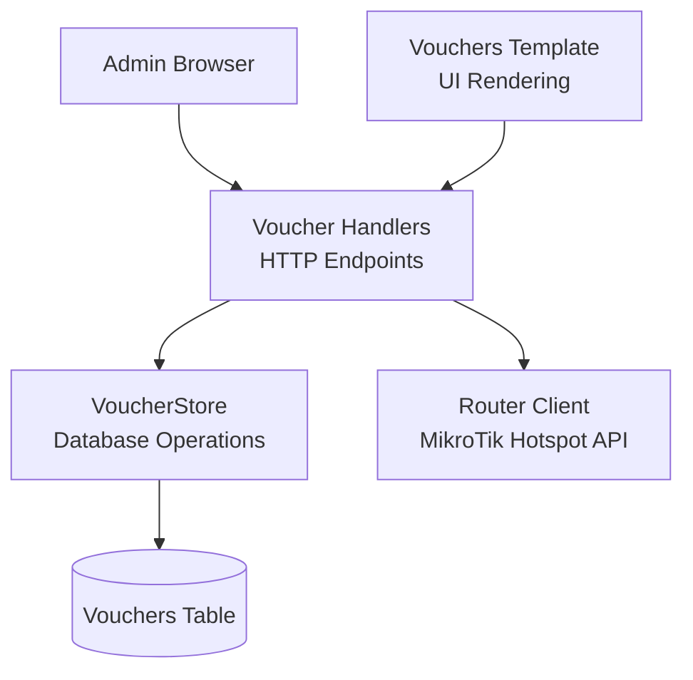

**Diagram sources**
- [handlers/vouchers.go:176-269](file://handlers/vouchers.go#L176-L269)
- [database/vouchers.go:197-276](file://database/vouchers.go#L197-L276)
- [templates/vouchers.html:14-24](file://templates/vouchers.html#L14-L24)

**Section sources**
- [database/vouchers.go:12-102](file://database/vouchers.go#L12-L102)
- [handlers/vouchers.go:17-66](file://handlers/vouchers.go#L17-L66)
- [templates/vouchers.html:1-24](file://templates/vouchers.html#L1-L24)

## Core Components
- Voucher state model: represents lifecycle status, allowances, timestamps, and helper methods for validation and display.
- VoucherStore: persists vouchers, performs batch creation, redemption, status changes, deletion, batch deletion, expiration sync, and statistics aggregation.
- Voucher handlers: implement admin workflows such as listing, filtering, generation, provisioning, validation, status updates, deletion, batch deletion, and CSV export.
- Vouchers template: provides the administrative UI for generation, filtering, pagination, and batch operations.

Key responsibilities:
- State definitions and validation rules live in the data model.
- Transactional redemption and expiration synchronization ensure consistency.
- Handlers coordinate user input, database access, and optional router interactions.
- The template surfaces statistics, filters, and actionable controls.

**Section sources**
- [database/vouchers.go:12-160](file://database/vouchers.go#L12-L160)
- [database/vouchers.go:197-576](file://database/vouchers.go#L197-L576)
- [handlers/vouchers.go:176-800](file://handlers/vouchers.go#L176-L800)
- [templates/vouchers.html:14-197](file://templates/vouchers.html#L14-L197)

## Architecture Overview
The voucher lifecycle is enforced by both local ledger logic and device-side enforcement:

- Local ledger: tracks code, batch, router binding, profile, time/data/device limits, price, status, uses, max uses, notes, and timestamps.
- Device side: MikroTik hotspot users enforce uptime and byte limits; controller can provision or revoke hotspot users.
- Expiration: controller marks unused/active vouchers expired when their validity window lapses.
- Redemption: transactionally increments use count, sets activation/expiry timestamps, and transitions to active or used depending on remaining uses.

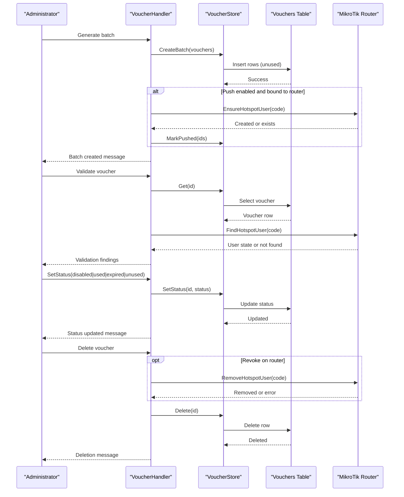

**Diagram sources**
- [handlers/vouchers.go:293-370](file://handlers/vouchers.go#L293-L370)
- [handlers/vouchers.go:518-568](file://handlers/vouchers.go#L518-L568)
- [handlers/vouchers.go:570-630](file://handlers/vouchers.go#L570-L630)
- [handlers/vouchers.go:632-708](file://handlers/vouchers.go#L632-L708)
- [database/vouchers.go:227-276](file://database/vouchers.go#L227-L276)
- [database/vouchers.go:497-539](file://database/vouchers.go#L497-L539)

## Detailed Component Analysis

### Voucher States and Transitions
The voucher lifecycle has five explicit states:

- Unused: newly generated key that has never been redeemed.
- Active: key was redeemed at least once and still has redemptions left.
- Used: all allowed redemptions have been consumed.
- Expired: validity window lapsed while unused or active.
- Disabled: operator blocked the key.

Transitions:
- Unused → Active: first successful redemption.
- Active → Used: final redemption reached.
- Unused/Active → Expired: automatic expiration when expires_at passes.
- Any → Disabled: manual disable action.
- Manual overrides: administrator can set status directly to disabled, unused, used, or expired.

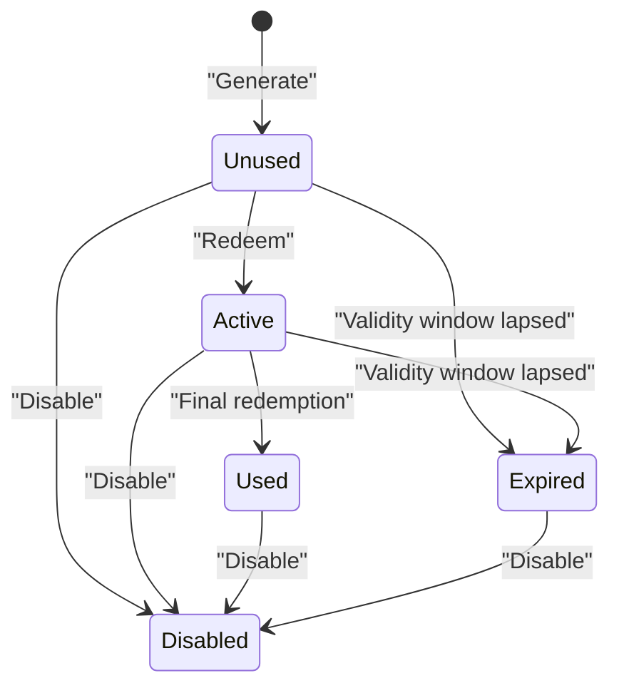

**Diagram sources**
- [database/vouchers.go:12-26](file://database/vouchers.go#L12-L26)
- [database/vouchers.go:141-160](file://database/vouchers.go#L141-L160)
- [database/vouchers.go:439-495](file://database/vouchers.go#L439-L495)
- [database/vouchers.go:561-576](file://database/vouchers.go#L561-L576)
- [handlers/vouchers.go:632-666](file://handlers/vouchers.go#L632-L666)

**Section sources**
- [database/vouchers.go:12-76](file://database/vouchers.go#L12-L76)
- [database/vouchers.go:141-160](file://database/vouchers.go#L141-L160)
- [database/vouchers.go:439-495](file://database/vouchers.go#L439-L495)
- [database/vouchers.go:561-576](file://database/vouchers.go#L561-L576)
- [handlers/vouchers.go:632-666](file://handlers/vouchers.go#L632-L666)

### Creation and Batch Generation
Administrators generate vouchers through a form that supports:

- Binding to a specific router or leaving it unbound.
- Batch naming and quantity control.
- Code formatting options: prefix, number of groups, group length.
- Hotspot profile assignment.
- Time limit (minutes), data limit (MB), devices per key.
- Price in cents and maximum login uses.
- Optional immediate provisioning on the target router.

Generation behavior:
- Codes are generated uniquely; if a collision occurs, the handler retries up to three times.
- Each voucher defaults to unused status.
- If push is enabled and a router is bound, the handler provisions hotspot users and marks them pushed.

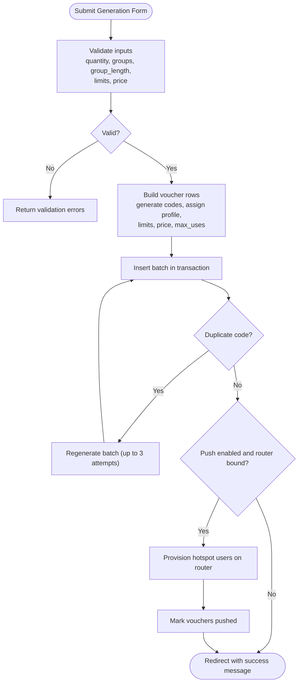

**Diagram sources**
- [handlers/vouchers.go:145-174](file://handlers/vouchers.go#L145-L174)
- [handlers/vouchers.go:293-370](file://handlers/vouchers.go#L293-L370)
- [handlers/vouchers.go:372-406](file://handlers/vouchers.go#L372-L406)
- [handlers/vouchers.go:471-516](file://handlers/vouchers.go#L471-L516)
- [database/vouchers.go:227-276](file://database/vouchers.go#L227-L276)

**Section sources**
- [handlers/vouchers.go:145-174](file://handlers/vouchers.go#L145-L174)
- [handlers/vouchers.go:293-370](file://handlers/vouchers.go#L293-L370)
- [handlers/vouchers.go:372-406](file://handlers/vouchers.go#L372-L406)
- [handlers/vouchers.go:471-516](file://handlers/vouchers.go#L471-L516)
- [database/vouchers.go:227-276](file://database/vouchers.go#L227-L276)

### Usage Tracking and Redemption
Redemption is transactional to prevent race conditions where two simultaneous logins consume the same single-use key.

Redemption process:
- Load voucher by id.
- Check redeemability based on status, expiry, and remaining uses.
- Increment uses.
- Set activation timestamp if missing.
- Compute expiry timestamp if missing and duration is configured.
- Transition to active unless max uses reached, then transition to used.
- Update last_used_at.
- Return refreshed voucher for display.

Usage tracking fields include:
- Uses: number of redemptions performed.
- MaxUses: maximum allowed redemptions.
- RemainingUses: computed allowance.
- ActivatedAt: first activation timestamp.
- ExpiresAt: validity end timestamp.
- LastUsedAt: most recent redemption timestamp.

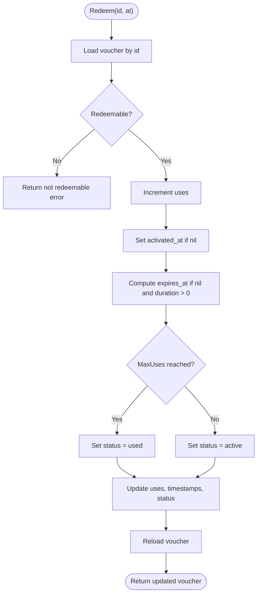

**Diagram sources**
- [database/vouchers.go:141-160](file://database/vouchers.go#L141-L160)
- [database/vouchers.go:439-495](file://database/vouchers.go#L439-L495)

**Section sources**
- [database/vouchers.go:125-160](file://database/vouchers.go#L125-L160)
- [database/vouchers.go:439-495](file://database/vouchers.go#L439-L495)

### Automatic Expiration Process
Expiration is synchronized before listings so administrators see accurate badges.

Rules:
- Only unused and active vouchers can be marked expired.
- Expiration applies only when expires_at is present and less than or equal to current time.
- SyncExpired returns the number of affected rows.

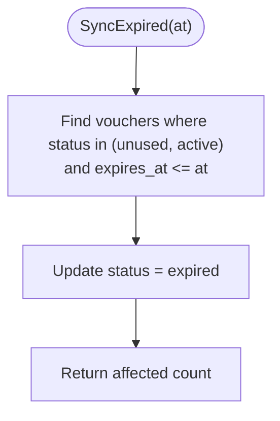

**Diagram sources**
- [database/vouchers.go:561-576](file://database/vouchers.go#L561-L576)
- [handlers/vouchers.go:203-209](file://handlers/vouchers.go#L203-L209)

**Section sources**
- [database/vouchers.go:561-576](file://database/vouchers.go#L561-L576)
- [handlers/vouchers.go:203-209](file://handlers/vouchers.go#L203-L209)

### Administrative Operations

#### Enabling and Disabling Vouchers
Administrators can change a voucher’s lifecycle state via a dedicated endpoint. Supported actions include:
- Disable: block redemption.
- Re-enable: reset to unused.
- Mark as used: force final consumption.
- Mark as expired: force expiration.

Validation:
- Unknown actions return an error.
- Not-found vouchers return a not-found response.

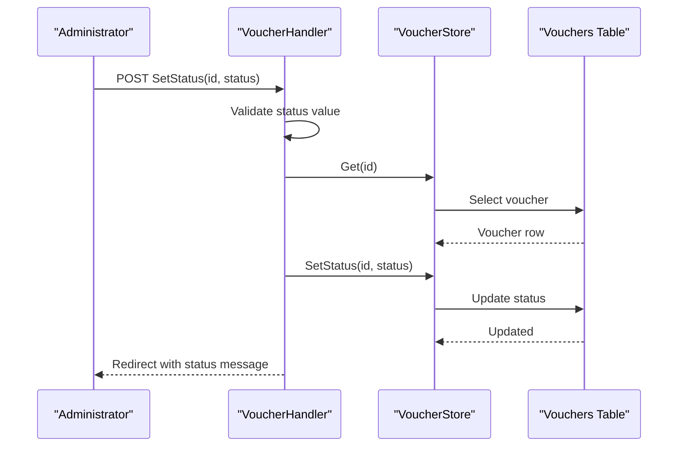

**Diagram sources**
- [handlers/vouchers.go:632-666](file://handlers/vouchers.go#L632-L666)
- [database/vouchers.go:497-511](file://database/vouchers.go#L497-L511)

**Section sources**
- [handlers/vouchers.go:632-666](file://handlers/vouchers.go#L632-L666)
- [database/vouchers.go:497-511](file://database/vouchers.go#L497-L511)

#### Manual Status Changes
Manual status changes allow operators to correct ledger state after troubleshooting or reconciliation. The supported statuses map directly to the lifecycle constants.

Best practices:
- Use “disabled” to immediately stop misuse.
- Use “used” when a key was consumed outside the portal but needs audit alignment.
- Use “expired” when a key’s validity window should be considered closed.
- Avoid arbitrary state jumps without investigation.

**Section sources**
- [handlers/vouchers.go:632-666](file://handlers/vouchers.go#L632-L666)
- [database/vouchers.go:12-26](file://database/vouchers.go#L12-L26)

#### Deletion with Optional Router Cleanup
Deletion removes the voucher from the ledger. When requested and the voucher is bound to a router, the handler attempts to remove the corresponding hotspot user on the device.

Behavior:
- If router lookup or removal fails, the handler logs a warning but still deletes the voucher.
- Success messages indicate whether the hotspot user was revoked.

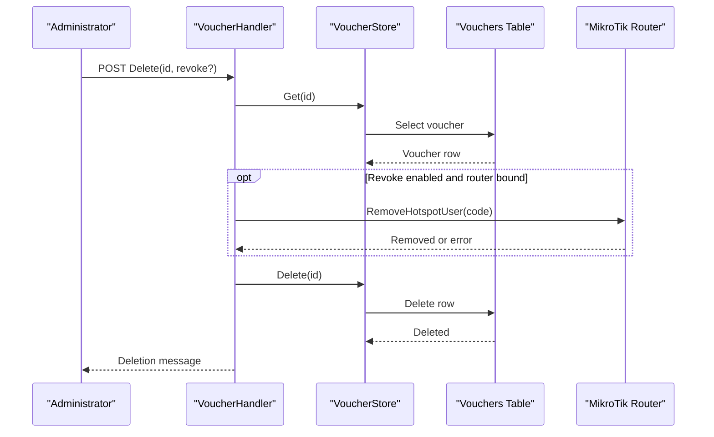

**Diagram sources**
- [handlers/vouchers.go:668-708](file://handlers/vouchers.go#L668-L708)
- [database/vouchers.go:529-539](file://database/vouchers.go#L529-L539)

**Section sources**
- [handlers/vouchers.go:668-708](file://handlers/vouchers.go#L668-L708)
- [database/vouchers.go:529-539](file://database/vouchers.go#L529-L539)

#### Batch Operations
Batch deletion allows removing entire print runs. Administrators can choose to delete only unused and expired keys, preserving redeemed keys for audit purposes.

Behavior:
- If only_unused is selected, deletion targets unused and expired statuses.
- Otherwise, all vouchers in the batch are removed.

**Section sources**
- [handlers/vouchers.go:710-730](file://handlers/vouchers.go#L710-L730)
- [database/vouchers.go:541-559](file://database/vouchers.go#L541-L559)
- [templates/vouchers.html:177-192](file://templates/vouchers.html#L177-L192)

### Voucher Validation Interface
The validation endpoint cross-checks:
- Local ledger redeemability.
- Whether the voucher is bound to a router.
- Whether the router is reachable.
- Whether a hotspot user exists on the device and its state.

Output:
- A human-readable summary including ledger readiness, device binding, device reachability, and hotspot user details.

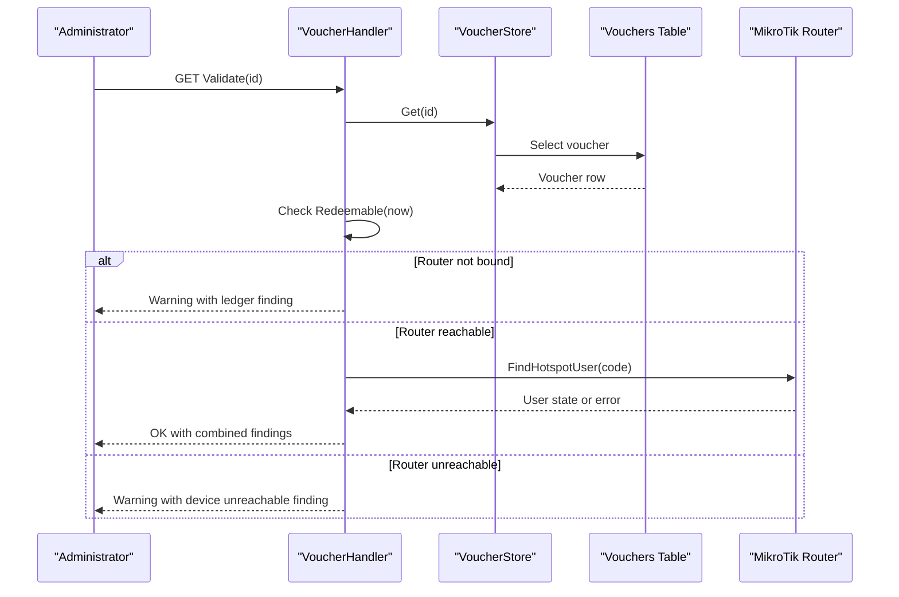

**Diagram sources**
- [handlers/vouchers.go:570-630](file://handlers/vouchers.go#L570-L630)
- [database/vouchers.go:141-160](file://database/vouchers.go#L141-L160)

**Section sources**
- [handlers/vouchers.go:570-630](file://handlers/vouchers.go#L570-L630)
- [database/vouchers.go:141-160](file://database/vouchers.go#L141-L160)

### Export Functionality
Export streams filtered vouchers as CSV for reporting and backup.

Supported filters:
- Status.
- Batch.
- Search query across code, batch, and note.
- Router binding.

CSV columns include:
- Code, batch, router name, profile, duration minutes, data limit MB, device limit, price, status label, uses, max uses, created timestamp, activated timestamp, expires timestamp, pushed flag, and note.

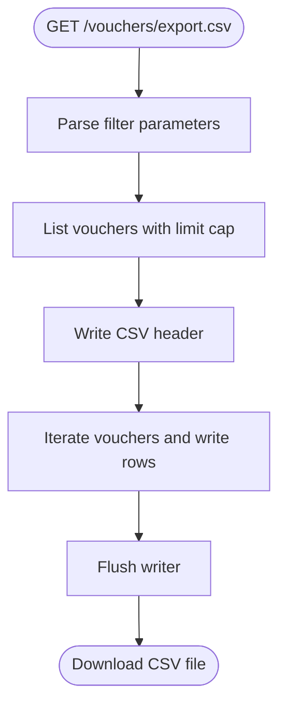

**Diagram sources**
- [handlers/vouchers.go:732-794](file://handlers/vouchers.go#L732-L794)

**Section sources**
- [handlers/vouchers.go:732-794](file://handlers/vouchers.go#L732-L794)

### Statistics Collection
Statistics aggregate voucher counts and monetary values for dashboard display.

Metrics:
- Total vouchers.
- Counts per status: unused, active, used, expired, disabled.
- Pushed vouchers: those already provisioned on routers.
- Billed cents: face value of vouchers redeemed at least once.
- Face value cents: total face value of all generated vouchers.

Display:
- The voucher page shows total issued, unused, active, used, pushed, and redeemed value.

**Section sources**
- [database/vouchers.go:578-645](file://database/vouchers.go#L578-L645)
- [handlers/vouchers.go:242-246](file://handlers/vouchers.go#L242-L246)
- [templates/vouchers.html:14-19](file://templates/vouchers.html#L14-L19)

## Dependency Analysis
The voucher subsystem depends on:

- Database layer: SQL queries for CRUD, batch operations, expiration sync, and statistics.
- Router client: optional integration with MikroTik hotspot API for provisioning and validation.
- Template layer: rendering of administrative UI and forms.

Coupling:
- Handlers depend on VoucherStore for persistence and on RouterClient for device operations.
- VoucherStore depends on the database abstraction and shared helpers for scanning and stamping timestamps.
- Template depends on handler-provided view models.

Potential circular dependencies:
- None observed between voucher modules; router interaction is optional and invoked by handlers.

External integrations:
- MikroTik hotspot API for user provisioning, querying, and removal.

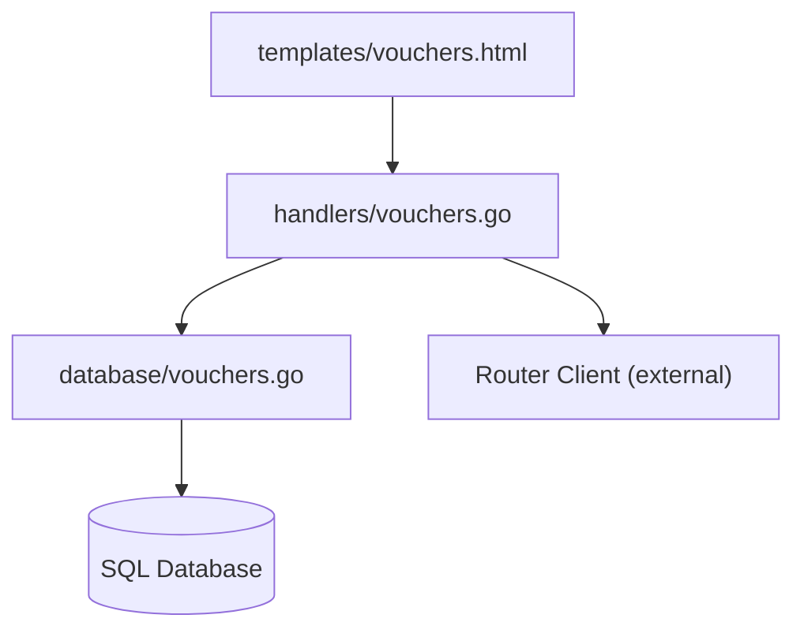

**Diagram sources**
- [handlers/vouchers.go:1-15](file://handlers/vouchers.go#L1-L15)
- [database/vouchers.go:1-10](file://database/vouchers.go#L1-L10)
- [templates/vouchers.html:1-10](file://templates/vouchers.html#L1-L10)

**Section sources**
- [handlers/vouchers.go:1-15](file://handlers/vouchers.go#L1-L15)
- [database/vouchers.go:1-10](file://database/vouchers.go#L1-L10)
- [templates/vouchers.html:1-10](file://templates/vouchers.html#L1-L10)

## Performance Considerations
- Batch insertion uses transactions to reduce overhead and maintain atomicity.
- Listing and counting support filters and pagination to avoid large result sets.
- Export caps list size to a safe limit for streaming CSV output.
- Expiration sync runs before listing to keep UI badges accurate without heavy background jobs.
- Redemptions are transactional to prevent race conditions under concurrent access.

Recommendations:
- Keep batch sizes reasonable; the handler enforces a maximum per generation run.
- Use filters to narrow exports and listings.
- Monitor router connectivity during bulk provisioning to avoid long timeouts.

[No sources needed since this section provides general guidance]

## Troubleshooting Guide
Common issues and resolutions:

- Voucher cannot be redeemed:
  - Check status: disabled, expired, or used.
  - Verify remaining uses and expiry timestamp.
  - Use the validation endpoint to inspect ledger and device state.

- Voucher appears active but is expired:
  - Trigger SyncExpired by reloading the voucher listing page.
  - Confirm expires_at is set and earlier than current time.

- Voucher not working on device:
  - Ensure voucher is bound to a router.
  - Run validation to check hotspot user existence and device reachability.
  - Provision the voucher to create or refresh the hotspot user.

- Deletion does not remove hotspot user:
  - Check router connectivity and permissions.
  - Review logs for removal errors; voucher deletion still succeeds.

- Batch deletion removes more than expected:
  - Confirm only_unused selection preserves redeemed keys.
  - Verify batch name matches intended print run.

**Section sources**
- [handlers/vouchers.go:570-630](file://handlers/vouchers.go#L570-L630)
- [handlers/vouchers.go:668-708](file://handlers/vouchers.go#L668-L708)
- [handlers/vouchers.go:710-730](file://handlers/vouchers.go#L710-L730)
- [database/vouchers.go:141-160](file://database/vouchers.go#L141-L160)
- [database/vouchers.go:561-576](file://database/vouchers.go#L561-L576)

## Conclusion
The voucher lifecycle is designed around clear states, transactional redemption, automatic expiration, and robust administrative controls. Operators can generate batches, provision keys on routers, validate vouchers against both ledger and device state, adjust status manually, delete records with optional router cleanup, perform batch operations, and export data for reporting. Following the best practices outlined here helps maintain accurate accounting, secure access control, and reliable hotspot provisioning.

[No sources needed since this section summarizes without analyzing specific files]

## Appendices

### Common Management Workflows

- Generate and provision vouchers:
  - Fill generation form with desired limits and profile.
  - Enable push to provision immediately on the target router.
  - Confirm success message and check pushed count in statistics.

- Investigate a problematic voucher:
  - Use validation to inspect ledger and device state.
  - If device user is missing, provision the voucher.
  - If ledger says expired or used, reconcile manually if appropriate.

- Clean up old batches:
  - Filter by batch name.
  - Choose only_unused to preserve audit trail.
  - Confirm deletion count.

- Export for reporting:
  - Apply filters matching the report scope.
  - Download CSV and import into POS or accounting systems.

**Section sources**
- [handlers/vouchers.go:293-370](file://handlers/vouchers.go#L293-L370)
- [handlers/vouchers.go:518-568](file://handlers/vouchers.go#L518-L568)
- [handlers/vouchers.go:570-630](file://handlers/vouchers.go#L570-L630)
- [handlers/vouchers.go:710-730](file://handlers/vouchers.go#L710-L730)
- [handlers/vouchers.go:732-794](file://handlers/vouchers.go#L732-L794)
- [templates/vouchers.html:26-107](file://templates/vouchers.html#L26-L107)
- [templates/vouchers.html:177-192](file://templates/vouchers.html#L177-L192)