# Voucher Provisioning

<cite>
**Referenced Files in This Document**
- [README.md](file://README.md)
- [handlers/vouchers.go](file://handlers/vouchers.go)
- [database/vouchers.go](file://database/vouchers.go)
- [database/voucher_code.go](file://database/voucher_code.go)
- [handlers/mikrotik.go](file://handlers/mikrotik.go)
- [handlers/mikrotik_hotspot_installer.go](file://handlers/mikrotik_hotspot_installer.go)
</cite>

## Table of Contents
1. [Introduction](#introduction)
2. [Project Structure](#project-structure)
3. [Core Components](#core-components)
4. [Architecture Overview](#architecture-overview)
5. [Detailed Component Analysis](#detailed-component-analysis)
6. [Dependency Analysis](#dependency-analysis)
7. [Performance Considerations](#performance-considerations)
8. [Troubleshooting Guide](#troubleshooting-guide)
9. [Conclusion](#conclusion)

## Introduction
This document explains how the controller provisions prepaid voucher codes as MikroTik Hotspot users and how it keeps a local ledger consistent when network or API calls fail. The system has two complementary views:

- **Local ledger**: SQLite-backed records for each voucher code, including validity, usage count, expiry, price, profile mapping, and whether the key was successfully pushed to a router.
- **Remote state**: MikroTik Hotspot user accounts that enforce time, data, and device limits on the router itself.

The push mechanism is optional during batch generation but is also executed automatically during captive portal redemption. This design lets vouchers work even if the controller restarts or goes offline after provisioning.

**Section sources**
- [README.md:187-195](file://README.md#L187-L195)

## Project Structure
The voucher provisioning flow spans three main layers:

| Layer | Responsibility | Key files |
|---|---|---|
| HTTP handlers | Admin UI, bulk generation, single-voucher push, validation, and captive portal redemption | `handlers/vouchers.go` |
| Router client | MikroTik REST/ROS calls, hotspot user/profile management, login/logout | `handlers/mikrotik.go`, `handlers/mikrotik_hotspot_installer.go` |
| Local ledger | Voucher generation, lifecycle states, redemption, push tracking, statistics | `database/vouchers.go`, `database/voucher_code.go` |

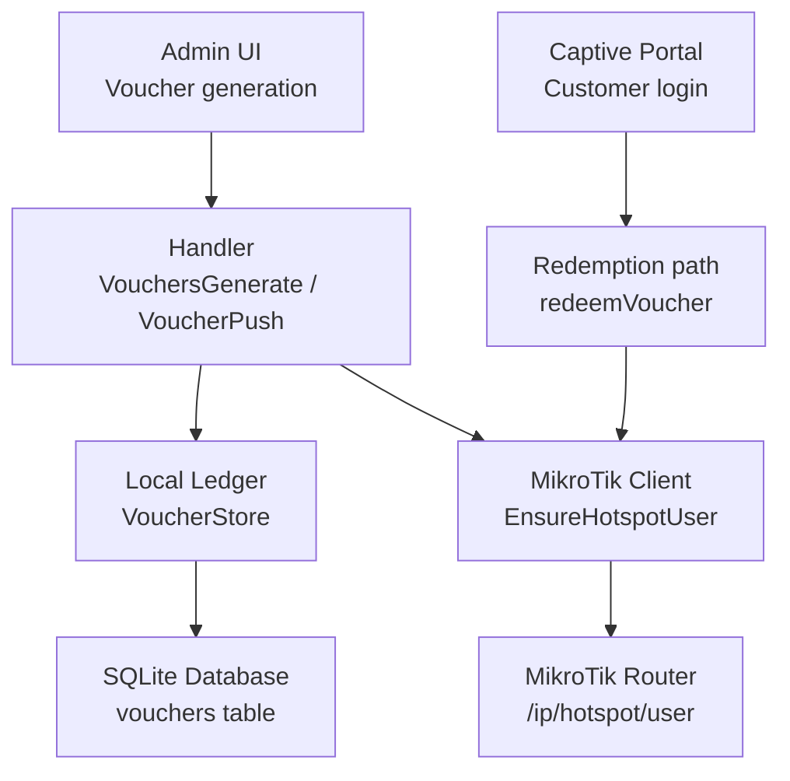

**Diagram sources**
- [handlers/vouchers.go:293-370](file://handlers/vouchers.go#L293-L370)
- [handlers/vouchers.go:836-884](file://handlers/vouchers.go#L836-L884)
- [handlers/mikrotik.go:1204-1268](file://handlers/mikrotik.go#L1204-L1268)
- [database/vouchers.go:513-527](file://database/vouchers.go#L513-L527)

**Section sources**
- [handlers/vouchers.go:17-19](file://handlers/vouchers.go#L17-L19)
- [handlers/vouchers.go:293-370](file://handlers/vouchers.go#L293-L370)
- [database/vouchers.go:78-102](file://database/vouchers.go#L78-L102)

## Core Components
The provisioning system is built around these core concepts:

| Concept | Meaning |
|---|---|
| Voucher code | A human-readable prepaid key such as `AIR-XXXX-XXXX`. It becomes both the hotspot username and password. |
| Profile | A MikroTik hotspot user profile that controls shared devices, rate limiting, session behavior, and scripts. |
| Limits | Time (`limit-uptime`) and data (`limit-bytes-total`) are enforced by the router; device concurrency comes from the profile’s shared-user setting. |
| Pushed state | A local flag indicating that the hotspot user already exists on the target router. |
| Redemption | Consuming one allowed use in the local ledger after successful provisioning and authentication. |

Key relationships:

- Each voucher maps to one hotspot user name.
- The hotspot user carries the same code as its password.
- The voucher’s profile field selects the router-side policy.
- The voucher’s duration and data limit become RouterOS limits.
- The voucher’s device limit influences the hotspot profile’s shared-user allowance when greater than one.

**Section sources**
- [handlers/vouchers.go:452-469](file://handlers/vouchers.go#L452-L469)
- [handlers/mikrotik.go:1149-1162](file://handlers/mikrotik.go#L1149-L1162)
- [database/vouchers.go:78-102](file://database/vouchers.go#L78-L102)
- [database/vouchers.go:141-160](file://database/vouchers.go#L141-L160)

## Architecture Overview
The provisioning architecture separates durable state from transient device state.

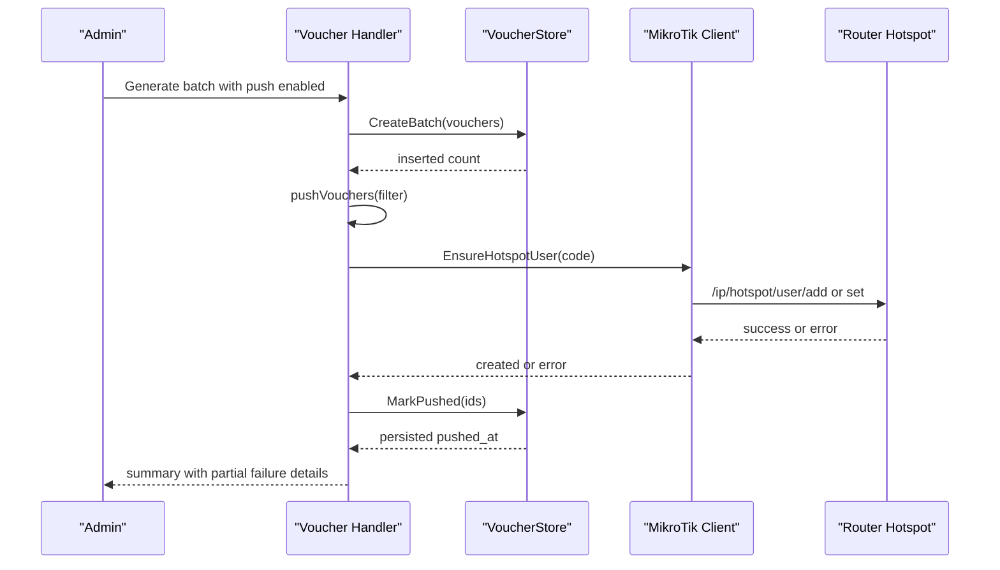

**Diagram sources**
- [handlers/vouchers.go:293-370](file://handlers/vouchers.go#L293-L370)
- [handlers/vouchers.go:471-516](file://handlers/vouchers.go#L471-L516)
- [handlers/mikrotik.go:1204-1268](file://handlers/mikrotik.go#L1204-L1268)
- [database/vouchers.go:513-527](file://database/vouchers.go#L513-L527)

## Detailed Component Analysis

### Voucher Code Generation and Normalization
Voucher codes are generated with a restricted alphabet that avoids visually similar characters. They are normalized for storage and lookup so customers can type codes without dashes or spaces.

Important behaviors:

- Codes are grouped and prefixed according to operator settings.
- Group length and group count are bounded.
- Duplicate codes trigger a retry loop for the entire batch.
- Lookup keys ignore case, dashes, and spaces.

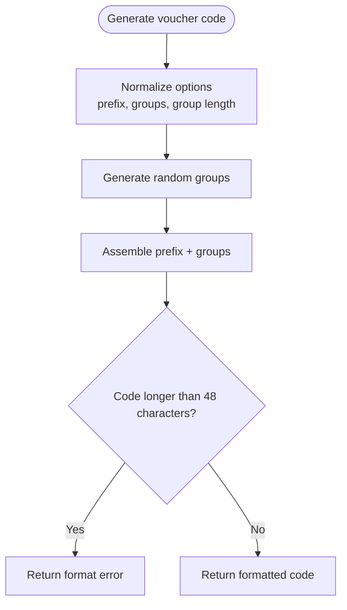

**Diagram sources**
- [database/voucher_code.go:10-16](file://database/voucher_code.go#L10-L16)
- [database/voucher_code.go:18-51](file://database/voucher_code.go#L18-L51)
- [database/voucher_code.go:53-76](file://database/voucher_code.go#L53-L76)
- [database/voucher_code.go:90-104](file://database/voucher_code.go#L90-L104)

**Section sources**
- [database/voucher_code.go:10-16](file://database/voucher_code.go#L10-L16)
- [database/voucher_code.go:53-76](file://database/voucher_code.go#L53-L76)
- [database/voucher_code.go:90-104](file://database/voucher_code.go#L90-L104)

### Batch Creation and Retry Logic
Batch creation protects against rare database collisions by regenerating the full batch up to three times.

Flow:

1. Build a batch of vouchers with unique codes.
2. Insert them in a transaction.
3. If a duplicate code error occurs, regenerate and retry.
4. After successful insertion, optionally provision the batch on the selected router.

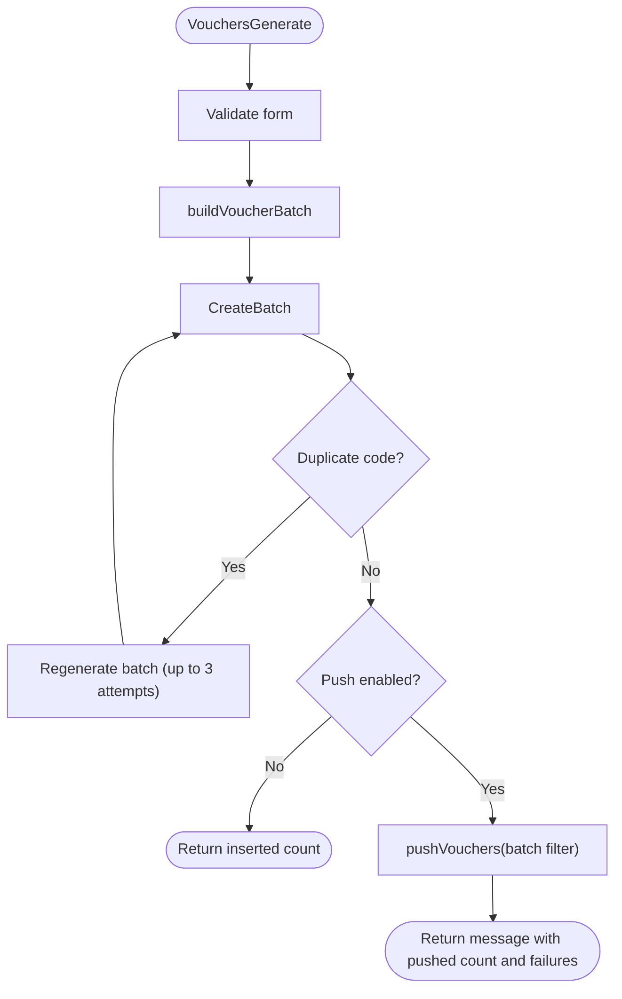

**Diagram sources**
- [handlers/vouchers.go:293-370](file://handlers/vouchers.go#L293-L370)
- [handlers/vouchers.go:372-406](file://handlers/vouchers.go#L372-L406)
- [database/vouchers.go:224-277](file://database/vouchers.go#L224-L277)

**Section sources**
- [handlers/vouchers.go:293-370](file://handlers/vouchers.go#L293-L370)
- [handlers/vouchers.go:372-406](file://handlers/vouchers.go#L372-L406)
- [database/vouchers.go:194-195](file://database/vouchers.go#L194-L195)
- [database/vouchers.go:224-277](file://database/vouchers.go#L224-L277)

### Push Mechanism and Bulk Provisioning
The push mechanism creates or updates hotspot users for every matching voucher. It is used both by batch generation and by per-voucher provisioning.

Key behaviors:

- Disabled vouchers are skipped.
- Each voucher is mapped to a `HotspotUserSpec`.
- Errors are collected rather than stopping immediately.
- After five errors, the loop stops early to avoid long hangs.
- Only successfully provisioned IDs are marked pushed.
- If marking the ledger fails, the operation reports a mixed result.

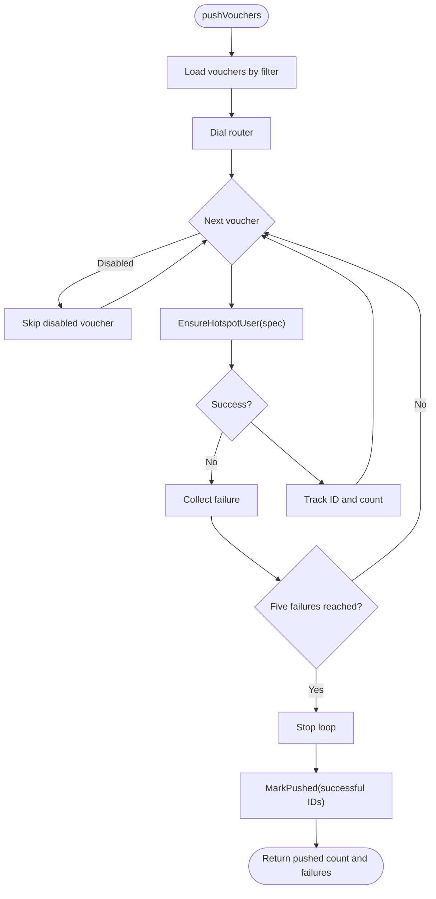

**Diagram sources**
- [handlers/vouchers.go:471-516](file://handlers/vouchers.go#L471-L516)
- [handlers/vouchers.go:452-469](file://handlers/vouchers.go#L452-L469)

**Section sources**
- [handlers/vouchers.go:471-516](file://handlers/vouchers.go#L471-L516)
- [handlers/vouchers.go:452-469](file://handlers/vouchers.go#L452-L469)

### EnsureHotspotUser Function
`EnsureHotspotUser` is the central function that synchronizes a voucher with a MikroTik hotspot user.

Responsibilities:

- Validate the user name.
- Build RouterOS arguments for name, password, profile, uptime limit, byte limit, comment, and enabled state.
- Look up an existing hotspot user.
- Update the existing user when found.
- Create the hotspot profile when needed.
- Add the hotspot user.
- Retry once if the profile was missing after the first add attempt.

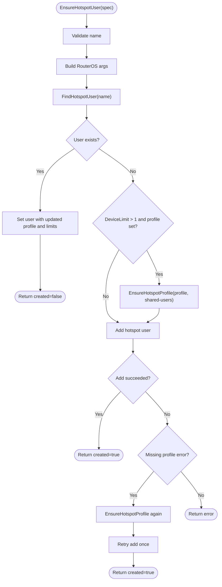

**Diagram sources**
- [handlers/mikrotik.go:1180-1202](file://handlers/mikrotik.go#L1180-L1202)
- [handlers/mikrotik.go:1204-1268](file://handlers/mikrotik.go#L1204-L1268)
- [handlers/mikrotik.go:1121-1147](file://handlers/mikrotik.go#L1121-L1147)

**Section sources**
- [handlers/mikrotik.go:1180-1202](file://handlers/mikrotik.go#L1180-L1202)
- [handlers/mikrotik.go:1204-1268](file://handlers/mikrotik.go#L1204-L1268)
- [handlers/mikrotik.go:1121-1147](file://handlers/mikrotik.go#L1121-L1147)

### Local Ledger System
The local ledger tracks voucher lifecycle and provisioning state independently of the router.

Primary fields and behaviors:

| Field or method | Purpose |
|---|---|
| `Code` | Unique voucher identifier used as hotspot username/password. |
| `Profile` | RouterOS hotspot profile name. |
| `DurationMinutes` | Maps to `limit-uptime`. |
| `DataLimitMB` | Maps to `limit-bytes-total`. |
| `DeviceLimit` | Influences profile shared-user allowance when greater than one. |
| `Status` | Lifecycle state: unused, active, used, expired, disabled. |
| `Uses` / `MaxUses` | Controls multi-use vouchers. |
| `PushedAt` | Records successful push to a router. |
| `Redeemable` | Validates status, expiry, and remaining uses. |
| `Redeem` | Atomically consumes a use inside a transaction. |
| `MarkPushed` | Updates `pushed_at` for successfully provisioned vouchers. |

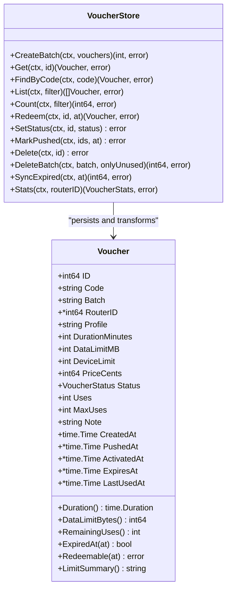

**Diagram sources**
- [database/vouchers.go:78-102](file://database/vouchers.go#L78-L102)
- [database/vouchers.go:104-180](file://database/vouchers.go#L104-L180)
- [database/vouchers.go:224-277](file://database/vouchers.go#L224-L277)
- [database/vouchers.go:439-495](file://database/vouchers.go#L439-L495)
- [database/vouchers.go:513-527](file://database/vouchers.go#L513-L527)

**Section sources**
- [database/vouchers.go:78-102](file://database/vouchers.go#L78-L102)
- [database/vouchers.go:141-180](file://database/vouchers.go#L141-L180)
- [database/vouchers.go:224-277](file://database/vouchers.go#L224-L277)
- [database/vouchers.go:439-495](file://database/vouchers.go#L439-L495)
- [database/vouchers.go:513-527](file://database/vouchers.go#L513-L527)

### Relationship Between Voucher Codes and Hotspot User Accounts
A voucher code is intentionally simple: it becomes the hotspot username and password. This makes the voucher self-contained and usable even when the controller is unavailable.

Mapping rules:

| Voucher field | Hotspot mapping |
|---|---|
| `Code` | Username and password |
| `Profile` | RouterOS hotspot user profile |
| `DurationMinutes` | `limit-uptime` |
| `DataLimitMB` | `limit-bytes-total` |
| `DeviceLimit` | Shared-user allowance when greater than one |
| `Note` | Comment attached to the hotspot user |

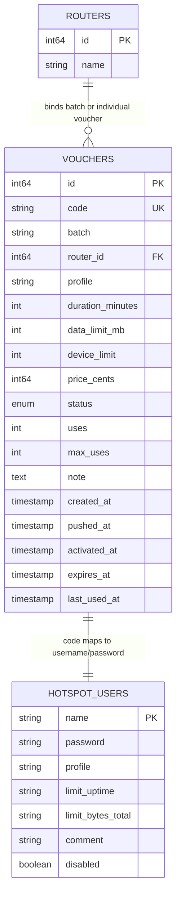

**Diagram sources**
- [database/vouchers.go:78-102](file://database/vouchers.go#L78-L102)
- [handlers/vouchers.go:452-469](file://handlers/vouchers.go#L452-L469)
- [handlers/mikrotik.go:1149-1162](file://handlers/mikrotik.go#L1149-L1162)

**Section sources**
- [handlers/vouchers.go:452-469](file://handlers/vouchers.go#L452-L469)
- [handlers/mikrotik.go:1149-1162](file://handlers/mikrotik.go#L1149-L1162)
- [database/vouchers.go:78-102](file://database/vouchers.go#L78-L102)

### Captive Portal Redemption Flow
During customer login, the controller follows a strict order to avoid burning vouchers when the router is unreachable.

Order guarantees:

1. Check that the voucher is bound to a router.
2. Validate the local ledger.
3. Provision the hotspot user.
4. Attempt API-based login.
5. Only then consume the voucher use.
6. Roll back the hotspot session if ledger redemption fails.

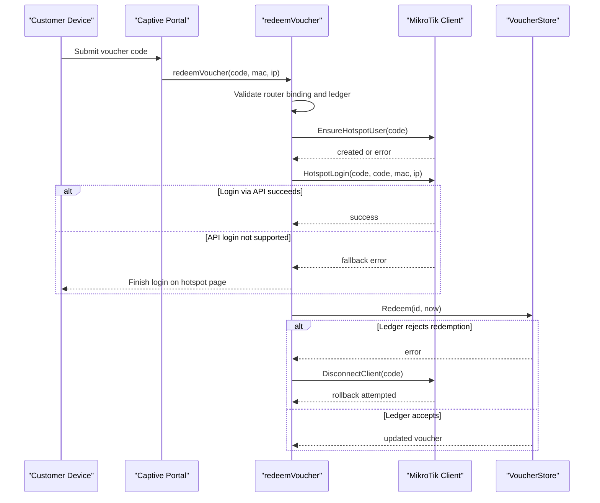

**Diagram sources**
- [handlers/vouchers.go:836-884](file://handlers/vouchers.go#L836-L884)
- [handlers/mikrotik.go:1204-1268](file://handlers/mikrotik.go#L1204-L1268)
- [database/vouchers.go:439-495](file://database/vouchers.go#L439-L495)

**Section sources**
- [handlers/vouchers.go:836-884](file://handlers/vouchers.go#L836-L884)

### Profile Mapping and Limit Enforcement
Profiles define the runtime behavior of hotspot users. Vouchers do not directly create profiles unless the device limit requires changing shared-user concurrency.

Behavior:

- Existing hotspot users are updated with current profile and limits.
- When `DeviceLimit > 1`, the handler ensures the profile exists and sets its shared-user allowance.
- Time and data limits are applied directly to the hotspot user.
- The router enforces those limits at runtime.

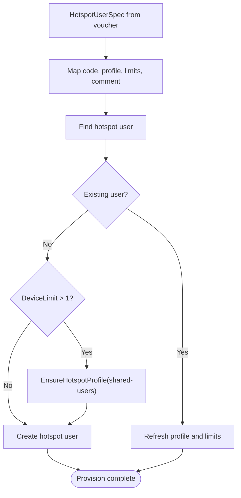

**Diagram sources**
- [handlers/vouchers.go:452-469](file://handlers/vouchers.go#L452-L469)
- [handlers/mikrotik.go:1121-1147](file://handlers/mikrotik.go#L1121-L1147)
- [handlers/mikrotik.go:1204-1268](file://handlers/mikrotik.go#L1204-L1268)

**Section sources**
- [handlers/vouchers.go:452-469](file://handlers/vouchers.go#L452-L469)
- [handlers/mikrotik.go:1121-1147](file://handlers/mikrotik.go#L1121-L1147)
- [handlers/mikrotik.go:1204-1268](file://handlers/mikrotik.go#L1204-L1268)

## Dependency Analysis
The following diagram shows how the voucher provisioning components depend on each other.

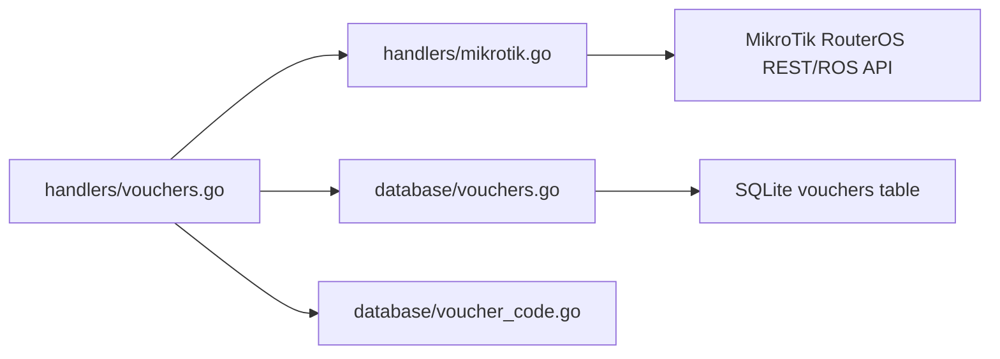

**Diagram sources**
- [handlers/vouchers.go:1-15](file://handlers/vouchers.go#L1-L15)
- [handlers/vouchers.go:452-516](file://handlers/vouchers.go#L452-L516)
- [handlers/mikrotik.go:1149-1268](file://handlers/mikrotik.go#L1149-L1268)
- [database/vouchers.go:197-277](file://database/vouchers.go#L197-L277)
- [database/voucher_code.go:18-76](file://database/voucher_code.go#L18-L76)

**Section sources**
- [handlers/vouchers.go:452-516](file://handlers/vouchers.go#L452-L516)
- [handlers/mikrotik.go:1149-1268](file://handlers/mikrotik.go#L1149-L1268)
- [database/vouchers.go:197-277](file://database/vouchers.go#L197-L277)
- [database/voucher_code.go:18-76](file://database/voucher_code.go#L18-L76)

## Performance Considerations
- Batch size is capped at 500 vouchers to prevent accidental large-scale operations.
- Bulk provisioning uses a timeout equal to four times the configured API timeout.
- Per-voucher operations use the standard API timeout.
- Database inserts use prepared statements and transactions.
- Redemption uses a transaction to prevent double-spending.
- The push loop collects failures and stops after five errors to avoid indefinite waits.

Recommendations:

- Keep batch sizes reasonable when pushing to routers.
- Monitor router API latency and adjust `API_TIMEOUT` if provisioning is slow.
- Use batch filters to re-provision only unpushed vouchers after partial failures.
- Avoid generating extremely long voucher codes; the generator caps length at 48 characters.

[No sources needed since this section provides general guidance]

## Troubleshooting Guide

### Network Connectivity Problems
Symptoms:

- Cannot reach the router during provisioning.
- Validation reports the device is unreachable.
- Bulk push returns connection-related errors.

Checks:

- Confirm the router IP, port, username, and credentials are correct.
- Verify firewall rules allow the controller IP to access the router API.
- Check whether the router is online in the controller’s router inventory.
- Review the router error hint returned by the handler.

Relevant paths:

- Single-voucher push error handling.
- Bulk push dial and timeout handling.
- Validation route that checks router reachability.

**Section sources**
- [handlers/vouchers.go:518-568](file://handlers/vouchers.go#L518-L568)
- [handlers/vouchers.go:570-630](file://handlers/vouchers.go#L570-L630)
- [handlers/vouchers.go:471-516](file://handlers/vouchers.go#L471-L516)

### Authentication Failures
Symptoms:

- Router returns unauthorized responses.
- Hotspot login fails after provisioning.
- The captive portal cannot log the client in through the API.

Checks:

- Ensure the router API user has read/write access to hotspot resources.
- Confirm the hotspot login endpoint supports the API login path.
- If API login is unsupported, the system falls back to letting the hotspot page finish authentication.
- Verify the voucher code matches the hotspot username and password.

Relevant paths:

- `EnsureHotspotUser` creates or updates the hotspot user.
- Redemption handles API login fallback.
- Installer creates a hotspot administrator using the same provisioning helper.

**Section sources**
- [handlers/mikrotik.go:1204-1268](file://handlers/mikrotik.go#L1204-L1268)
- [handlers/vouchers.go:836-884](file://handlers/vouchers.go#L836-L884)
- [handlers/mikrotik_hotspot_installer.go:275-289](file://handlers/mikrotik_hotspot_installer.go#L275-L289)

### Rate Limiting from the Router API
Symptoms:

- Some vouchers succeed while others fail.
- Bulk provisioning stops after several errors.
- The UI reports partial provisioning.

Behavior:

- Bulk provisioning collects up to five errors before stopping.
- Successful vouchers are still marked pushed.
- Failed vouchers remain unpushed and can be retried later.

Recommended actions:

- Reduce batch size.
- Retry the failed batch later.
- Inspect the first reported failure for router-specific messages.
- Use the voucher validation tool to confirm whether the hotspot user exists on the router.

**Section sources**
- [handlers/vouchers.go:471-516](file://handlers/vouchers.go#L471-L516)
- [handlers/vouchers.go:570-630](file://handlers/vouchers.go#L570-L630)

### Partial Failures During Bulk Provisioning
Symptoms:

- Some vouchers show as pushed while others do not.
- The generation response includes a warning about partial provisioning.
- Statistics show fewer pushed vouchers than generated.

How it works:

- The handler iterates vouchers and skips disabled ones.
- Each call to `EnsureHotspotUser` is independent.
- Only IDs that succeed are passed to `MarkPushed`.
- If `MarkPushed` fails, the handler logs a mixed-result failure.

Operational guidance:

- Re-run push for the affected batch.
- Export vouchers to CSV and compare `pushed_to_router` with router state.
- Use the per-voucher validate action to inspect local and remote state.

**Section sources**
- [handlers/vouchers.go:471-516](file://handlers/vouchers.go#L471-L516)
- [database/vouchers.go:513-527](file://database/vouchers.go#L513-L527)
- [handlers/vouchers.go:570-630](file://handlers/vouchers.go#L570-L630)

### Voucher Not Redeemable
Symptoms:

- The captive portal refuses the voucher.
- The ledger reports the voucher is disabled, expired, or fully used.

Checks:

- Confirm the voucher status is not disabled, expired, or used.
- Check expiry time and maximum uses.
- Confirm the voucher is bound to a router.
- Verify the hotspot user exists and is enabled on the router.

**Section sources**
- [database/vouchers.go:141-160](file://database/vouchers.go#L141-L160)
- [handlers/vouchers.go:836-884](file://handlers/vouchers.go#L836-L884)

## Conclusion
The voucher provisioning system is designed for reliability and auditability. It separates durable ledger state from transient router state, allows vouchers to work independently of the controller after provisioning, and handles partial failures gracefully. Operators should monitor pushed counts, retry failed batches, and use the validation tools to reconcile local and remote state. For production deployments, keep batch sizes reasonable, configure appropriate API timeouts, and ensure router API permissions and firewall rules allow reliable communication between the controller and MikroTik routers.

[No sources needed since this section summarizes without analyzing specific files]