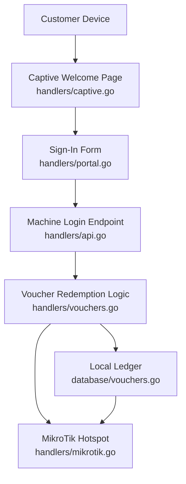
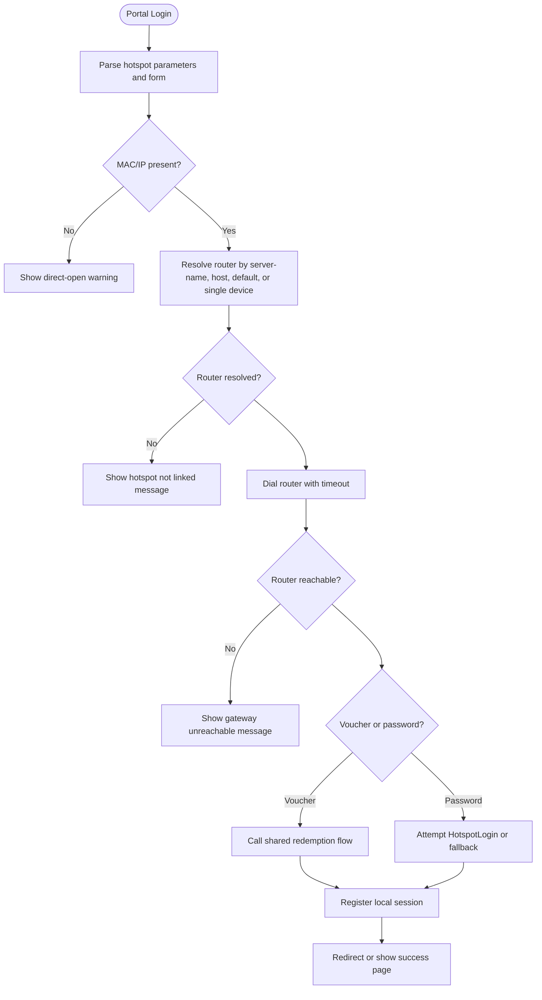
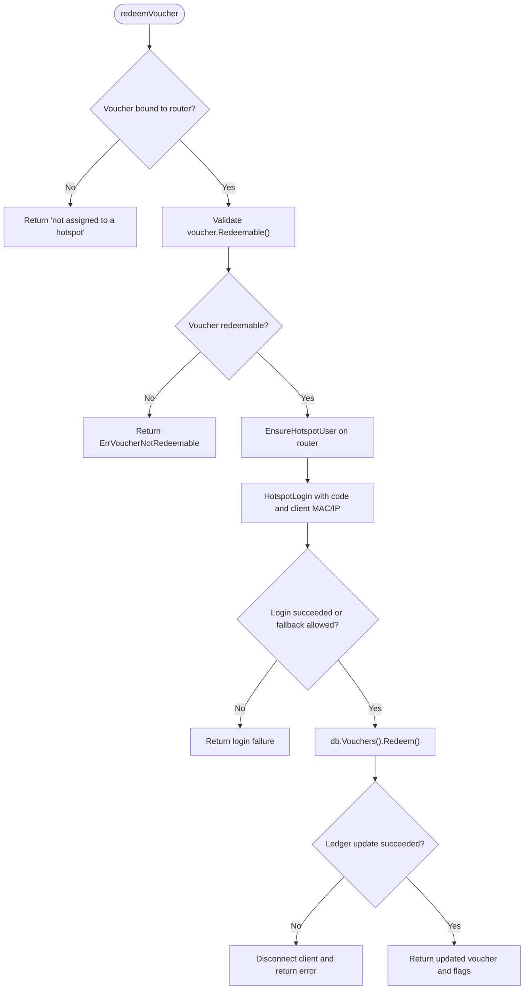
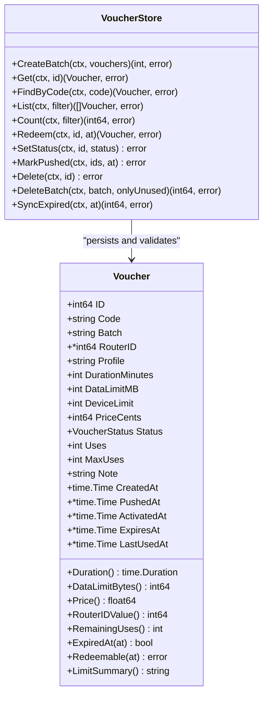
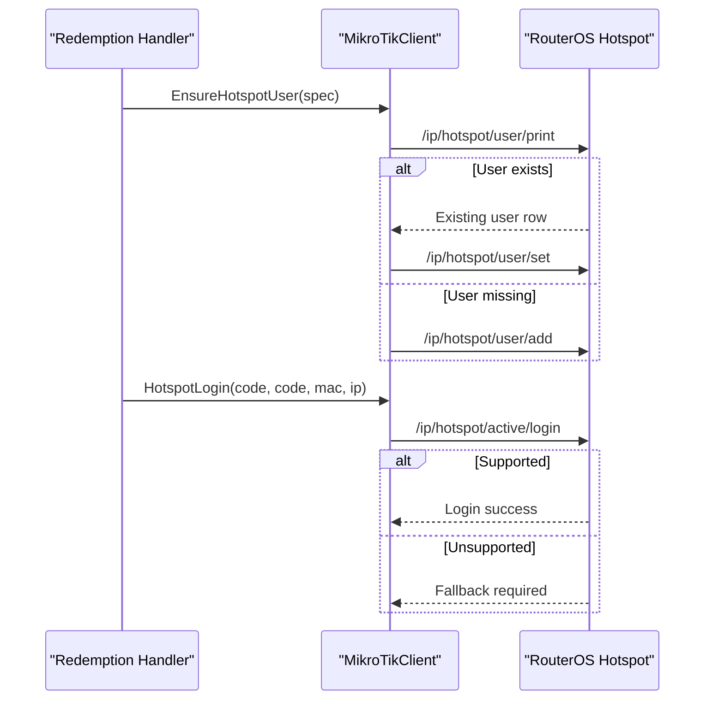
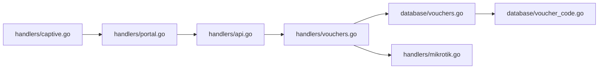

# Voucher Redemption

<cite>
**Referenced Files in This Document**
- [captive.go](file://handlers/captive.go)
- [portal.go](file://handlers/portal.go)
- [api.go](file://handlers/api.go)
- [vouchers.go](file://handlers/vouchers.go)
- [mikrotik.go](file://handlers/mikrotik.go)
- [voucher_code.go](file://database/voucher_code.go)
- [vouchers.go](file://database/vouchers.go)
</cite>

## Table of Contents
1. [Introduction](#introduction)
2. [Project Structure](#project-structure)
3. [Core Components](#core-components)
4. [Architecture Overview](#architecture-overview)
5. [Detailed Component Analysis](#detailed-component-analysis)
6. [Dependency Analysis](#dependency-analysis)
7. [Performance Considerations](#performance-considerations)
8. [Troubleshooting Guide](#troubleshooting-guide)
9. [Conclusion](#conclusion)

## Introduction
This document explains the voucher redemption workflow used by customers through the captive portal and machine-to-machine endpoints. It covers:
- How a customer enters a voucher code on the hotspot login page.
- How the controller resolves the correct MikroTik router.
- The validation checks performed before redeeming a voucher.
- How the local ledger records activation, usage, and expiry.
- How the system integrates with MikroTik’s hotspot authentication to establish a session.
- Examples of successful flows and common error scenarios with their user-facing messages.

## Project Structure
The voucher redemption path spans three layers:
- **Portal layer**: renders the captive welcome and sign-in pages, captures hotspot parameters, and displays user messages.
- **Redemption handler**: validates vouchers, provisions them on the router, authenticates the client, and updates the ledger.
- **Data and device layer**: persists voucher state and communicates with MikroTik RouterOS.



**Diagram sources**
- [captive.go:95-153](file://handlers/captive.go#L95-L153)
- [portal.go:85-194](file://handlers/portal.go#L85-L194)
- [api.go:1170-1285](file://handlers/api.go#L1170-L1285)
- [vouchers.go:824-884](file://handlers/vouchers.go#L824-L884)
- [vouchers.go:439-495](file://database/vouchers.go#L439-L495)
- [mikrotik.go:1204-1267](file://handlers/mikrotik.go#L1204-L1267)

**Section sources**
- [captive.go:95-153](file://handlers/captive.go#L95-L153)
- [portal.go:85-194](file://handlers/portal.go#L85-L194)
- [api.go:1170-1285](file://handlers/api.go#L1170-L1285)

## Core Components
- **Captive welcome page**: Shows the initial Wi-Fi sign-in screen and detects whether the client is already online.
- **Portal login form**: Accepts either a voucher code or a hotspot username/password pair.
- **API portal login**: Machine endpoint for automated clients that submit a voucher code along with hotspot redirect parameters.
- **Voucher redemption logic**: Centralizes provisioning, authentication, and ledger updates.
- **Voucher data model**: Encapsulates lifecycle status, limits, timestamps, and redemption rules.
- **MikroTik integration**: Creates or updates hotspot users, performs login, and manages sessions.

Key responsibilities:
- Validation: status, expiration, remaining uses, router binding, and device reachability.
- Local ledger: tracks creation, activation, last use, expiry, pushes, and usage counts.
- Router integration: ensures the hotspot user exists, applies time/data/device limits, and logs the client in.

**Section sources**
- [captive.go:10-49](file://handlers/captive.go#L10-L49)
- [portal.go:19-83](file://handlers/portal.go#L19-L83)
- [vouchers.go:78-102](file://database/vouchers.go#L78-L102)
- [mikrotik.go:1149-1176](file://handlers/mikrotik.go#L1149-L1176)

## Architecture Overview
The redemption architecture separates concerns between user experience, business validation, persistence, and device control.

```mermaid
sequenceDiagram
participant Client as "Customer Device"
participant Portal as "Portal Login<br/>handlers/portal.go"
participant API as "API Portal Login<br/>handlers/api.go"
participant Handler as "Redemption Handler<br/>handlers/vouchers.go"
participant DB as "Voucher Store<br/>database/vouchers.go"
participant Router as "MikroTik Client<br/>handlers/mikrotik.go"
Client->>Portal : Submit voucher code via hotspot redirect
Portal->>Handler : Call shared redemption flow
Handler->>DB : Find voucher by normalized code
DB-->>Handler : Return voucher record
Handler->>Router : Ensure hotspot user exists
Router-->>Handler : Created or updated user
Handler->>Router : Attempt HotspotLogin
alt Direct API login supported
Router-->>Handler : Login success
else Fallback to browser login
Router-->>Handler : Not supported; return fallback URL
end
Handler->>DB : Redeem one use inside transaction
DB-->>Handler : Updated voucher with timestamps and remaining uses
Handler-->>Portal : Success result with note and redirect
Portal-->>Client : Redirect to original destination or show success page
```

**Diagram sources**
- [portal.go:116-194](file://handlers/portal.go#L116-L194)
- [api.go:1221-1285](file://handlers/api.go#L1221-L1285)
- [vouchers.go:836-884](file://handlers/vouchers.go#L836-L884)
- [vouchers.go:439-495](file://database/vouchers.go#L439-L495)
- [mikrotik.go:1204-1267](file://handlers/mikrotik.go#L1204-L1267)

## Detailed Component Analysis

### Captive Portal Entry and Session Awareness
The captive welcome page serves the initial sign-in experience. When a MikroTik hotspot redirects a client, it includes hotspot parameters such as MAC address, IP, link-login, and server name. If no parameters are present, the page still renders a friendly welcome screen. If the client already has an open session, the page congratulates them instead of asking them to sign in again.

Important behaviors:
- Hotspot redirects are forwarded directly to the sign-in form so parameters remain intact.
- A probe request from operating systems returns the portal without logging router warnings.
- Live session detection uses the client’s source IP against active sessions.

User impact:
- Guests see a branded sign-in page.
- Returning guests who are already connected see a timer and connection status rather than another login form.

**Section sources**
- [captive.go:10-49](file://handlers/captive.go#L10-L49)
- [captive.go:95-153](file://handlers/captive.go#L95-L153)
- [captive.go:155-185](file://handlers/captive.go#L155-L185)
- [captive.go:187-211](file://handlers/captive.go#L187-L211)

### Portal Login Flow
The portal login handler accepts both voucher-based and username/password-based logins. It normalizes hotspot parameters, resolves the correct router, and routes to either voucher redemption or password authentication.

Key steps:
1. Parse the combined query string and form body.
2. Normalize the voucher code using dash/space-insensitive formatting.
3. Resolve the router using server-name, link-login host, default portal, or single-router fallback.
4. Dial the router and enforce timeouts.
5. For vouchers, call the shared redemption path.
6. For passwords, attempt direct hotspot login or fall back to the hotspot’s own login page.
7. Register a local session after successful authentication.
8. Redirect to the original destination or render the success page.

User-facing behavior:
- Unknown voucher codes display a friendly “not recognised” message.
- Vouchers bound to another router show a location mismatch message.
- Unreachable routers show a retryable error.
- Successful redemptions show the voucher allowance and redirect the guest.



**Diagram sources**
- [portal.go:85-194](file://handlers/portal.go#L85-L194)
- [portal.go:244-271](file://handlers/portal.go#L244-L271)
- [portal.go:306-329](file://handlers/portal.go#L306-L329)
- [portal.go:331-344](file://handlers/portal.go#L331-L344)
- [portal.go:404-451](file://handlers/portal.go#L404-L451)

**Section sources**
- [portal.go:85-194](file://handlers/portal.go#L85-L194)
- [portal.go:244-271](file://handlers/portal.go#L244-L271)
- [portal.go:306-329](file://handlers/portal.go#L306-L329)
- [portal.go:331-344](file://handlers/portal.go#L331-L344)
- [portal.go:404-451](file://handlers/portal.go#L404-L451)

### Machine-to-Machine API Redemption
The API provides two relevant endpoints:
- `/api/voucher/redeem/{code}`: Provisions the key, logs the client in, and consumes one redemption.
- `/api/portal/login`: Accepts a voucher code plus hotspot redirect parameters and returns authentication status and redirect target.

Both endpoints:
- Look up the voucher by normalized code.
- Resolve the router associated with the voucher or server name.
- Call the shared redemption handler.
- Map errors to structured API responses.

Error mapping examples:
- Unknown code: `invalid_code`.
- Voucher cannot be redeemed: `not_redeemable`.
- Voucher not assigned to a hotspot: `no_router`.
- General device failure: `redeem_failed`.

Successful response includes:
- Authentication status.
- Whether login was performed via API.
- Optional note explaining fallback behavior.
- Updated voucher data.
- Safe redirect target when applicable.

**Section sources**
- [api.go:1170-1219](file://handlers/api.go#L1170-L1219)
- [api.go:1221-1285](file://handlers/api.go#L1221-L1285)

### Shared Redemption Logic
The shared redemption function is the core of voucher processing. Its design prioritizes safety:
- It never burns a voucher if the router cannot be reached.
- It provisions the hotspot user first.
- It attempts direct login through the RouterOS API.
- It only consumes the ledger entry after successful authentication.
- If the ledger update fails after login, it tries to disconnect the client to prevent free access.

Validation order:
1. Check that the voucher is bound to a router.
2. Validate redeemability against the local ledger.
3. Ensure the hotspot user exists or create it.
4. Attempt hotspot login.
5. Update the ledger atomically.



**Diagram sources**
- [vouchers.go:824-884](file://handlers/vouchers.go#L824-L884)

**Section sources**
- [vouchers.go:824-884](file://handlers/vouchers.go#L824-L884)

### Voucher Data Model and Validation Rules
The voucher data model stores the prepaid key’s identity, limits, pricing, lifecycle state, and timestamps. Redemption validation is centralized in the model:

- **Status checks**: disabled, expired, or fully used vouchers cannot be redeemed.
- **Expiration check**: if an explicit validity window has ended, redemption is rejected.
- **Usage limit check**: if `MaxUses` is configured and `Uses` has reached it, redemption is rejected.
- **Remaining uses calculation**: supports unlimited redemptions when `MaxUses` is zero or negative.
- **Timestamps**: creation, push, activation, expiry, and last-used times are tracked.

The store’s `Redeem` method:
- Runs inside a database transaction.
- Re-reads the voucher after updating to return current allowance and validity window.
- Sets the first activation timestamp when missing.
- Computes expiry based on duration when needed.
- Marks the voucher as used when all allowed redemptions have been consumed.



**Diagram sources**
- [vouchers.go:78-102](file://database/vouchers.go#L78-L102)
- [vouchers.go:141-160](file://database/vouchers.go#L141-L160)
- [vouchers.go:439-495](file://database/vouchers.go#L439-L495)

**Section sources**
- [vouchers.go:78-102](file://database/vouchers.go#L78-L102)
- [vouchers.go:141-160](file://database/vouchers.go#L141-L160)
- [vouchers.go:439-495](file://database/vouchers.go#L439-L495)

### MikroTik Hotspot Integration
The system maps each voucher to a MikroTik hotspot user. The mapping includes:
- Username and password derived from the voucher code.
- Hotspot profile.
- Uptime limit.
- Total bytes limit.
- Comment identifying the generation batch.
- Disabled flag set to enabled.

When redeeming:
- The controller calls `EnsureHotspotUser`, which creates or updates the hotspot user.
- If the profile does not exist, it is created automatically.
- If the device supports direct login, the controller authenticates the client immediately.
- If the device expects the browser to complete login, the portal redirects to the hotspot’s login-only URL with credentials appended.

Session establishment:
- After successful authentication, the portal registers a local session with router, username, IP, MAC, login method, and server name.
- The local session allows the welcome page to detect that the client is already online.



**Diagram sources**
- [mikrotik.go:1149-1176](file://handlers/mikrotik.go#L1149-L1176)
- [mikrotik.go:1204-1267](file://handlers/mikrotik.go#L1204-L1267)
- [portal.go:331-344](file://handlers/portal.go#L331-L344)

**Section sources**
- [mikrotik.go:1149-1176](file://handlers/mikrotik.go#L1149-L1176)
- [mikrotik.go:1204-1267](file://handlers/mikrotik.go#L1204-L1267)
- [portal.go:331-344](file://handlers/portal.go#L331-L344)

### Voucher Code Normalization
Voucher codes are generated to be human-friendly and resistant to misreading. They use a safe alphabet and optional prefix with grouped characters. Lookup normalization removes dashes and spaces and uppercases the input, allowing flexible typing.

Key behaviors:
- Generated codes avoid confusing characters like `0/O`, `1/I`, and `L`.
- Default format is a prefix followed by groups of random characters.
- Stored codes are formatted consistently.
- Lookup keys normalize user input for matching.

**Section sources**
- [voucher_code.go:10-16](file://database/voucher_code.go#L10-L16)
- [voucher_code.go:53-76](file://database/voucher_code.go#L53-L76)
- [voucher_code.go:90-104](file://database/voucher_code.go#L90-L104)

## Dependency Analysis
The redemption workflow depends on several modules:



Coupling characteristics:
- The portal and API handlers share the same redemption logic to avoid duplication.
- The redemption handler depends on the voucher store for atomic ledger updates.
- The redemption handler depends on the MikroTik client for device operations.
- Voucher code generation and normalization are isolated in the voucher code module.

Potential risks:
- Router connectivity affects both provisioning and authentication.
- Database failures during redemption can leave inconsistent state if not handled carefully; the implementation mitigates this by provisioning before consuming and attempting rollback on ledger failure.

**Diagram sources**
- [captive.go:95-153](file://handlers/captive.go#L95-L153)
- [portal.go:116-194](file://handlers/portal.go#L116-L194)
- [api.go:1170-1285](file://handlers/api.go#L1170-L1285)
- [vouchers.go:824-884](file://handlers/vouchers.go#L824-L884)
- [vouchers.go:439-495](file://database/vouchers.go#L439-L495)
- [voucher_code.go:90-104](file://database/voucher_code.go#L90-L104)

**Section sources**
- [captive.go:95-153](file://handlers/captive.go#L95-L153)
- [portal.go:116-194](file://handlers/portal.go#L116-L194)
- [api.go:1170-1285](file://handlers/api.go#L1170-L1285)
- [vouchers.go:824-884](file://handlers/vouchers.go#L824-L884)
- [vouchers.go:439-495](file://database/vouchers.go#L439-L495)
- [voucher_code.go:90-104](file://database/voucher_code.go#L90-L104)

## Performance Considerations
- **Atomic ledger updates**: Redemption runs inside a transaction to prevent race conditions where multiple devices consume the same single-use voucher.
- **Timeouts**: Router API calls use configurable timeouts to avoid blocking requests indefinitely.
- **Provisioning before consumption**: Ensures that temporary device failures do not waste voucher redemptions.
- **Fallback login**: Avoids unnecessary API calls on older RouterOS builds by delegating login to the browser when needed.
- **Batch generation safeguards**: Generation batches are capped to prevent accidental large inserts.

[No sources needed since this section provides general guidance]

## Troubleshooting Guide

### Common Error Scenarios and User Messages

| Scenario | System Behavior | User-Facing Message or Response |
|---|---|---|
| Unknown voucher code | Lookup fails with not found | “That voucher code was not recognised. Check the spelling, or ask the front desk.” |
| Voucher belongs to another router | Portal rejects cross-device redemption | “That voucher belongs to a different hotspot. Please use the key issued for this location.” |
| Voucher disabled | Ledger validation rejects redemption | Reason wrapped in `ErrVoucherNotRedeemable`; shown as a readable reason |
| Voucher expired | Ledger validation rejects redemption | Reason includes expiry date |
| Voucher fully used | Ledger validation rejects redemption | Reason indicates no redemptions left |
| Voucher not assigned to a router | Redemption returns a specific error | “this key is not assigned to a hotspot yet, please contact the front desk” |
| Router unreachable or timed out | Redemption fails before ledger consumption | “The hotspot is busy or unreachable; your voucher was not used. Please try again.” |
| Router login refused | Redemption reports device-side failure | “That voucher could not be activated: <router error hint>” |
| Router expects browser login | Controller redirects to hotspot login-only URL | Notice: “the hotspot asked your device to finish the login” |
| API unknown code | Returns `invalid_code` | Structured API error |
| API voucher not redeemable | Returns `not_redeemable` | Structured API error with reason |
| API voucher not bound to router | Returns `no_router` | Structured API error |
| API general failure | Returns `redeem_failed` | Structured API error |

### Diagnostic Checks
- Verify the voucher exists and matches the expected router.
- Confirm the voucher status is usable and not expired.
- Check remaining uses when `MaxUses` is configured.
- Confirm the router is reachable and responsive.
- Inspect whether the hotspot user was created or updated on the device.
- Review local session registration after successful login.

**Section sources**
- [portal.go:196-242](file://handlers/portal.go#L196-L242)
- [api.go:1170-1285](file://handlers/api.go#L1170-L1285)
- [vouchers.go:836-884](file://handlers/vouchers.go#L836-L884)
- [vouchers.go:141-160](file://database/vouchers.go#L141-L160)

## Conclusion
The voucher redemption workflow combines a clear user experience with robust backend validation and safe device integration. Customers enter a voucher code through the captive portal, the controller resolves the correct MikroTik router, validates the voucher against its local ledger, provisions the hotspot user, authenticates the client, and finally consumes the redemption atomically. The system gracefully handles fallback authentication, router unavailability, and inconsistent states while providing clear user messages and structured API responses. This design keeps the controller reliable even when the router is temporarily unavailable and ensures that vouchers are only consumed when a valid session can be established.

[No sources needed since this section summarizes without analyzing specific files]