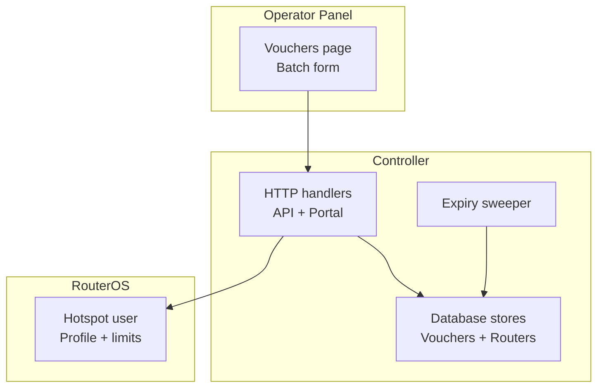
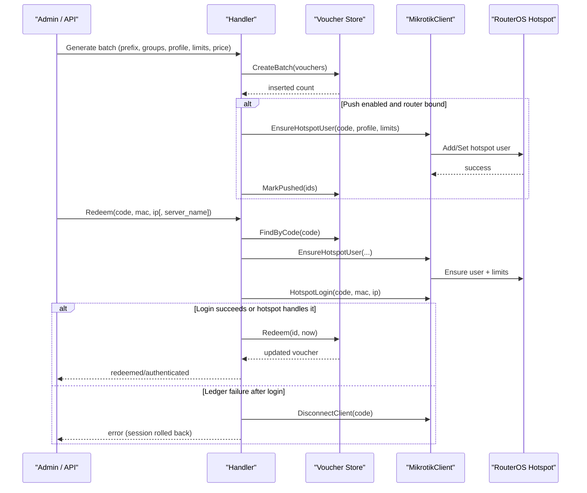
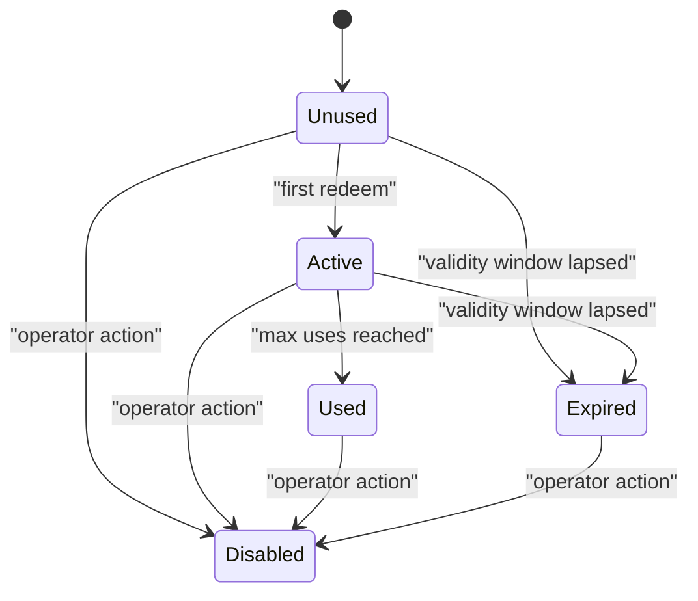
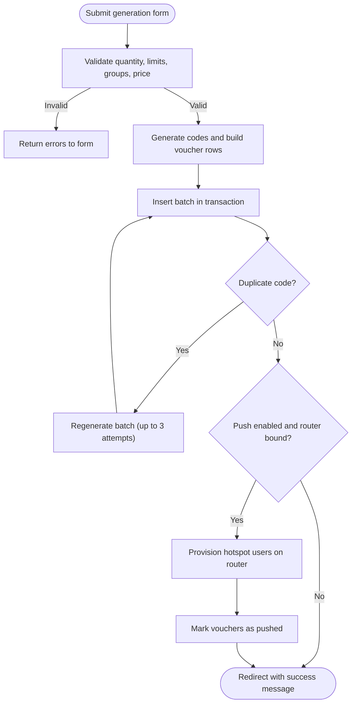
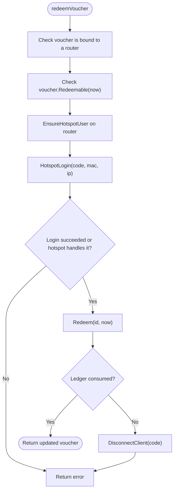
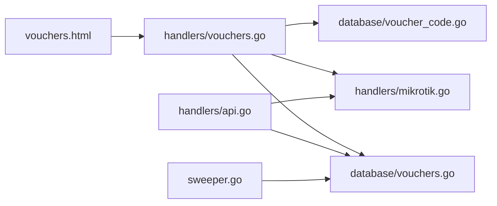

# Voucher System

<cite>
**Referenced Files in This Document**
- [README.md](file://README.md)
- [database/vouchers.go](file://database/vouchers.go)
- [database/voucher_code.go](file://database/voucher_code.go)
- [handlers/vouchers.go](file://handlers/vouchers.go)
- [handlers/api.go](file://handlers/api.go)
- [handlers/mikrotik.go](file://handlers/mikrotik.go)
- [handlers/portal.go](file://handlers/portal.go)
- [templates/vouchers.html](file://templates/vouchers.html)
- [sweeper.go](file://sweeper.go)
</cite>

## Table of Contents
1. [Introduction](#introduction)
2. [Project Structure](#project-structure)
3. [Core Components](#core-components)
4. [Architecture Overview](#architecture-overview)
5. [Detailed Component Analysis](#detailed-component-analysis)
6. [Dependency Analysis](#dependency-analysis)
7. [Performance Considerations](#performance-considerations)
8. [Troubleshooting Guide](#troubleshooting-guide)
9. [Conclusion](#conclusion)

## Introduction
This document explains the prepaid voucher system used by the MikroTik controller. It covers how vouchers are generated, what limits they carry, how they are redeemed, and how usage is tracked. It also documents batch generation, prefixes, group formats, profile assignment, pricing configuration, provisioning to routers, the local ledger, and the rollback behavior when device connections fail.

The system supports:
- Time-based sessions via `limit-uptime`.
- Data caps via `limit-bytes-total`.
- Device concurrency via hotspot profiles.
- Multi-use keys through a local redemption counter.
- Optional immediate provisioning so keys work even if the controller goes offline.
- A reliable redemption flow that never burns a key unless the local ledger successfully records the use.

**Section sources**
- [README.md:187-195](file://README.md#L187-L195)

## Project Structure
The voucher system spans three main layers:
- Database layer: voucher model, code generation, batch storage, redemption, status management, and statistics.
- Handler layer: web/admin UI, API endpoints, captive portal login, router provisioning, and redemption orchestration.
- Router integration: creation or update of hotspot users and enforcement of time/data/device limits on the MikroTik device.

**Diagram sources**
- [handlers/vouchers.go:176-269](file://handlers/vouchers.go#L176-L269)
- [handlers/api.go:1000-1085](file://handlers/api.go#L1000-L1085)
- [database/vouchers.go:197-277](file://database/vouchers.go#L197-L277)
- [handlers/mikrotik.go:1204-1268](file://handlers/mikrotik.go#L1204-L1268)
- [sweeper.go:11-34](file://sweeper.go#L11-L34)

**Section sources**
- [README.md:197-205](file://README.md#L197-L205)

## Core Components
- Voucher model and lifecycle states: unused, active, used, expired, disabled.
- Code generator: human-friendly codes with prefix, groups, and group length.
- Batch store: transactional insertion with duplicate-code handling.
- Redemption ledger: atomic use counting, activation/expiry timestamps, and remaining-use checks.
- Provisioning client: ensures hotspot users exist on routers with correct profiles and limits.
- Web/API interfaces: batch generation, push/provision, validation, export, and redemption.
- Background sweeper: marks expired vouchers and cleans idle coin balances.

Key responsibilities:
- Generation: create unique codes, assign profile/time/data/device limits, price, and optional router binding.
- Provisioning: write hotspot users to routers; mark them as pushed so they work without the controller.
- Redemption: prepare device-side account, authenticate the client, then consume one ledger entry.
- Tracking: record uses, activation/expiry, last-used time, and status transitions.

**Section sources**
- [database/vouchers.go:12-160](file://database/vouchers.go#L12-L160)
- [database/voucher_code.go:10-76](file://database/voucher_code.go#L10-L76)
- [database/vouchers.go:224-277](file://database/vouchers.go#L224-L277)
- [database/vouchers.go:439-495](file://database/vouchers.go#L439-L495)
- [handlers/mikrotik.go:1204-1268](file://handlers/mikrotik.go#L1204-L1268)
- [handlers/vouchers.go:293-406](file://handlers/vouchers.go#L293-L406)
- [handlers/vouchers.go:836-884](file://handlers/vouchers.go#L836-L884)
- [sweeper.go:11-34](file://sweeper.go#L11-L34)

## Architecture Overview
The voucher lifecycle has two major flows:

1. Generation and optional provisioning
   - Operator or API creates a batch.
   - Codes are generated and stored locally.
   - Optionally, each voucher’s hotspot user is created on the target router.
   - Pushed vouchers can work while the controller is offline.

2. Redemption
   - Portal or API resolves the correct router.
   - Controller ensures the hotspot user exists and applies limits.
   - Client is authenticated either directly via API or by redirecting to the hotspot login page.
   - Only after successful authentication does the controller consume one redemption in the local ledger.
   - If ledger consumption fails after authentication, the controller disconnects the client to avoid free access.

**Diagram sources**
- [handlers/vouchers.go:293-406](file://handlers/vouchers.go#L293-L406)
- [handlers/vouchers.go:471-516](file://handlers/vouchers.go#L471-L516)
- [handlers/mikrotik.go:1204-1268](file://handlers/mikrotik.go#L1204-L1268)
- [handlers/vouchers.go:836-884](file://handlers/vouchers.go#L836-L884)
- [database/vouchers.go:439-495](file://database/vouchers.go#L439-L495)

## Detailed Component Analysis

### Voucher Model and Lifecycle
The voucher model carries all allowance and tracking fields:
- Identity: id, code, batch, optional router binding.
- Allowances: hotspot profile, duration minutes, data limit MB, device limit.
- Business fields: price in cents, max uses, note.
- Lifecycle: status, uses, activated/expired/last-used timestamps, pushed timestamp.

Lifecycle rules:
- Unused → Active on first redemption.
- Active → Used when max uses reached.
- Expired when validity window lapses.
- Disabled by operator action.

Redeemability checks include status, expiry, and remaining uses. The device-side limits for uptime, bytes, and shared users are enforced by RouterOS; the controller tracks its own bookkeeping.

**Diagram sources**
- [database/vouchers.go:12-26](file://database/vouchers.go#L12-L26)
- [database/vouchers.go:141-160](file://database/vouchers.go#L141-L160)
- [database/vouchers.go:439-495](file://database/vouchers.go#L439-L495)

**Section sources**
- [database/vouchers.go:78-160](file://database/vouchers.go#L78-L160)
- [database/vouchers.go:439-495](file://database/vouchers.go#L439-L495)

### Voucher Code Generation and Prefixes
Codes are cryptographically random and human friendly:
- Alphabet excludes easily confused characters.
- Format supports an optional prefix plus dash-separated groups.
- Default options produce a standard pattern with a large combination space.
- User input is normalized for lookup, ignoring case, dashes, and spaces.
- Stored codes are uppercased and dash-separated.

Configuration options:
- Prefix: brand or location tag.
- Groups: number of random segments.
- GroupLength: characters per segment.

Validation prevents excessively long codes and clamps invalid ranges.

**Section sources**
- [database/voucher_code.go:10-76](file://database/voucher_code.go#L10-L76)
- [database/voucher_code.go:90-109](file://database/voucher_code.go#L90-L109)

### Batch Generation Interface
The admin page exposes a generation form with:
- Quantity cap to prevent accidental huge batches.
- Batch name grouping.
- Profile selection.
- Time limit in minutes.
- Data limit in MB.
- Devices per key.
- Max logins allowed.
- Price in currency units.
- Code prefix, groups, and group length.
- Optional immediate provisioning.

Validation enforces:
- Quantity between 1 and the configured maximum.
- Non-negative integers for numeric fields.
- Group count and length within safe bounds.
- Valid decimal price.

On success, the handler inserts the batch atomically and retries up to three times if a duplicate code collision occurs.

**Diagram sources**
- [handlers/vouchers.go:145-174](file://handlers/vouchers.go#L145-L174)
- [handlers/vouchers.go:293-370](file://handlers/vouchers.go#L293-L370)
- [handlers/vouchers.go:372-406](file://handlers/vouchers.go#L372-L406)
- [handlers/vouchers.go:471-516](file://handlers/vouchers.go#L471-L516)

**Section sources**
- [handlers/vouchers.go:17-19](file://handlers/vouchers.go#L17-L19)
- [handlers/vouchers.go:145-174](file://handlers/vouchers.go#L145-L174)
- [handlers/vouchers.go:293-406](file://handlers/vouchers.go#L293-L406)
- [templates/vouchers.html:26-106](file://templates/vouchers.html#L26-L106)

### Voucher Types and Limits
A voucher can express:
- Time allowance: session duration in minutes.
- Data allowance: total bytes transferred.
- Device allowance: concurrent devices via hotspot profile settings.
- Usage allowance: maximum redemptions.
- Pricing: face value recorded for accounting.

These allowances are mapped to RouterOS hotspot user attributes:
- `limit-uptime` from duration minutes.
- `limit-bytes-total` from data limit MB.
- Profile and device limit from the selected hotspot profile.

Zero values mean unlimited where applicable.

**Section sources**
- [handlers/vouchers.go:452-469](file://handlers/vouchers.go#L452-L469)
- [handlers/mikrotik.go:1204-1268](file://handlers/mikrotik.go#L1204-L1268)
- [database/vouchers.go:104-112](file://database/vouchers.go#L104-L112)

### Group Assignments and Profile Settings
- Each voucher belongs to a batch for grouping and reporting.
- Each voucher may be bound to a specific router or left unbound for dynamic resolution.
- The hotspot profile determines device concurrency and other hotspot behaviors.
- When provisioning, the controller ensures the profile exists before creating the user.

Resolution order for routing a login:
1. Portal server-name tag.
2. Voucher-bound router.
3. Default portal router.

**Section sources**
- [database/vouchers.go:78-123](file://database/vouchers.go#L78-L123)
- [handlers/api.go:1126-1170](file://handlers/api.go#L1126-L1170)
- [handlers/mikrotik.go:1248-1267](file://handlers/mikrotik.go#L1248-L1267)

### Pricing Configuration
Vouchers carry a price in cents for accounting and dashboard totals. This is separate from the piso Wi-Fi coin rates, which configure time-per-pulse tiers.

- Voucher price: set per batch during generation.
- Coin rate tiers: define how many pulses buy how much time; not part of voucher generation.

The README documents coin slot variables and rate semantics, while voucher pricing is captured in the voucher row.

**Section sources**
- [database/vouchers.go:78-115](file://database/vouchers.go#L78-L115)
- [database/rates.go:12-49](file://database/rates.go#L12-L49)
- [README.md:91-106](file://README.md#L91-L106)

### Redemption Process and Session Rollback
Redemption follows a strict order to protect both customers and inventory:
1. Load voucher by code.
2. Resolve the target router.
3. Ensure hotspot user exists with correct limits.
4. Attempt to log the client in via API; if unsupported, allow the hotspot page to finish login.
5. Only after successful authentication, consume one redemption in the local ledger.
6. If ledger consumption fails, disconnect the client to roll back the session.

**Diagram sources**
- [handlers/vouchers.go:836-884](file://handlers/vouchers.go#L836-L884)

**Section sources**
- [handlers/vouchers.go:836-884](file://handlers/vouchers.go#L836-L884)
- [handlers/api.go:1172-1219](file://handlers/api.go#L1172-L1219)
- [handlers/portal.go:220-241](file://handlers/portal.go#L220-L241)

### Local Ledger and Expiry Tracking
The local ledger tracks:
- Uses and max uses.
- Activation timestamp on first use.
- Expiration timestamp derived from duration when not already set.
- Last-used timestamp.
- Status transitions.

Background maintenance:
- Before listing, expired vouchers are synchronized to keep badges accurate.
- A periodic sweeper marks expired vouchers every five minutes.

Statistics include totals by status, pushed count, billed value, and face value.

**Section sources**
- [database/vouchers.go:439-495](file://database/vouchers.go#L439-L495)
- [database/vouchers.go:561-576](file://database/vouchers.go#L561-L576)
- [database/vouchers.go:578-645](file://database/vouchers.go#L578-L645)
- [handlers/vouchers.go:201-218](file://handlers/vouchers.go#L201-L218)
- [sweeper.go:11-34](file://sweeper.go#L11-L34)

### Provisioning Workflow and Reliability
Provisioning writes hotspot users to routers so vouchers work even when the controller is down:
- The handler maps a voucher to a hotspot user spec including name, password, profile, comment, uptime limit, byte limit, and device limit.
- The router client ensures the user exists; if missing, it adds the user.
- If the profile is missing, it creates the profile and retries once.
- Successful provisioning updates the pushed timestamp.

This makes the system self-healing on fresh routers and resilient to transient API failures.

**Section sources**
- [handlers/vouchers.go:452-516](file://handlers/vouchers.go#L452-L516)
- [handlers/mikrotik.go:1204-1268](file://handlers/mikrotik.go#L1204-L1268)

### Examples of Voucher Configurations
- One-hour unlimited-data single-device key:
  - Duration: 60 minutes.
  - Data limit: 0 MB (unlimited).
  - Device limit: 1.
  - Max uses: 1.
  - Profile: default or custom hourly profile.
- Two-day data-capped multi-device key:
  - Duration: 0 (unlimited time).
  - Data limit: e.g., 2000 MB.
  - Device limit: 2.
  - Max uses: 1.
- Multi-login family key:
  - Duration: 120 minutes.
  - Data limit: 500 MB.
  - Device limit: 1.
  - Max uses: 3.
  - Profile: default.
- Location-tagged batch:
  - Prefix: e.g., HOTEL-A.
  - Groups: 2.
  - Group length: 4.
  - Batch label: e.g., BATCH-YYYYMMDD-HHMM.

These configurations are entered through the generation form or API request fields.

**Section sources**
- [handlers/vouchers.go:45-89](file://handlers/vouchers.go#L45-L89)
- [handlers/vouchers.go:372-406](file://handlers/vouchers.go#L372-L406)
- [database/voucher_code.go:18-51](file://database/voucher_code.go#L18-L51)

## Dependency Analysis
The voucher system depends on:
- Database store for persistence and queries.
- Router client for hotspot user management and login.
- HTTP handlers for admin UI and API.
- Background sweeper for expiry maintenance.

**Diagram sources**
- [templates/vouchers.html:26-106](file://templates/vouchers.html#L26-L106)
- [handlers/vouchers.go:176-406](file://handlers/vouchers.go#L176-L406)
- [handlers/api.go:1000-1085](file://handlers/api.go#L1000-L1085)
- [handlers/mikrotik.go:1204-1268](file://handlers/mikrotik.go#L1204-L1268)
- [database/vouchers.go:197-277](file://database/vouchers.go#L197-L277)
- [database/voucher_code.go:53-76](file://database/voucher_code.go#L53-L76)
- [sweeper.go:11-34](file://sweeper.go#L11-L34)

**Section sources**
- [handlers/vouchers.go:176-406](file://handlers/vouchers.go#L176-L406)
- [handlers/api.go:1000-1085](file://handlers/api.go#L1000-L1085)
- [database/vouchers.go:197-277](file://database/vouchers.go#L197-L277)
- [sweeper.go:11-34](file://sweeper.go#L11-L34)

## Performance Considerations
- Batch size is capped to prevent accidental large insertions.
- Batch insertion uses a single transaction to ensure consistency.
- Provisioning uses a bounded context timeout proportional to the configured API timeout.
- Listing operations normalize pagination limits to avoid excessive result sets.
- Expiry synchronization runs before listings and periodically in the background.

Recommendations:
- Keep batch sizes reasonable for your deployment.
- Prefer pre-provisioning when controllers may be offline.
- Use filters and exports judiciously to avoid heavy queries.

[No sources needed since this section provides general guidance]

## Troubleshooting Guide
Common issues and resolutions:

- Voucher cannot be redeemed:
  - Check status: disabled, expired, or already used.
  - Verify remaining uses and expiry timestamp.
  - Confirm the voucher is bound to a router.

- Router unreachable during redemption:
  - Provisioning will fail; use the provision action to retry.
  - Check router health and API connectivity.
  - Review router connection logs and latency.

- Voucher works but user not found on device:
  - Run validation to inspect ledger and device state.
  - Provision the voucher to create the hotspot user.

- Multiple simultaneous redemptions:
  - The redemption endpoint is transactional; only one use is consumed per allowed maximum.

- Expiry badge stale:
  - Listings synchronize expired vouchers automatically.
  - The background sweeper also marks expired vouchers every five minutes.

- CSV export missing columns:
  - Export includes code, batch, router, profile, limits, price, status, uses, timestamps, and notes.

Operational actions available:
- Disable/re-enable/mark as used/expired.
- Delete single voucher or entire batch.
- Export filtered vouchers to CSV.
- Validate voucher against ledger and device.

**Section sources**
- [database/vouchers.go:141-160](file://database/vouchers.go#L141-L160)
- [database/vouchers.go:497-511](file://database/vouchers.go#L497-L511)
- [database/vouchers.go:529-559](file://database/vouchers.go#L529-L559)
- [handlers/vouchers.go:518-568](file://handlers/vouchers.go#L518-L568)
- [handlers/vouchers.go:570-630](file://handlers/vouchers.go#L570-L630)
- [handlers/vouchers.go:632-730](file://handlers/vouchers.go#L632-L730)
- [handlers/vouchers.go:732-794](file://handlers/vouchers.go#L732-L794)
- [sweeper.go:11-34](file://sweeper.go#L11-L34)

## Conclusion
The voucher system combines a robust local ledger with device-side enforcement to deliver reliable prepaid hotspot access. Operators can generate configurable batches, optionally provision keys upfront, and track usage and expiry accurately. The redemption path prioritizes safety: device preparation and authentication occur before ledger consumption, and any ledger failure triggers a session rollback. With clear batch grouping, flexible prefixes, profile-driven device limits, and comprehensive admin tools, the system supports diverse operational models while protecting revenue and customer experience.

[No sources needed since this section summarizes without analyzing specific files]